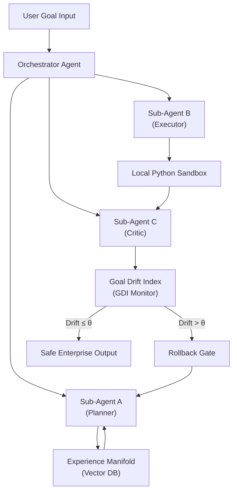
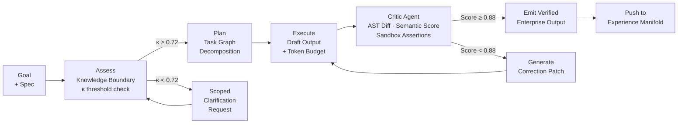
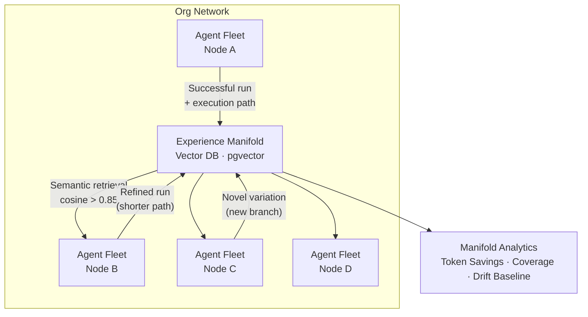

<!-- _class: title -->

<div class="eyebrow">◈ India Runs Hackathon · Redrob AI · Track 2: Ideathon</div>

# EMMA
## Enterprise Metacognitive<br>Multi-Agent Fleet

<p class="sub">A safe, self-correcting, and collectively evolving AI agent workforce — built to automate complex, long-running enterprise tasks with mathematical alignment guarantees.</p>

<div class="meta">
  <span class="tag">Challenge 1 · AI Systems Architect</span>
  <span class="tag">42-Day Build · EMMA Command Center</span>
  <span class="tag">Reimagining Work</span>
</div>

---

<!-- _class: pillar -->

## The Silent Crisis of Enterprise Copilots

> Enterprise AI adoption has stalled — not from lack of interest, but from a triad of structural failures that no single-agent copilot can resolve.

<div class="cols">
<div class="col-card">

### ⚠ The 80% Completion Cap

Current LLM agents lack **intrinsic self-reflection**. Without knowing their own knowledge boundaries, they silently hallucinate, produce malformed outputs, and cascade token errors — causing 60–80% of complex autonomous tasks to fail before delivery.

</div>
<div class="col-card">

### 🧱 Siloed Workflow Intelligence

Every agent starts from zero. A successful OAuth integration on Machine A has **zero influence** on Machine B. There is no mechanism for agents to share execution intelligence — no compounding, no institutional memory, no collective evolution.

</div>
</div>

### 🔴 The Enterprise Safety Barrier

**Alignment Drift** — agents semantically deviating from their original goals mid-execution — is the primary reason enterprises block agentic deployments entirely. A single rogue planning loop can consume compute budgets, corrupt data, or create infinite execution cycles. Without a *quantifiable drift index*, safety is subjective and unenforceable.

---

<!-- _class: pillar -->

## Reimagining Work with EMMA

<div class="cols">
<div class="col-card">

### From Reactive to Autonomous
EMMA replaces **single-turn chatbots** with a *persistent, self-healing multi-agent fleet*. Agents plan, execute, critique their own output, correct course, and share successful execution paths across the entire organization — automatically.

### The 42-Day Milestone
**EMMA Command Center Console** — a web prototype demonstrating real-time agent thought streams, critique diffs, Goal Drift gauges, and safety overrides. A live proof-of-concept of every EMMA pillar.

</div>
<div class="col-card">

**Operational Flow**



</div>
</div>

---

<!-- _class: pillar -->

## Pillar 1 — Intrinsic Metacognition

> *"Thinking about thinking."* Before an agent writes a single line of output, EMMA agents interrogate their own capability boundaries, decompose goals into verifiable sub-tasks, and critique every artifact they produce against a formal specification.

**The 3-Stage Metacognitive Loop**

### Stage 1 · Assess (Knowledge Boundary Probe)
The agent issues a structured **self-capability query**: *"Do I have sufficient context, tool access, and domain knowledge to complete this task without hallucination risk?"* If confidence falls below threshold `κ = 0.72`, it raises a scoped clarification request rather than proceeding with incomplete information.

### Stage 2 · Plan (Dynamic Checklist Decomposition)
Goals are decomposed into an **ordered, dependency-aware task graph** with explicit acceptance criteria per node. Each node carries an estimated token budget, an expected output type, and a sandbox validation requirement flag.

### Stage 3 · Evaluate / Critique (Self-Healing Execution)
Every artifact is passed to a *Critic Agent* that applies **AST-level structural diffing**, semantic similarity scoring against the original specification, and sandbox execution with assertion checks — then returns a scored critique with targeted correction patches.

---

<!-- _class: pillar -->

## Pillar 1 — Critique-Refinement Loop



<div class="cols" style="margin-top:1em">
<div class="col-card">

**Key Metrics**
- Critique threshold: `score ≥ 0.88`
- Max refinement passes: `3` (then escalate)
- AST diff: structural, not textual
- Sandbox: isolated subprocess, memory-capped

</div>
<div class="col-card">

**Why It Works**
Self-correction eliminates the hallucination cascade. Each pass narrows semantic distance to the spec. The Critic Agent is *stateless* — it cannot rationalize its own prior output, ensuring genuinely adversarial evaluation.

</div>
</div>

---

<!-- _class: pillar -->

## Pillar 2 — Group-Evolving Agents (GEA)

> The **Experience Manifold** is EMMA's institutional memory — a vector-indexed, execution-path database that turns every successful agent run into a reusable, queryable intelligence asset available to the entire fleet.

### The Mechanism

When Agent A completes a verified task, its full execution sequence — *goal decomposition graph, tool invocations, correction patches, final output* — is **embedded and indexed** in the Manifold. When any future agent faces a semantically similar goal (cosine similarity `> 0.85`), it retrieves this prior path as a **high-confidence prior**, dramatically reducing planning tokens and failure iterations.



**Result:** Every agent run makes the *entire fleet smarter*. Token costs fall compoundingly. Task success rates increase as the Manifold densifies. Organizations accumulate a proprietary intelligence asset that competitors cannot replicate.

---

<!-- _class: safety -->

## Pillar 3 — Mathematical Safety: SAHOO & GDI

> Alignment cannot be a policy document. EMMA enforces it numerically, structurally, and in real-time.

<div class="cols">
<div class="col-card">

### Goal Drift Index (GDI)

A **multi-signal scalar** computed at every planning step:

`GDI = α·Δsem + β·Δstruct + γ·Δscope`

- `Δsem` — Cosine distance between current agent goal embedding and the original goal embedding
- `Δstruct` — AST-level structural deviation of planned output from accepted schema
- `Δscope` — Ratio of in-scope vs. out-of-scope tool invocations

**Threshold `θ = 0.35`:** GDI above this triggers Constraint Preservation Gate review. Above `0.60` triggers hard rollback.

</div>
<div class="col-card">

### SAHOO Framework

**S**andbox Execution Isolation · **A**ST Constraint Parsing · **H**ierarchical Rollback Guards · **O**rchestrator Override Channel · **O**ffline Regression Test Suite

```
SAHOO Gate Sequence:
  1. AST parse → schema validation
  2. Sandbox dry-run → assertion check
  3. GDI measurement → drift gate
  4. Human override channel (async)
  5. Regression baseline comparison
  6. Emit ✓ OR rollback to checkpoint
```

</div>
</div>

<div class="kpi-row" style="margin-top:1em">
  <div class="kpi"><span class="num safe">θ = 0.35</span><span class="label">Drift Alert Threshold</span></div>
  <div class="kpi"><span class="num danger">θ = 0.60</span><span class="label">Hard Rollback Threshold</span></div>
  <div class="kpi"><span class="num" style="color:var(--amber)">6-Gate</span><span class="label">SAHOO Safety Sequence</span></div>
  <div class="kpi"><span class="num">100%</span><span class="label">Sandbox Isolation</span></div>
</div>

---

<!-- _class: pillar -->

## The 42-Day Build — EMMA Command Center Console

> A production-demonstrable React/Vite web console that makes every EMMA pillar *observable, interactive, and auditable* in real time.

<div class="cols">
<div class="col-card">

### 🖥 Live Thought Stream
High-frequency terminal output streamed via **WebSocket** from the FastAPI backend — showing agent planning steps, tool invocations, and metacognitive self-queries as they happen. Color-coded by stage: <span class="safe">■ Plan</span> · <span class="amber">■ Execute</span> · <span class="danger">■ Critique</span>

### ⚖ Split Diff View
Side-by-side **Monaco-style diff panel**: *Initial Draft* (left) vs. *Self-Critiqued / Corrected Output* (right). Inline annotations surface the Critic Agent's specific correction rationale at each changed line.

</div>
<div class="col-card">

### 🌡 Drift Speedometer (GDI Dial)
An interactive SVG arc-dial rendering the **live Goal Drift Index** — green zone (`0–0.35`), amber warning zone (`0.35–0.60`), red rollback zone (`0.60+`). Snaps to a checkpoint marker on every rollback event with timestamp.

### 🔒 Local Python Sandbox
All agent code execution routed through an **isolated subprocess** with memory cap (`256 MB`), timeout (`30 s`), and filesystem jail. Execution output and assertion results surface in the console's sandbox panel.

**Tech Stack:**
<span class="badge">React 18 / Vite</span> <span class="badge">FastAPI</span> <span class="badge">SQLite3</span> <span class="badge">pgvector</span> <span class="badge">WebSocket</span> <span class="badge">Python Subprocess Sandbox</span> <span class="badge">Monaco Editor</span>

</div>
</div>

---

<!-- _class: case -->

## Reimagining the User Journey — Enterprise Case Study

**Goal:** *"Integrate our legacy PostgreSQL reporting database with our new OAuth 2.0 secure API portal."*

| Step | Agent Action | EMMA Mechanism |
|------|-------------|----------------|
| `01` | Orchestrator decomposes goal into 4 sub-tasks: schema introspection, OAuth flow build, endpoint mapping, integration test | **Metacognitive Planner** |
| `02` | Sub-Agent A queries Experience Manifold — finds a prior OAuth integration path (similarity `0.91`) | **GEA Manifold Retrieval** |
| `03` | Sub-Agent B executes token exchange flow; receives `401 Unauthorized` on legacy header format | **Sandbox Execution** |
| `04` | Critic Agent detects header mismatch via AST diff; GDI reading: `0.28` (within bounds) | **GDI Monitor + Critique** |
| `05` | Correction patch generated: replaces `Bearer` prefix with `Token` per legacy spec; re-executed in sandbox — assertions pass | **Self-Healing Loop** |
| `06` | Full verified execution path pushed to Manifold as `oauth_legacy_psql_v1` | **Manifold Contribution** |
| `07` | All 12 developers in the org can now run the same OAuth integration with zero planning tokens — retrieved as a verified prior | **Fleet-Wide Evolution** |

> **Outcome:** A task that previously required a senior engineer's 4-hour session is completed in **< 8 minutes**, verified, and institutionalized as organizational intelligence — permanently.

---

<!-- _class: roadmap -->

## The 42-Day Hackathon Roadmap

| Phase | Days | Deliverable | Key Milestone |
|-------|------|-------------|---------------|
| **Phase 1** | `01 – 10` | Design system, pitch deck, FastAPI scaffold, React/Vite project init, SQLite3 schema | ✅ Dev environment live · Architecture locked |
| **Phase 2** | `11 – 18` | Metacognitive Assess/Plan engine, Critic Agent (AST diff + semantic scoring) | ✅ Self-correction loop demonstrable end-to-end |
| **Phase 3** | `19 – 25` | Python Sandbox harness, GDI computation engine, SAHOO gate sequence | ✅ Safety layer operational · Rollback tested |
| **Phase 4** | `26 – 30` | Experience Manifold (pgvector), GEA retrieval & contribution pipeline | ✅ Fleet learning demonstrable across 3 agents |
| **Phase 5** | `31 – 35` | Command Center Dashboard: Thought Stream, Split Diff, Drift Dial, Sandbox Panel | ✅ Full UI-backend integration complete |
| **Phase 6** | `36 – 40` | End-to-end test on real dataset (OAuth + legacy DB case study) | ✅ Case study walkthrough recorded |
| **Phase 7** | `41 – 42` | Video walkthrough production, submission compilation, deck finalisation | 🚀 **Submission ready** |

<div class="kpi-row" style="margin-top:1.2em">
  <div class="kpi"><span class="num safe">3</span><span class="label">EMMA Pillars</span></div>
  <div class="kpi"><span class="num">7</span><span class="label">Build Phases</span></div>
  <div class="kpi"><span class="num" style="color:var(--amber)">42</span><span class="label">Days to Delivery</span></div>
  <div class="kpi"><span class="num safe">1</span><span class="label">Live Demo Console</span></div>
</div>

---

<!-- _class: title -->

<div class="eyebrow">◈ Enterprise Metacognitive Multi-Agent Fleet</div>

# The Fleet is Ready.
## Work will never be the same.

<p class="sub">EMMA doesn't replace human judgment — it amplifies it. Every agent run makes the workforce smarter. Every correction makes the system safer. Every goal achieved compounds into permanent organizational intelligence.</p>

<div class="cols" style="margin-top:2em">
<div class="col-card">

**Three Pillars**
- **Intrinsic Metacognition** — Agents that know their limits and correct themselves
- **Group-Evolving Agents** — A fleet that learns collectively, not in isolation
- **Mathematical Safety (SAHOO/GDI)** — Alignment you can measure, not just promise

</div>
<div class="col-card">

**42-Day Proof Point**
The EMMA Command Center Console delivers a *live, interactive demonstration* of all three pillars — real thought streams, real drift gauges, real self-correction diffs — on a real enterprise integration task.

<br>

> *Safe. Self-correcting. Collectively evolving.*
> **This is how enterprises will run AI.**

</div>
</div>
