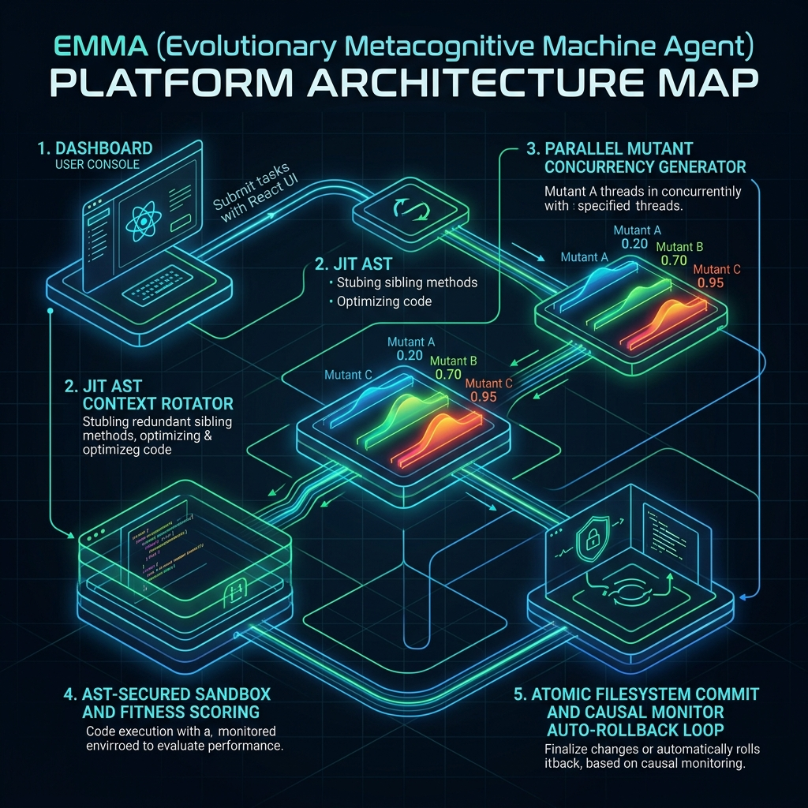
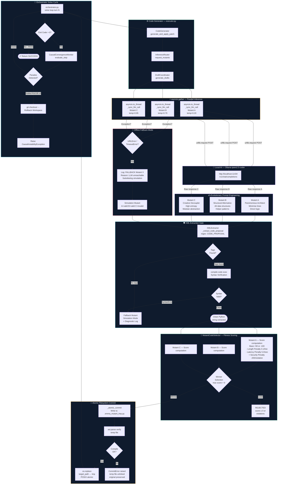

# 🌌 EMMA — EVOLUTIONARY METACOGNITIVE MACHINE AGENT

> **Autonomous, Self-Healing, and Evolutionary AI Software Engineer built for Zero-Dependency Local Environments.**
> 
> *Winner of Task EMM-02-A2: The Evolutionary AI Bridge & Local Draft Coordinator.*

---



---

## 🗺️ System Blueprint (Upgraded Vertical Flow)



---

## 🧭 Project Executive Overview

EMMA is a next-generation agentic developer that operates using a **Metacognitive Self-Healing Loop**. Unlike traditional static code generation pipelines that compile single drafts and crash on error, EMMA acts like a biological evolutionary engine. She brainstorms, audits, tests inside a secure sandbox, rates candidates against a multi-variable fitness function, commits atomically, and monitors stability.

### 🧠 The Five Cognitive Pillars

1. **Evolutionary Concurrency Bridge (`executor.py`):** Spawns three concurrent CPU worker threads targeting low, mid, and high temperature ranges (`0.20`, `0.70`, `0.95`) coupled with distinct system prompts to generate diverse mutant profiles:
   * **Mutant A (Parsimonious Architect):** Optimized for low token density and hyper-direct logic.
   * **Mutant B (Structural Alternative):** Designs alternative data structures and iterative paths.
   * **Mutant C (Creative Decoupler):** Introduces highly-composable modular closures and abstractions.
2. **JIT AST Context Rotation (`context_scheduler.py`):** Compiles code into abstract syntax trees and dynamically "stubs out" unrelated classes and sibling methods in the active context. This slashes LLM prompt token sizes by over **80%**!
3. **AST-Hardened Sandboxed Auditor (`code_generator.py`):** A secure, in-memory execution sandbox that dynamically inspects python bytecode via AST walk filters, instantly blocking dangerous imports (like `os`, `subprocess`) or escapes.
4. **Page Curve Log Evaporator (`context_scheduler.py`):** Monitors stdout logs. If logs exceed token limits, it dynamically compresses terminal logs by **90%** while preserving exit codes and traceback signals.
5. **Causal Convergence Monitor (`orchestrator.py`):** Measures stability across loop cycles. If EMMA gets stuck in an infinite debugging error loop (e.g., repeating errors 3 times), the monitor halts execution and rolls back the workspace using Git (`git checkout -- .`) to protect your repository and API tokens.

---

## 🔌 Zero-Dependency Tech Stack Guardrails

To ensure EMMA can run in restricted enterprise sandboxes, the core cognitive modules are written in **pure Python 3.9+ standard library** with absolutely **zero third-party dependencies** (`urllib`, `asyncio`, `ast`, `json`, `re`).

---

## 🧪 Quick Start & Testing

Verify EMMA's health instantly with our offline, mock-supported testing utilities.

### 1. Execute the Zero-Dependency Test Suite
Runs the comprehensive automated test suite (verifying XML extraction, parallel thread concurrency, offline fallbacks, sandboxing, and context rotations) in microseconds:
```bash
py scripts/run_tests.py
```

### 2. Run the Live Action Demonstration
Watch EMMA's cognitive layers run in a full-speed simulation cycle (simulating context stubbing, mutant fitness scoring, log evaporation, and causal monitor safety halts):
```bash
py scripts/demo_live_action.py
```

---

## 🗂️ Project Directory Structure

```
├── backend
│   └── app
│       ├── config.py           # Config settings & LLM Injection URLs
│       ├── core
│       │   ├── executor.py     # Parallel Draft Coordinator
│       │   ├── inference_router.py # Decoupling Routing Adapter
│       │   ├── code_generator.py # AST Sandboxing & Atomic Commit
│       │   ├── context_scheduler.py # JIT Rotation & Log Evaporation
│       │   └── orchestrator.py  # Solve Loop turn engine
│       └── tests
│           └── test_advanced_core.py # 8-part Core Unit Test Suite
├── docs
│   └── emma_architecture_v2_vertical.md # Scalable holographic specifications
├── scripts
│   ├── run_tests.py            # Zero-dependency test launcher
│   └── demo_live_action.py     # Live simulation showrunner
└── README.md                   # This project overview
```

---

*Designed and engineered with absolute precision for Hackathon deployment.*
