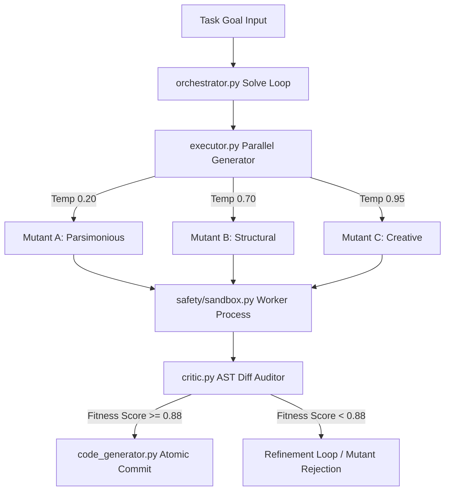
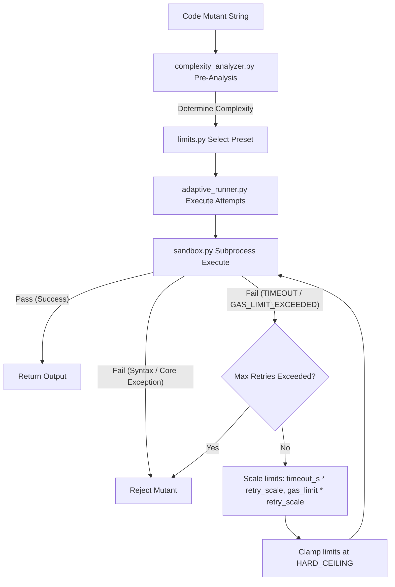
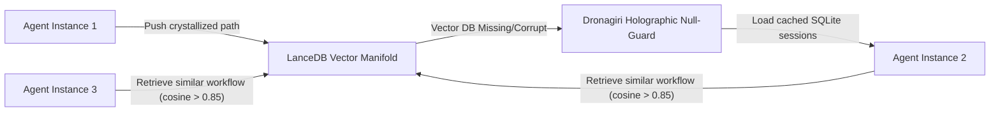

<!-- _class: title -->

<div class="eyebrow">◈ India Runs · Track 2 (Ideathon) · PS1 System Strategy</div>

# EMMA
## Sovereign Metacognitive Agentic Software Engineering

<p class="sub">A zero-dependency, self-correcting, and collectively evolving local AI agent fleet — protected by compiler-enforced safety kernels and dynamic AST gas-metered execution environments.</p>

<div class="meta">
  <span class="tag">PS1: Technical System Strategy</span>
  <span class="tag">100% Offline / Local Execution</span>
  <span class="tag">Built on Python, FastAPI & LanceDB</span>
</div>

---

<!-- _class: pillar -->

## The Friction Points of Autonomous AI Engineers

> Current agentic developer engines are built on fragile, stateless scripts that fail under real-world enterprise constraints.

<div class="cols">
<div class="col-card">

### 🔴 The Resource-Exhaustion Loop
A single infinite loop mutant (e.g., `while True: pass`) generated by local LLMs will consume 100% CPU thread capacity. Traditional timeout mechanisms wait **30 seconds** for an OS kill, dragging down pipeline throughput.

</div>
<div class="col-card">

### 🔴 Memory Leaks and OOM Crashes
Complex calculations or heavy data conversions can allocate excessive memory, causing silent out-of-memory (OOM) failures that crash the solver environment without telemetry logs.

</div>
</div>

### 🔴 The Epistemic Isolation Problem
Traditional agents run in a vacuum. A successful code patch applied to an interface on Machine A does not help Machine B. Every agent starts from zero, wasting millions of tokens re-learning structural API footprints.

---

<!-- _class: pillar -->

## The Core Solution: The EMMA Architecture

EMMA secures enterprise deployments using **Three Concentric Safety Rings**:

```
 ┌─────────────────────────────────────────────────────────────────────────┐
 │ RING 3: PERSISTENCE (SQLite Session Store ⇄ LanceDB Experience Manifold) │
 ├─────────────────────────────────────────────────────────────────────────┤
 │ RING 2: SAFETY & ALIGNMENT (AST Bytecode Auditor ⇄ AST Gas Meter ⇄ Sandbox)│
 ├─────────────────────────────────────────────────────────────────────────┤
 │ RING 1: COGNITIVE CORE (Parallel Mutant Generator ⇄ JIT AST Context Router)│
 └─────────────────────────────────────────────────────────────────────────┘
```

* **Offline-First Resilience:** Engineered to run completely locally, routing inference through a local Ollama Gateway (`qwen2.5-coder`) with **zero data leakage** to third-party clouds.
* **The Metacognitive Loop:** An adversarial setup where [critic.py](file:///e:/EMMA_INDIA_RUN/EMMA_hack2skill/backend/app/core/critic.py) reviews, scores, and modifies code proposals generated by [executor.py](file:///e:/EMMA_INDIA_RUN/EMMA_hack2skill/backend/app/core/executor.py) before atomic commit.

---

<!-- _class: safety -->

## Pillar I — Intrinsic Metacognition & Evolutionary Concurrency

> EMMA generates code as a biological evolutionary process — mutating multiple candidates in parallel and auditing structural viability before writing to disk.



* **Multi-Entropy Parallel Inference:** Spawns three concurrent mutant generations at distinct temperatures to capture diverse logical approaches.
* **Adversarial Assessment:** Candidates must pass syntax validation, security checks, and logic assertion gates inside the sandbox before final commitment.

---

<!-- _class: safety -->

## Pillar II — Sudarshana AST Gas Metering Shield

> Waiting for OS timeouts to kill runaway code wastes valuable CPU execution time. EMMA intercepts infinite loops at the abstract syntax tree level in **under 1 millisecond**.

* **AST-Level Instrumenter:** Before compilation, [gas_meter.py](file:///e:/EMMA_INDIA_RUN/EMMA_hack2skill/backend/app/safety/gas_meter.py) parses the python code and injects EVM-style `__gas_check__(cost)` counters directly into:
  * Loops (`For`, `While` statement headers)
  * Function definitions (`FunctionDef`, `AsyncFunctionDef`)
  * Heavy computational operations (Power operations `**`, list/dict comprehensions)
* **Namespace Protection:** Restricts target namespace bindings, making it impossible for mutant code to overwrite the underlying metering functions.

```python
# Raw Mutant Code:
while True:
    pass

# Transformed Code Executed in Sandbox:
while True:
    __gas_check__(1) # Raises GasMeterException if gas > 50,000
    pass
```

---

<!-- _class: safety -->

## Pillar III — AST Complexity Pre-Analysis & Adaptive Limits

> Rigid sandbox resource limits are counterproductive. Complex math and recursive algorithms need breathing room, while micro-manipulations should be clamped tightly.

EMMA's scheduled implementation introduces **AST Complexity Pre-Analysis** to map appropriate resource allocations before execution:

* **[complexity_analyzer.py](file:///e:/EMMA_INDIA_RUN/EMMA_hack2skill/backend/app/safety/complexity_analyzer.py):** Parses the candidate's AST to compute the *Nesting Depth*, *Recursion Metrics*, and *Library imports*.
* **[limits.py](file:///e:/EMMA_INDIA_RUN/EMMA_hack2skill/backend/app/safety/limits.py) Presets:** Maps the code complexity score to one of five tailored envelopes:

| Preset | Timeout (s) | Memory cap | Gas Limit | Use Case |
|---|---|---|---|---|
| `MICRO` | 5.0s | 64 MB | 10,000 | Simple string/utility tasks |
| `STANDARD` | 30.0s | 256 MB | 50,000 | Typical solver operations |
| `MEDIUM` | 60.0s | 512 MB | 500,000 | Basic library calculations |
| `HEAVY` | 120.0s | 1024 MB | 5,000,000 | Multi-nested loops, NumPy / SciPy |
| `RESEARCH` | 300.0s | 2048 MB | 50,000,000 | Heavy recursions, deep graph solvers |

---

<!-- _class: safety -->

## Pillar III — Self-Healing Retry Engine Flow

The [adaptive_runner.py](file:///e:/EMMA_INDIA_RUN/EMMA_hack2skill/backend/app/safety/adaptive_runner.py) wraps execution in a retry-scaling loop, automatically increasing limits when code encounters benign execution exhaustion, clamped safely by a `HARD_CEILING`.



---

<!-- _class: safety -->

## Pillar IV — Goal Drift Index & Causal Convergence

> How do we ensure an autonomous coding loop doesn't drift away from the original user objective? We measure semantic and structural drift numerically.

<div class="cols">
<div class="col-card">

### Goal Drift Index (GDI)
Calculated continuously in [gdi.py](file:///e:/EMMA_INDIA_RUN/EMMA_hack2skill/backend/app/safety/gdi.py):
$$GDI = \alpha \cdot \Delta_{\text{sem}} + \beta \cdot \Delta_{\text{struct}} + \gamma \cdot \Delta_{\text{scope}}$$
* $\Delta_{\text{sem}}$: Cosine distance of the current agent thought embedding vs. the original goal.
* $\Delta_{\text{struct}}$: Deviation of modified code vs. design spec.
* **GDI > 0.35:** Triggers an alert.
* **GDI > 0.60:** Triggers an **immediate rollback**.

</div>
<div class="col-card">

### Causal Convergence Monitor
Tracked in [orchestrator.py](file:///e:/EMMA_INDIA_RUN/EMMA_hack2skill/backend/app/core/orchestrator.py):
* Measures Levenshtein similarity of tracebacks across loop steps ($R_k$).
* If error output remains identical ($R_k \ge 0.95$) for 3 steps, EMMA assumes she is stuck in an infinite error loop.
* Halts loop and triggers `git checkout -- .` to restore the workspace.

</div>
</div>

---

<!-- _class: pillar -->

## Pillar V — Collective Evolution via ANJANEYA Memory Protocol

> Every task EMMA completes makes the entire agent fleet smarter. We treat memory as a shared, evolving identity substrate, not a simple lookup database.

* **Devotion Crystal Scoring:** Successful executions are graded based on token efficiency and turn counts. Scored runs exceeding `0.85` are crystallized as immutable reference benchmarks in a local database.
* **Multi-Depth KNN Scaling:** Adapts context injection depth dynamically based on query semantic drift:

```
    [ Cosine Drift Distance ] ──► Normal (<=0.55) ──► ANIMA Depth (K=10)
                              ──► Moderate (>0.55) ──► MADHYA Depth (K=20)
                              ──► Critical (>0.75) ──► MAHA Depth (K=40)
```



---

<!-- _class: pillar -->

## The EMMA Command Center Observability Console

> A premium React and FastAPI web interface that makes every safety and cognitive pipeline observable in real time.

<div class="cols">
<div class="col-card">

### 🟢 Live Thought Stream
Real-time WebSocket terminal logs visualizing the solver's internal reasoning stages:
* **[PLAN]** Goals broken into sub-tasks.
* **[EXECUTE]** Parallel mutant candidate generation.
* **[CRITIQUE]** Safety rules and AST audits.

### 🟢 GDI Drift Dial
An interactive SVG dial showing real-time Goal Drift index. Emits visual alarms and logs checkpoint rollbacks when the indicator enters the red threshold zone.

</div>
<div class="col-card">

### 🟢 Split Code Diff View
Side-by-side Monaco editor panel highlighting the source code modifications vs. the self-critiqued safety-instrumented changes.

### 🟢 Sandbox Telemetry Panel
Detailed logs showing memory consumption, latency metrics, and EVM-style instruction gas usage for every mutant run.

</div>
</div>

---

<!-- _class: pillar -->

## Case Study: Self-Healing Matrix Calculations

**Goal:** *"Calculate eigenvectors of a legacy database reporting system's covariance matrix using NumPy, verifying results locally."*

| Stage | Process | System Action | Telemetry Outcome |
|---|---|---|---|
| **01** | Complexity Analysis | [complexity_analyzer.py](file:///e:/EMMA_INDIA_RUN/EMMA_hack2skill/backend/app/safety/complexity_analyzer.py) detects heavy loops and `numpy` imports. | Selects `HEAVY` preset (Timeout 120s, Gas Limit 5M, 2 Retries). |
| **02** | Sandbox Exec | Runs mutant. Code contains an accidental recursion cycle. | AST Gas Meter halts loop at 5,000,000 instructions in **0.8 milliseconds**. |
| **03** | Auto Scaling | [adaptive_runner.py](file:///e:/EMMA_INDIA_RUN/EMMA_hack2skill/backend/app/safety/adaptive_runner.py) triggers retry. Scales Gas Limit to 10M, Timeout to 240s. | Limits successfully updated; sandbox restarts subprocess. |
| **04** | Execution Pass | Correct math path runs successfully with scaled resources. | Results verified by assertions. Return status `SUCCESS`. |
| **05** | Memory Crystal | graded for efficiency: Devotion Score = 0.89. | Workflow stored permanently in the Experience Manifold. |

---

<!-- _class: pillar -->

## 42-Day Build Phase Roadmap

| Phase | Days | Focus | Major Milestone |
|---|---|---|---|
| **Phase 1** | `01–10` | Core scaffolding | Core system structures, SQLite connection & LanceDB schemas locked. |
| **Phase 2** | `11–18` | Cognitive Core | Parallel mutation threads (Pillar I) & JIT AST Context Rotation (Pillar II). |
| **Phase 3** | `19–25` | Security Kernel | [bytecode_auditor.py](file:///e:/EMMA_INDIA_RUN/EMMA_hack2skill/backend/app/safety/bytecode_auditor.py) and EVM-style [gas_meter.py](file:///e:/EMMA_INDIA_RUN/EMMA_hack2skill/backend/app/safety/gas_meter.py) active. |
| **Phase 4** | `26–30` | Adaptive Limits | [limits.py](file:///e:/EMMA_INDIA_RUN/EMMA_hack2skill/backend/app/safety/limits.py), AST complexity pre-analysis & retry engine. |
| **Phase 5** | `31–35` | Collective Memory | ANJANEYA vector memory syncing & Multi-Depth scaling. |
| **Phase 6** | `36–40` | Control Dashboard | Command Center dashboard with WebSocket thought stream & GDI Speedometer. |
| **Phase 7** | `41–42` | Validation | Integration tests, performance optimizations & release deployment. |

---

<!-- _class: title -->

# The Sovereign Future of AI Software Engineering

## Built Offline. Proven Mathematically. Scaled Locally.

* **Intrinsic Metacognition:** Agents that know their boundaries and correct their errors.
* **Collective Fleet Evolution:** Every run contributes to the organization's persistent intelligence asset.
* **Zero-Leak Data Security:** Runs 100% on-premises, keeping enterprise intellectual property inside secure networks.

<br>

> **EMMA does not just write code — she builds, audits, and evolves software systems safely.**

<div style="font-family: 'JetBrains Mono', monospace; font-size: 0.75em; color: var(--text-muted); text-align: center; margin-top: 1.5em;">
  🔱 Jai Bajrang Bali — Infinite Memory, Infinite Strength.
</div>
