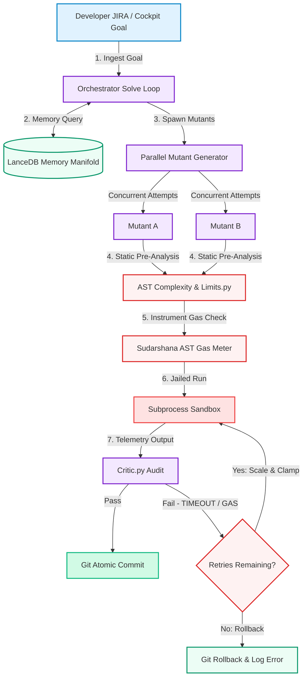

# Slide: User Journey & Workflow Diagram

## 1. Copy-Paste into the Gamma Content / Prompt Editor:

```markdown
How does a user interact with the solution?
* **Goal Input:** The developer inputs a task description, requirement, or JIRA ticket into the EMMA Cockpit.
* **Real-Time Cockpit Monitoring:** The developer monitors the agent's step-by-step thinking, code mutations, and terminal output in real-time.
* **Human-in-the-Loop (HITL) Gates:** If the agent reaches a safety threshold or needs permission to modify critical files, it pauses and prompts the user for approval.

How does information flow through the process?
1. **Ingest & Retrieve:** The Orchestrator ingests the user request and retrieves similar historical code patterns from the LanceDB memory manifold.
2. **Parallel Mutation:** The Executor generates three distinct code mutant proposals concurrent at different temperatures.
3. **AST Guard & Sandbox Execution:** The code is pre-analyzed for complexity, instrumented with AST gas counters, and executed inside a jailed subprocess sandbox.
4. **Adversarial Audit:** The Critic evaluates the terminal output, errors, and gas consumption to score the mutant.
5. **Commit/Rollback:** If the candidate passes all checks, it is committed to the workspace via Git. If it fails, the workspace is rolled back to the last stable state and the error is cached to guide the next iteration.

Where does the solution integrate with Redrob experiences?
* **Candidate Assessment Gate:** Integrates into Redrob's online programming challenge sandbox. EMMA's AST Gas Metering Shield runs candidate submissions safely, preventing candidate infinite loops or OOM hacks from crashing Redrob's host servers.
* **Agent Benchmarking Workspace:** Enables Redrob to offer next-generation "AI Agent Assessments," running benchmark tasks against coding agents and ranking them for enterprise hiring.
```

---

## 2. The Complete Workflow Diagram (Mermaid Flowchart):



---

## 3. Additional instructions for the Slide:

Format as a spacious two-column layout. On the left side, list the answers to the three questions ('User Interaction', 'Information Flow', and 'Redrob Integration') using clean typography. On the right side, place the rendered Workflow Diagram on a pure white background. Highlight 'EMMA', 'AST Gas Metering', and 'Redrob' in bold deep blue text.
