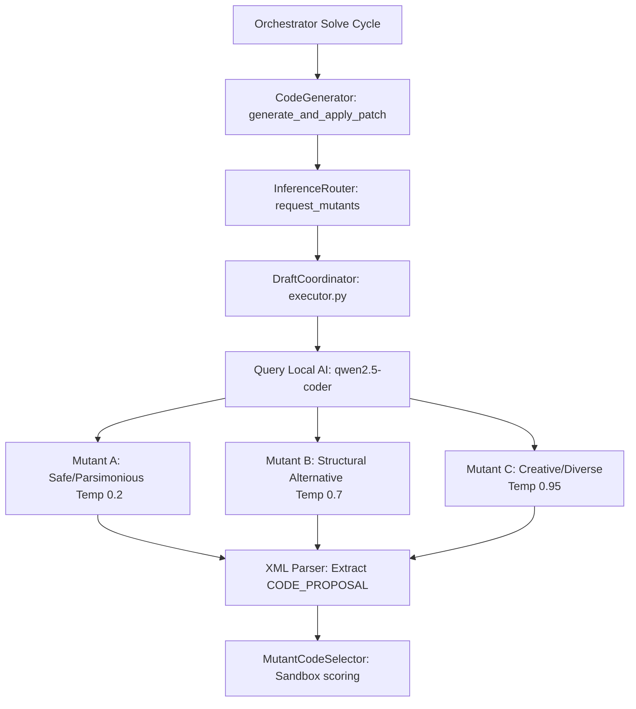

# 🌌 EMMA COGNITIVE CORE: MISSION ARCHITECTURE
## Task EMM-02-A2: The Local AI Bridge & Evolutionary Draft Coordinator

Welcome to the technical design and execution plan for **EMM-02-A2**. This document translates EMMA's high-level evolutionary mechanics into an actionable, premium implementation roadmap. It is saved directly in the project environment for reference.

---



---

## 🧭 1. Executive Summary (In Plain Terms)

Currently, EMMA is like a highly advanced robot operating in **"Simulation Mode."** When she wants to write or fix code, she uses predetermined test changes because she doesn't have a direct line of communication to a real, live-action AI brain.

**Task EMM-02-A2 is the bridge that connects EMMA to a real, local AI brain!**

Once implemented, EMMA will go from simulating her steps to querying a local model, parsing dynamic drafts, testing them inside a secure sandbox, and automatically applying the winning code directly to your project files.

---

## 🛰️ 2. Core Pillars of EMM-02-A2

### 🔌 Pillar 1: The Core Bridge (`backend/app/core/executor.py`)
We are constructing the **`DraftCoordinator`**. This module acts as the physical link between the local file system and the local LLM endpoint (`http://localhost:11434/v1`). It orchestrates concurrent inference requests using Python's standard `urllib.request` wrapped in non-blocking threads (`asyncio.to_thread`) to maintain a strict **zero-dependency** system constraint.

### 🧠 Pillar 2: The Evolutionary Brainstorm (Mutants A, B, & C)
Instead of relying on a single, deterministic response, EMMA utilizes evolutionary diversity. The coordinator generates exactly three alternative solutions in parallel, applying custom temperatures to force structural differences:
*   **Mutant A (The Safe Bet) [Temp `0.2`]:** Focused entirely on parsimonious, optimal, and hyper-direct logic. Minimizes token count and execution latency.
*   **Mutant B (The Structural Alternative) [Temp `0.7`]:** Introduces moderate structural divergence, alternative coding styles, or different algorithmic helpers.
*   **Mutant C (The Creative Explorer) [Temp `0.95`]:** A high-entropy draft allowing creative naming, out-of-the-box abstractions, or unique layout structures.

### 🛡️ Pillar 3: The XML Formatting Safeguard (`<CODE_PROPOSAL>`)
Local models are naturally conversational and often output unnecessary text block wrappers, explanations, and markdown snippets (e.g. ` ```python `) that result in Python `SyntaxError` failures during sandboxing. 
To eliminate this variance, we enforce strict XML parsing boundary tags:
```xml
<CODE_PROPOSAL>
# Clean Python code goes here
def solution(data):
    return [x * 2 for x in data]
</CODE_PROPOSAL>
```
The coordinator uses robust regular expressions to strip out conversational noise and peel away the XML shell, feeding 100% clean, parseable Python code directly to the sandbox.

---

## 🛠️ 3. Actionable Implementation Roadmap

### 📦 Phase 1: The Draft Coordinator Scaffolding
*   **Target File:** `backend/app/core/executor.py`
*   **Objective:** Write the `DraftCoordinator` class, integrating system prompts, the three-tier temperature pipeline, and XML block extraction logic.
*   **Safety Fallback:** Implement a seamless fallback to simulated mutants if the local LLM service is offline or unreachable, keeping test suites 100% green.

### 🔌 Phase 2: Inference Router Integration
*   **Target File:** `backend/app/core/inference_router.py`
*   **Objective:** Implement the `InferenceRouter` class containing `request_mutants()` to cleanly route requests from the `CodeGenerator` straight to the new `DraftCoordinator`.

### 🧪 Phase 3: Validation & Rigorous Testing
*   **Target File:** `backend/app/tests/test_advanced_core.py`
*   **Objective:** Implement comprehensive unit tests (`test_draft_coordinator`) verifying:
    *   XML content extraction with conversational preambles/postambles.
    *   Graceful fallback behavior under mock connectivity failures.
    *   System prompt formatting constraints.

---

## 🌌 4. Why This Upgrade is a Game Changer

By moving from hardcoded simulations to live model queries, we unlock the true power of **EMMA's Metacognitive Loop**. EMMA will be able to dynamically analyze actual file contexts, propose real solutions, and automatically heal real errors without human intervention.
