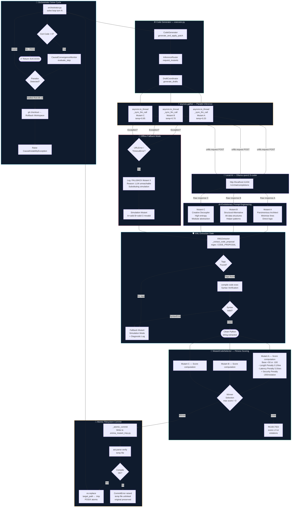

# 🌌 EMMA COGNITIVE CORE — MISSION ARCHITECTURE
## Task EMM-02-A2: The Local AI Bridge & Evolutionary Draft Coordinator
### Classification: Production-Grade Architectural Specification v2.0

---

## 🗺️ System Signal Flow — Upgraded Architecture Diagram



---

## 🧭 1. Executive Architecture Summary

### 1.1 Problem Statement

EMMA's current `code_generator.py` (Phase 1) contains a simulation harness
that generates syntactically trivial mutants A, B, and C from template
functions. This simulation is sufficient for pipeline validation but produces
zero creative or contextually relevant code. The simulation harness must be
replaced with a live inference bridge that issues parallel HTTP calls to a
locally-hosted `qwen2.5-coder` model via the OpenAI-compatible Ollama endpoint
at `http://localhost:11434/v1/chat/completions`.

The architectural challenge is threefold:

1. **Non-Blocking IO Constraint:** FastAPI's async event loop cannot be blocked
   by synchronous `urllib.request.urlopen` calls. All HTTP calls must be
   offloaded to worker threads via `asyncio.to_thread` and joined via
   `asyncio.gather`, preserving event loop throughput.

2. **Entropy Diversification Constraint:** A single LLM call at a single
   temperature produces one candidate. EMMA requires three *structurally
   distinct* candidates. Structural divergence is seeded by: (a) temperature
   coefficient variation, (b) distinct system prompt engineering that targets
   different cognitive axes (parsimony vs. structural creativity vs. modular
   decoupling), and (c) stateless parallel execution so the three requests
   have zero shared hidden state.

3. **Deterministic Extraction Constraint:** Local models (Ollama +
   `qwen2.5-coder`) emit conversational preambles, markdown code fences
   (` ```python `), and postamble explanations alongside the actual code.
   A single `SyntaxError` caused by non-code text will score `-100.0` in
   the `MutantCodeSelector` fitness gate, wasting a generation. XML boundary
   tags (`<CODE_PROPOSAL>`) enforced via system prompt + deterministic regex
   extraction eliminate this variance entirely.

---

## 🛰️ 2. Target File Specifications

### File 1: `backend/app/core/executor.py`

**Primary Class:** `DraftCoordinator`

**Responsibility:** End-to-end orchestration of parallel LLM inference, XML
response parsing, and offline fallback routing. This class has no knowledge
of the sandbox; it only produces a `List[str]` of clean Python code strings.

**Required Standard Library Imports:**
```python
import asyncio
import json
import re
import urllib.request
import urllib.error
from typing import List, Optional, Tuple, Dict, Any
```

> **Zero-Dependency Guardrail:** No third-party libraries permitted.
> Violation of this rule is a hard architectural failure.

---

### File 2: `backend/app/core/inference_router.py`

**Primary Class:** `InferenceRouter`

**Responsibility:** Thin routing adapter. Translates the `CodeGenerator`'s
call signature into `DraftCoordinator`'s interface. Decouples the code
generator from inference implementation details.

---

### File 3: `backend/app/tests/test_advanced_core.py`

**Responsibility:** Comprehensive unit test suite validating the XML parser,
fallback logic, and parallel concurrency structure. All LLM calls are mocked
via `unittest.mock.patch`.

---

## 🔩 3. Detailed Class Specification: `DraftCoordinator`

### 3.1 Constructor

```python
class DraftCoordinator:
    def __init__(
        self,
        llm_url:    str   = "http://localhost:11434/v1",
        model:      str   = "qwen2.5-coder",
        timeout:    float = 10.0,
        max_tokens: int   = 1024,
    ) -> None:
```

**Field Semantics:**

| Field | Type | Default | Description |
|---|---|---|---|
| `llm_url` | `str` | `http://localhost:11434/v1` | Base URL of the Ollama OpenAI-compat endpoint |
| `model` | `str` | `qwen2.5-coder` | Model identifier forwarded in the JSON body |
| `timeout` | `float` | `10.0` | Hard ceiling in seconds for `urllib.request.urlopen` |
| `max_tokens` | `int` | `1024` | `max_tokens` field in the LLM request body |

The constructor must compile the XML extraction regex at init time to avoid
re-compiling on every parse call:

```python
self._code_proposal_re: re.Pattern[str] = re.compile(
    r"<CODE_PROPOSAL>\s*(?:```python\s*)?(.*?)(?:\s*```)?\s*</CODE_PROPOSAL>",
    re.DOTALL | re.IGNORECASE,
)
```

---

### 3.2 System Prompt Engineering — Mutant Differentiation

Each of the three parallel requests carries a distinct **system-role
instruction** targeting a different cognitive axis of the model. The
user-role message is identical for all three — only the system prompt
and temperature differ.

#### Mutant A — The Parsimonious Architect (`temperature: 0.20`)

**Cognitive Axis:** Minimise token density. Maximise algorithmic directness.

```
SYSTEM PROMPT (Mutant A):
You are an elite Python software engineer optimising for parsimony.
Your ONLY output is a single Python function or class wrapped inside
<CODE_PROPOSAL> ... </CODE_PROPOSAL> XML tags.

RULES:
- Use the fewest lines possible. Prefer list comprehensions, generator
  expressions, and single-expression returns over multi-step assignments.
- Never write docstrings longer than one line.
- Never define helper variables unless strictly required for clarity.
- The code block must be syntactically complete and self-contained.
- Output NOTHING outside the <CODE_PROPOSAL> tags. No explanation.
  No preamble. No markdown.
```

**Temperature:** `0.2` — Low temperature enforces high-confidence, deterministic
token selection biased toward well-trained short patterns. Produces the most
compact and reliable draft.

---

#### Mutant B — The Structural Alternative (`temperature: 0.70`)

**Cognitive Axis:** Structural divergence. Alternative algorithmic decomposition.

```
SYSTEM PROMPT (Mutant B):
You are a senior Python architect who designs structurally diverse solutions.
Your ONLY output is a single Python function or class wrapped inside
<CODE_PROPOSAL> ... </CODE_PROPOSAL> XML tags.

RULES:
- Use a structurally different approach from the obvious solution.
  If a loop is typical, use a map/filter pipeline. If recursion is
  typical, use an iterative stack. If a dict is obvious, consider
  a named tuple or dataclass.
- You may define one private helper function inside the main function
  body if it improves structural clarity.
- Favour explicit, readable variable names over terse one-letter names.
- The code block must be syntactically complete and self-contained.
- Output NOTHING outside the <CODE_PROPOSAL> tags. No explanation.
```

**Temperature:** `0.7` — Mid-range temperature introduces sufficient
stochasticity to produce structural variation without departing into
incoherence. Most likely to surface non-obvious data structure choices.

---

#### Mutant C — The Creative Decoupler (`temperature: 0.95`)

**Cognitive Axis:** High-entropy modular abstraction. Maximum structural
distance from A and B.

```
SYSTEM PROMPT (Mutant C):
You are a creative Python engineer who approaches problems through radical
modular decomposition. Your ONLY output is a single Python function or class
wrapped inside <CODE_PROPOSAL> ... </CODE_PROPOSAL> XML tags.

RULES:
- Decompose the problem into the smallest possible logical units.
  Use inner classes, closures, or factory patterns if they produce
  a more composable interface.
- It is acceptable to be more verbose if it yields superior
  reusability or testability.
- Use descriptive, expressive naming conventions.
- The code block must be syntactically complete and self-contained.
- Output NOTHING outside the <CODE_PROPOSAL> tags. No explanation.
  No preamble. No markdown fences.
```

**Temperature:** `0.95` — High entropy. The model has wider token probability
distributions, producing the most semantically diverse output. The fitness
selector handles the outcome either way.

---

### 3.3 HTTP Request Construction — Zero-Dependency Implementation

```python
def _sync_llm_call(
    self,
    system_prompt: str,
    user_message:  str,
    temperature:   float,
) -> str:
    """
    Synchronous HTTP POST to the local LLM endpoint.
    Executed inside a worker thread via asyncio.to_thread.

    Returns the raw response text string from the model.
    Raises urllib.error.URLError on connection failure or timeout.
    Raises ValueError if the JSON response schema is unexpected.
    """
    endpoint = f"{self.llm_url.rstrip('/')}/chat/completions"

    payload: Dict[str, Any] = {
        "model":       self.model,
        "temperature": temperature,
        "max_tokens":  self.max_tokens,
        "stream":      False,
        "messages": [
            {"role": "system", "content": system_prompt},
            {"role": "user",   "content": user_message},
        ],
    }

    body = json.dumps(payload).encode("utf-8")

    req = urllib.request.Request(
        url     = endpoint,
        data    = body,
        headers = {
            "Content-Type": "application/json",
            "Accept":       "application/json",
        },
        method  = "POST",
    )

    with urllib.request.urlopen(req, timeout=self.timeout) as resp:
        raw = resp.read().decode("utf-8")

    data = json.loads(raw)

    try:
        return data["choices"][0]["message"]["content"]
    except (KeyError, IndexError) as exc:
        raise ValueError(
            f"Unexpected LLM response schema: {list(data.keys())}"
        ) from exc
```

**Critical notes:**
- `timeout=self.timeout` covers both TCP connect and full response read phases.
- `stream: False` ensures Ollama returns the full completion in a single JSON
  body rather than SSE chunks.
- All exceptions from `_sync_llm_call` (`URLError`, `ValueError`,
  `json.JSONDecodeError`) must be caught by the async wrapper, not
  propagate into `asyncio.gather`.

---

### 3.4 Parallel Async Dispatch — Non-Blocking IO Multiplexing

```python
async def generate_drafts(
    self,
    task:             str,
    target_signature: str = "",
    file_context:     str = "",
) -> List[str]:
    user_message = self._build_user_message(task, target_signature, file_context)

    tasks = [
        asyncio.to_thread(
            self._sync_llm_call,
            self._SYSTEM_PROMPTS[i],   # A=0, B=1, C=2
            user_message,
            self._TEMPERATURES[i],     # [0.20, 0.70, 0.95]
        )
        for i in range(3)
    ]

    # return_exceptions=True ensures a single failed call does NOT
    # cancel its siblings — partial results are still processed.
    raw_responses: List[str | BaseException] = await asyncio.gather(
        *tasks, return_exceptions=True
    )

    mutants: List[str] = []

    for i, result in enumerate(raw_responses):
        label = ("A", "B", "C")[i]

        if isinstance(result, BaseException):
            self._log_fallback(label, result)
            mutants.append(self._fallback_mutant(i, task, target_signature))
            continue

        extracted = self._extract_code_proposal(result)
        if extracted is None:
            self._log_extraction_failure(label, result[:200])
            mutants.append(self._fallback_mutant(i, task, target_signature))
            continue

        mutants.append(extracted)

    return mutants
```

**Why `return_exceptions=True` is mandatory:** With the default
`return_exceptions=False`, a single `URLError` cancels remaining futures
and discards valid responses from healthy slots. With `True`, exceptions
are captured as result values, allowing per-slot fallback substitution.

---

### 3.5 Deterministic XML Extraction Specification

#### 3.5.1 Regex Pattern

```python
_CODE_PROPOSAL_PATTERN = re.compile(
    r"<CODE_PROPOSAL>"        # Opening anchor tag
    r"\s*"                    # Optional whitespace / newlines after opening tag
    r"(?:```python\s*)?"      # Optional opening markdown fence (non-capturing)
    r"(.*?)"                  # Group 1: the actual code content (minimal match)
    r"(?:\s*```)?"            # Optional closing markdown fence (non-capturing)
    r"\s*"                    # Optional whitespace / newlines before closing tag
    r"</CODE_PROPOSAL>",      # Closing anchor tag
    re.DOTALL | re.IGNORECASE,
)
```

**Flags:**
- `re.DOTALL` — `.` matches `\n`, enabling multi-line code block capture.
- `re.IGNORECASE` — Tolerates minor model casing deviations.

#### 3.5.2 Extraction & Verification Pipeline

```python
def _extract_code_proposal(self, raw_response: str) -> Optional[str]:
    match = self._code_proposal_re.search(raw_response)
    if match is None:
        return None

    code = match.group(1).strip()
    if not code:
        return None

    # Bytecode viability gate
    try:
        compile(code, "<sandbox>", "exec")
    except SyntaxError:
        return None

    return code
```

#### 3.5.3 Adversarial Input Test Matrix

| Input Pattern | Expected Behaviour |
|---|---|
| Clean XML, no markdown | Extract raw body |
| XML + markdown fence | Strip fence; extract body |
| Preamble prose + XML | Ignore preamble; extract body |
| XML + postamble prose | Ignore postamble; extract body |
| Lowercase `<code_proposal>` tags | `IGNORECASE` handles; extract body |
| No tags at all | `match` is `None`; return `None`; trigger fallback |
| Tags present, empty body | `code` is `""` after strip; return `None` |
| Tags present, SyntaxError in body | `compile()` raises; return `None` |

---

### 3.6 User Message Construction

```python
def _build_user_message(
    self,
    task:             str,
    target_signature: str,
    file_context:     str,
) -> str:
    parts = [f"TASK: {task}"]

    if target_signature:
        parts.append(f"TARGET SIGNATURE: {target_signature}")

    if file_context:
        truncated = file_context[:2000]
        parts.append(
            f"ACTIVE FILE CONTEXT (truncated to 2000 chars):\n"
            f"```python\n{truncated}\n```"
        )

    parts.append(
        "Wrap your entire solution inside <CODE_PROPOSAL> and "
        "</CODE_PROPOSAL> tags. Output nothing else."
    )

    return "\n\n".join(parts)
```

---

### 3.7 Offline Fallback Specification

**Dual-mode detection triggers:**

1. **Per-slot:** A single `asyncio.to_thread` coroutine raises any exception.
   The fallback substitutes a simulation mutant for that slot only; healthy
   slots receive their real LLM output.

2. **Full fallback:** All three slots fail (e.g., service completely down).
   All three slots return simulation mutants.

**Required diagnostic log format on every fallback activation:**

```
[DraftCoordinator] FALLBACK: Mutant {label} — LLM unreachable.
  Reason: {exception_type}: {exception_message}
  Substituting simulation mutant.
```

**Fallback mutant contract:**
- Fallback A: syntactically valid
- Fallback B: syntactically valid
- Fallback C: intentionally invalid (exercises `-100` syntax rejection path)

---

## 🔌 4. Detailed Class Specification: `InferenceRouter`

**File:** `backend/app/core/inference_router.py`

```python
class InferenceRouter:
    """
    Thin routing adapter between CodeGenerator and DraftCoordinator.
    Callers never import DraftCoordinator directly.
    """

    def __init__(self, coordinator: Optional[DraftCoordinator] = None) -> None:
        from app.config import Settings
        self._coordinator = coordinator or DraftCoordinator(
            llm_url    = Settings.LOCAL_LLM_URL,
            model      = Settings.LOCAL_LLM_MODEL,
            timeout    = 10.0,
            max_tokens = 1024,
        )

    async def request_mutants(
        self,
        task:             str,
        target_signature: str = "",
        file_context:     str = "",
    ) -> List[str]:
        """Route a mutant generation request to the DraftCoordinator."""
        return await self._coordinator.generate_drafts(
            task             = task,
            target_signature = target_signature,
            file_context     = file_context,
        )
```

**Integration point in `CodeGenerator.generate_mutants`** — replace
the simulation block with:

```python
from app.core.inference_router import InferenceRouter

router = InferenceRouter()
return await router.request_mutants(
    task             = task,
    target_signature = target_signature,
    file_context     = self._read_file_safe(file_path),
)
```

---

## 🧪 5. Test Specification: `test_advanced_core.py`

### 5.1 `TestXMLExtractor`

| Test Method | Input | Expected Outcome |
|---|---|---|
| `test_clean_xml_extraction` | Clean `<CODE_PROPOSAL>def f(): pass</CODE_PROPOSAL>` | Returns `"def f(): pass"` |
| `test_strips_markdown_fence` | XML-wrapped code inside triple backticks | Strips fence; returns clean code |
| `test_ignores_preamble_text` | Prose before `<CODE_PROPOSAL>` | Preamble discarded; code extracted |
| `test_ignores_postamble_text` | Prose after `</CODE_PROPOSAL>` | Postamble discarded; code extracted |
| `test_no_tags_returns_none` | Raw LLM response with no XML tags | Returns `None` |
| `test_empty_body_returns_none` | `<CODE_PROPOSAL>  </CODE_PROPOSAL>` | Returns `None` after strip |
| `test_syntax_error_returns_none` | XML wrapping `def f( pass` | `compile()` fails; returns `None` |
| `test_lowercase_tags_accepted` | `<code_proposal>def f(): pass</code_proposal>` | `IGNORECASE`; returns code |

### 5.2 `TestDraftCoordinatorFallback`

| Test Method | Mock Setup | Expected Outcome |
|---|---|---|
| `test_full_fallback_on_connection_error` | All three `urlopen` calls raise `URLError` | Returns 3 simulation mutants; no exception |
| `test_partial_fallback_slot_c_fails` | A and B succeed; C raises `TimeoutError` | LLM output for A/B, fallback for C |
| `test_fallback_logs_diagnostic` | `URLError` raised on slot A | Log line emitted containing `"FALLBACK"` and `"Mutant A"` |
| `test_all_live_responses_parsed` | All three return valid XML-wrapped code | All three extracted; no fallback triggered |
| `test_invalid_xml_triggers_fallback` | LLM returns no `<CODE_PROPOSAL>` tags | Extraction fails; fallback substituted |

### 5.3 `TestParallelConcurrency`

| Test Method | Approach | Assertion |
|---|---|---|
| `test_three_threads_launched` | Mock `asyncio.to_thread`; inspect call count | Called exactly 3 times |
| `test_gather_used_not_sequential_await` | Mock `asyncio.gather` | Called once with 3 coroutine args |
| `test_timeout_does_not_block_siblings` | Slot A mocked to sleep 15s; B and C return immediately | Total wall time < 12s |

---

## 🌌 6. Configuration Reference

**File:** `backend/app/config.py`

```python
class Settings:
    LOCAL_LLM_URL:   str = "http://localhost:11434/v1"
    LOCAL_LLM_MODEL: str = "qwen2.5-coder"
```

Both values must be injectable as `DraftCoordinator` constructor arguments
to support unit testing without a running Ollama instance.

---

## 📐 7. Complexity & Performance Targets

| Metric | Target | Rationale |
|---|---|---|
| Total generation latency (live) | `< timeout + 200ms` | Bounded by slowest thread; parallelism eliminates sequential overhead |
| Total generation latency (fallback) | `< 5ms` | Pure in-memory simulation; no IO |
| XML extraction time per response | `< 0.1ms` | Pre-compiled regex; single `re.Pattern.search()` call |
| Memory overhead per call | `< 50KB` | Three JSON payloads + three response strings; no retained state |
| Fallback detection latency | `< timeout + 50ms` | `asyncio.gather(return_exceptions=True)` catches without delay |

---

## 🛡️ 8. Implementation Checklist

```
Phase 1: DraftCoordinator (executor.py)
  [ ] Constructor with compiled regex and constant tables
  [ ] _build_user_message() with 2000-char context truncation
  [ ] _sync_llm_call() with urllib.request, timeout, JSON parsing
  [ ] _extract_code_proposal() with regex + compile() verification
  [ ] generate_drafts() with asyncio.to_thread + asyncio.gather
  [ ] Per-slot exception handler + fallback substitution
  [ ] Diagnostic logging on every fallback activation
  [ ] Three simulation fallback mutants (A=valid, B=valid, C=invalid)

Phase 2: InferenceRouter (inference_router.py)
  [ ] __init__ with injectable DraftCoordinator
  [ ] request_mutants() routing wrapper
  [ ] CodeGenerator.generate_mutants() updated to use InferenceRouter

Phase 3: Test Suite (test_advanced_core.py)
  [ ] TestXMLExtractor: 8 adversarial extraction tests
  [ ] TestDraftCoordinatorFallback: 5 async fallback tests
  [ ] TestParallelConcurrency: 3 concurrency structure tests
  [ ] All tests pass with Ollama service OFFLINE (mocked)
  [ ] All tests pass with Ollama service ONLINE (integration)
```
