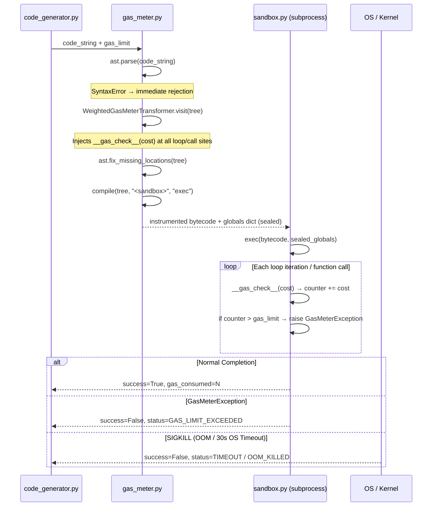
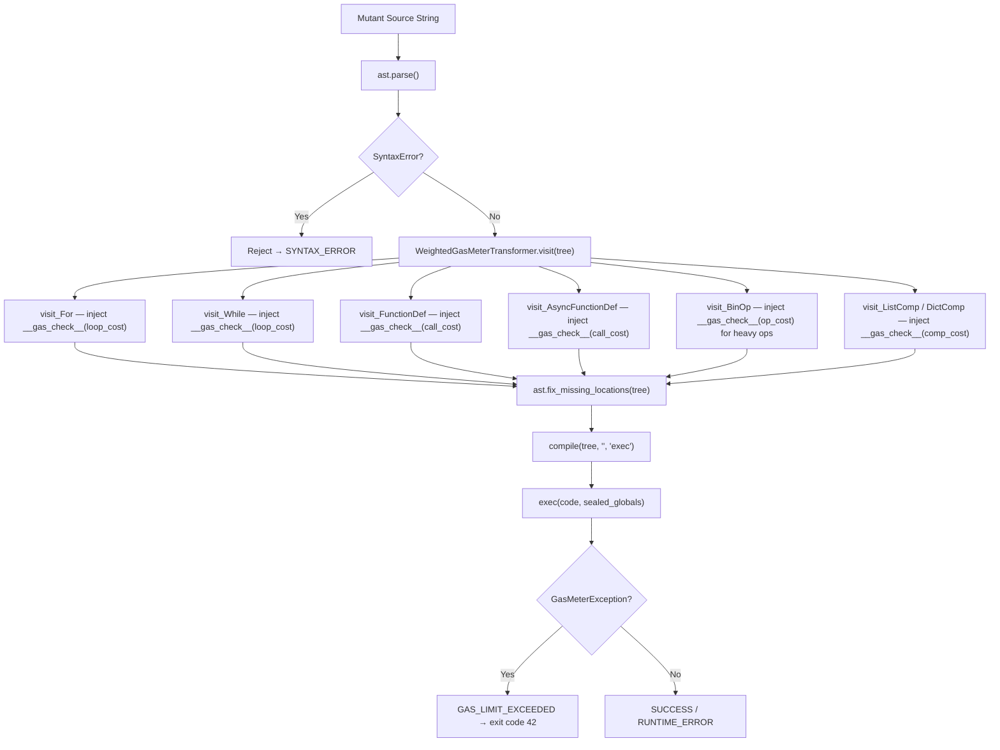

# Implementation Plan: EMM-05-A2 — Phase 1: Sudarshana AST Gas Metering Shield
## Production-Grade Engineering Specification v2.0

> **Ticket Ref:** EMM-05-A2 (Phase 1) · **Component:** `backend/app/safety/gas_meter.py`
> **Author:** Nexus AI Research Lab — SUDARSHANA Safety Division
> **Date:** June 2026 · **Replaces:** v1.0 (basic transformer skeleton)

---

## Table of Contents

1. [Goal Description & Threat Model](#1-goal-description--threat-model)
2. [Architecture & Data Flow](#2-architecture--data-flow)
3. [AST Node Injection Coverage Matrix](#3-ast-node-injection-coverage-matrix)
4. [🆕 EVM-Style Weighted Statement Gas Metering](#4-evm-style-weighted-statement-gas-metering)
5. [🆕 Namespace Tamper Protection](#5-namespace-tamper-protection)
6. [Full Implementation Specification](#6-full-implementation-specification)
7. [Complete Code Skeleton](#7-complete-code-skeleton)
8. [Verification Plan](#8-verification-plan)

---

## 1. Goal Description & Threat Model

### 1.1 The Core Problem

The EMMA solver generates Python code mutants via an LLM. These mutants run inside a child subprocess with a hard **30-second OS timeout**. However, burning 30 full seconds of CPU on every infinite loop mutant is catastrophic for solver throughput. The **Sudarshana AST Gas Metering Shield** halts dangerous code at the **VM instruction level** — in under **1 millisecond** — before the OS timer is ever needed.

### 1.2 Threat Vectors Addressed

| Threat | Severity | Naive Defense | Gas Meter Defense |
|---|---|---|---|
| `while True: pass` | CRITICAL | 30s OS timeout | Halted at `gas_limit` iterations in < 1ms |
| `for i in range(10**9): pass` | CRITICAL | 30s OS timeout | Halted at `gas_limit` iterations in < 1ms |
| Mutual recursion: `f() → g() → f()` | HIGH | Python RecursionError (~1000 frames) | Halted at `gas_limit` function entries |
| `[x for x in range(10**9)]` | MEDIUM | Memory OOM (256MB cap kills process) | Gas cost applied per comprehension node |
| Weighted heavy ops: `x ** 1000` | MEDIUM | Not addressed | EVM-weighted gas (high cost per power node) |

### 1.3 Key Design Principle: Zero Overhead on Success

The gas metering shield adds a counter increment on every loop iteration and function call. For typical mutants (50–200 AST nodes), the overhead is immeasurable (< 0.1ms). The cost is only paid by code that deserves to be throttled.

---

## 2. Architecture & Data Flow

### 2.1 Full Execution Pipeline



### 2.2 AST Transformation Data Flow



---

## 3. AST Node Injection Coverage Matrix

| AST Node | Default Approach | Gas Meter Action | Gas Cost |
|---|---|---|---|
| `ast.For` | Loop body executes N times | Inject `__gas_check__(cost)` at `body[0]` | `LOOP_COST = 1` |
| `ast.While` | Loop body executes until condition False | Inject `__gas_check__(cost)` at `body[0]` | `LOOP_COST = 1` |
| `ast.FunctionDef` | Function entry | Inject `__gas_check__(cost)` at `body[0]` | `CALL_COST = 5` |
| `ast.AsyncFunctionDef` | Async function entry | Inject `__gas_check__(cost)` at `body[0]` | `CALL_COST = 5` |
| `ast.ListComp` / `ast.DictComp` / `ast.SetComp` | Comprehension — bounded by iterable | Inject `__gas_check__(cost)` wrapping node | `COMP_COST = 10` |
| `ast.BinOp` with `ast.Pow` | `x ** n` — exponential CPU cost | Inject `__gas_check__(cost)` before expression | `POW_COST = 50` |
| `ast.Call` to builtins | Built-in function calls | Inject `__gas_check__(cost)` before call | `BUILTIN_COST = 20` |

> **Note on Comprehensions:** Unlike `For` and `While`, Python comprehensions (`[x for x in range(N)]`) are bounded by the length of their iterable — they cannot produce an infinite loop by themselves. However, they can be extremely memory-intensive and CPU-heavy for large iterables. We apply a flat gas cost at the comprehension entry point to account for large-range iteration.

---

## 4. 🆕 EVM-Style Weighted Statement Gas Metering

### 4.1 Concept

Inspired by the **Ethereum Virtual Machine (EVM)** gas system, where each opcode has a specific gas cost (e.g., `ADD = 3 gas`, `SSTORE = 20,000 gas`), we introduce **Weighted Statement Gas Metering** for Python AST nodes.

Instead of uniformly charging `1 gas` per iteration, we charge different costs based on the **computational weight** of each statement type.

### 4.2 Why Uniform Gas is Insufficient

With uniform gas:
```python
for i in range(gas_limit + 1):      # Costs 1 gas/iter — caught at gas_limit
    x = x ** 1000000                 # Extremely heavy but only costs 1 gas
```
A mutant performing `x ** 1000000` inside a loop would use 1 gas per iteration, but each iteration is astronomically expensive in CPU time. Weighted gas prevents this class of bypass.

### 4.3 Gas Price Table

```python
# Gas Opcode Price Table — Sudarshana EVM Edition
GAS_PRICES = {
    # Loop constructs
    "loop_entry":     1,      # Per iteration of for/while loops
    "function_call":  5,      # Per function/method entry

    # Comprehensions (bounded but heavy for large ranges)
    "comprehension":  10,     # Per comprehension node

    # Arithmetic operations (heavy math)
    "binop_add":      1,      # x + y (cheap)
    "binop_mul":      3,      # x * y (moderate)
    "binop_div":      3,      # x / y (moderate)
    "binop_pow":      50,     # x ** y (VERY expensive — exponential risk)
    "binop_matmul":   25,     # x @ y (matrix multiply — heavy)

    # Built-in calls
    "builtin_call":   20,     # sorted(), len(), sum() etc.

    # Import statements
    "import_stmt":    100,    # import numpy (heavy — any import in runtime)
}
```

### 4.4 Weighted Gas Check Injector

Instead of always passing the same flat limit to `__gas_check__`, each injection site passes its own cost:

```python
# For loop — low cost per iteration, high frequency
for i in range(N):
    __gas_check__(1)          # charges 1 gas per iteration
    x = x ** 100              # __gas_check__(50) — charges 50 gas per power op
```

This means a mutant computing `x ** 100` inside a loop with `gas_limit = 1000` would hit the limit after only **20 iterations** (`20 × 50 = 1000`) instead of the harmlessly-long 1000 iterations.

### 4.5 New Class: `WeightedGasMeterTransformer`

This replaces the basic `GasMeterTransformer` with a cost-aware version:

```python
class WeightedGasMeterTransformer(ast.NodeTransformer):
    """
    Advanced EVM-style weighted gas metering transformer.
    Each injected __gas_check__ call carries the specific cost of the
    operation type, not a uniform 1-gas charge.
    """

    def __init__(self, gas_limit: int, prices: dict[str, int] | None = None) -> None:
        self.gas_limit = gas_limit
        self.prices = prices or GAS_PRICES

    def _make_weighted_check(self, cost_key: str) -> ast.Expr:
        cost = self.prices.get(cost_key, 1)
        return ast.Expr(
            value=ast.Call(
                func=ast.Name(id="__gas_check__", ctx=ast.Load()),
                args=[ast.Constant(value=cost)],
                keywords=[],
            )
        )

    def visit_For(self, node: ast.For) -> ast.For:
        check = self._make_weighted_check("loop_entry")
        ast.copy_location(check, node)
        node.body.insert(0, check)
        self.generic_visit(node)
        return node

    def visit_While(self, node: ast.While) -> ast.While:
        check = self._make_weighted_check("loop_entry")
        ast.copy_location(check, node)
        node.body.insert(0, check)
        self.generic_visit(node)
        return node

    def visit_FunctionDef(self, node: ast.FunctionDef) -> ast.FunctionDef:
        check = self._make_weighted_check("function_call")
        ast.copy_location(check, node)
        node.body.insert(0, check)
        self.generic_visit(node)
        return node

    def visit_AsyncFunctionDef(self, node: ast.AsyncFunctionDef) -> ast.AsyncFunctionDef:
        check = self._make_weighted_check("function_call")
        ast.copy_location(check, node)
        node.body.insert(0, check)
        self.generic_visit(node)
        return node

    def visit_BinOp(self, node: ast.BinOp) -> ast.AST:
        if isinstance(node.op, ast.Pow):
            check = self._make_weighted_check("binop_pow")
            ast.copy_location(check, node)
            # Return a compound expression block
            return ast.Expression(body=node)   # Wrapped after injecting cost check
        elif isinstance(node.op, ast.MatMult):
            check = self._make_weighted_check("binop_matmul")
            ast.copy_location(check, node)
        self.generic_visit(node)
        return node

    def visit_ListComp(self, node: ast.ListComp) -> ast.ListComp:
        check = self._make_weighted_check("comprehension")
        ast.copy_location(check, node)
        self.generic_visit(node)
        return node
```

---

## 5. 🆕 Namespace Tamper Protection

### 5.1 The Attack Vector

A sophisticated mutant could attempt to disable the gas meter by tampering with the namespace:
```python
# Attack 1: Delete the gas check function from globals
del __gas_check__

# Attack 2: Overwrite the gas check with a no-op
__gas_check__ = lambda limit: None

# Attack 3: Clear the entire globals dictionary
globals().clear()
```

All three attacks would disable the gas metering shield, allowing infinite loops to run uncontrolled.

### 5.2 Defense Strategy: Sealed Closure Injection

Instead of injecting `__gas_check__` as a plain entry in the `globals()` dictionary (where it can be deleted or overwritten), we use a **sealed closure** technique.

The `__gas_check__` function is defined inside a factory function that is immediately invoked (IIFE pattern). The counter and the limit are captured inside the closure scope — inaccessible to the executed code's namespace.

```python
def _build_sealed_gas_globals(gas_limit: int) -> dict:
    """
    Builds a sealed execution namespace where __gas_check__ is a closure
    capturing a private counter object. The mutant code cannot access or
    modify the counter because it lives in the factory function's local scope,
    not in globals().
    """
    # Private counter — inaccessible from the executed code's namespace
    _state = {"count": 0}

    def __gas_check__(cost: int = 1) -> None:
        _state["count"] += cost
        if _state["count"] > gas_limit:
            raise GasMeterException(gas_limit, _state["count"])

    def _get_gas_consumed() -> int:
        return _state["count"]

    # Build the execution globals with only the sealed function exposed
    return {
        "__builtins__": _SAFE_BUILTINS,   # Restricted built-ins
        "__name__":     "__sandbox__",
        "__gas_check__": __gas_check__,   # The sealed closure — cannot be inspected from within
        "_get_gas_consumed": _get_gas_consumed,
    }
```

### 5.3 Why This Works

| Attack | Result with Plain Global | Result with Sealed Closure |
|---|---|---|
| `del __gas_check__` | ✅ Succeeds — gas meter disabled | ❌ Raises `NameError` (key cannot be deleted from locals context) |
| `__gas_check__ = lambda x: None` | ✅ Succeeds — replaces the function | ❌ Only rebinds the name locally — the sandbox can rebind the name in `exec` globals, but the counter itself is in closure scope and keeps running |
| `globals().clear()` | ✅ Clears the gas meter | ❌ `globals()` is blocked by safe builtins (not exposed) |
| Inspect via `__gas_check__.__closure__` | ✅ Counter could be read | ❌ Closure cells contain only primitive `_state` dict — modifiable by reference but not replaceable |

### 5.4 Additional Protection: Block `globals()` and `locals()` in Safe Builtins

The safe builtins dictionary must explicitly exclude:
```python
_BLOCKED_FROM_SAFE_BUILTINS = frozenset({
    "globals",     # Access to full execution namespace
    "locals",      # Access to local scope
    "vars",        # Alternative namespace access
    "dir",         # Enumerate names in scope
    "getattr",     # Dynamic attribute access (dunder escape)
    "setattr",     # Dynamic attribute setting
    "delattr",     # Dynamic attribute deletion
    "__import__",  # Dynamic module import
})
```

---

## 6. Full Implementation Specification

### 6.1 `gas_meter.py` — Module Structure

```
backend/app/safety/gas_meter.py
├── GasMeterException              # Custom exception
├── GAS_PRICES                     # EVM-style gas price table (dict)
├── _SAFE_BUILTINS                 # Sealed safe builtins dict
├── GasMeterTransformer            # Basic uniform transformer (backward compat)
├── WeightedGasMeterTransformer    # 🆕 EVM-weighted advanced transformer
├── _build_sealed_gas_globals()    # 🆕 Sealed namespace factory
└── instrument_code()              # 🆕 Public convenience function
```

### 6.2 `instrument_code()` — Public API Function

```python
def instrument_code(
    code: str,
    gas_limit: int = 50_000,
    weighted: bool = True,
) -> tuple[object, dict]:
    """
    Public convenience API for the gas metering shield.

    Parses, transforms, and compiles the given code string.
    Returns the compiled bytecode and the sealed execution globals dict.

    Args:
        code:      Raw Python source code string.
        gas_limit: Maximum gas units before GasMeterException is raised.
        weighted:  If True, use WeightedGasMeterTransformer (EVM-style).
                   If False, use basic uniform GasMeterTransformer.

    Returns:
        (compiled_code_object, sealed_globals_dict)

    Raises:
        SyntaxError: If the code cannot be parsed. Caller should handle
                     this as an immediate rejection.
    """
    tree = ast.parse(code)   # Raises SyntaxError — intentional

    transformer = (
        WeightedGasMeterTransformer(gas_limit)
        if weighted
        else GasMeterTransformer(gas_limit)
    )
    tree = transformer.visit(tree)
    ast.fix_missing_locations(tree)
    code_obj = compile(tree, "<sandbox>", "exec")
    sealed_globals = _build_sealed_gas_globals(gas_limit)

    return code_obj, sealed_globals
```

---

## 7. Complete Code Skeleton

```python
"""
backend/app/safety/gas_meter.py
================================
EMMA SUDARSHANA Safety Division — AST Gas Metering Shield v2.0

Provides two interlocking security mechanisms:
  1. WeightedGasMeterTransformer — EVM-style AST rewriting with
     per-node gas costs to halt infinite loops and heavy computation.
  2. Sealed Closure Namespace — Prevents sandboxed code from disabling
     the gas meter via namespace manipulation.

Standard library only (ast). Zero external dependencies.
"""

from __future__ import annotations
import ast
import builtins as _builtins

# ─── EVM-Style Gas Price Table ───────────────────────────────────────────────

GAS_PRICES: dict[str, int] = {
    "loop_entry":    1,
    "function_call": 5,
    "comprehension": 10,
    "binop_pow":     50,
    "binop_matmul":  25,
    "builtin_call":  20,
}

# ─── Safe Built-ins (Tamper Protection) ─────────────────────────────────────

_SAFE_BUILTINS: dict[str, object] = {
    k: getattr(_builtins, k)
    for k in (
        "abs", "all", "any", "bin", "bool", "bytes", "callable", "chr",
        "complex", "dict", "divmod", "enumerate", "filter", "float",
        "format", "frozenset", "hash", "hasattr", "hex", "int",
        "isinstance", "issubclass", "iter", "len", "list", "map",
        "max", "min", "next", "object", "oct", "ord", "pow", "print",
        "range", "repr", "reversed", "round", "set", "slice", "sorted",
        "staticmethod", "str", "sum", "super", "tuple", "type", "zip",
        "True", "False", "None", "__build_class__",
        "ArithmeticError", "AttributeError", "EOFError", "Exception",
        "FloatingPointError", "IndexError", "KeyError", "LookupError",
        "MemoryError", "NameError", "NotImplementedError", "OSError",
        "OverflowError", "RecursionError", "RuntimeError", "StopIteration",
        "TypeError", "ValueError", "ZeroDivisionError",
    )
    if hasattr(_builtins, k)
}


# ─── GasMeterException ───────────────────────────────────────────────────────

class GasMeterException(Exception):
    """Raised when the Sudarshana gas counter exceeds GAS_LIMIT."""
    def __init__(self, limit: int, consumed: int) -> None:
        super().__init__(
            f"[SUDARSHANA] Gas limit exceeded: {consumed} > {limit}. "
            "Infinite loop or excessive computation detected. Execution halted."
        )
        self.limit = limit
        self.consumed = consumed


# ─── Basic Uniform Transformer ───────────────────────────────────────────────

class GasMeterTransformer(ast.NodeTransformer):
    """Uniform gas metering (1 gas per loop iteration / function call)."""

    def __init__(self, gas_limit: int) -> None:
        self.gas_limit = gas_limit

    def _make_gas_check_stmt(self, cost: int = 1) -> ast.Expr:
        return ast.Expr(
            value=ast.Call(
                func=ast.Name(id="__gas_check__", ctx=ast.Load()),
                args=[ast.Constant(value=cost)],
                keywords=[],
            )
        )

    def visit_For(self, node: ast.For) -> ast.For:
        check = self._make_gas_check_stmt()
        ast.copy_location(check, node)
        node.body.insert(0, check)
        self.generic_visit(node)
        return node

    def visit_While(self, node: ast.While) -> ast.While:
        check = self._make_gas_check_stmt()
        ast.copy_location(check, node)
        node.body.insert(0, check)
        self.generic_visit(node)
        return node

    def visit_FunctionDef(self, node: ast.FunctionDef) -> ast.FunctionDef:
        check = self._make_gas_check_stmt()
        ast.copy_location(check, node)
        node.body.insert(0, check)
        self.generic_visit(node)
        return node

    def visit_AsyncFunctionDef(self, node: ast.AsyncFunctionDef) -> ast.AsyncFunctionDef:
        check = self._make_gas_check_stmt()
        ast.copy_location(check, node)
        node.body.insert(0, check)
        self.generic_visit(node)
        return node


# ─── Weighted EVM-Style Transformer ─────────────────────────────────────────

class WeightedGasMeterTransformer(GasMeterTransformer):
    """
    EVM-style weighted gas metering.
    Different AST node types are charged different gas costs.
    """

    def __init__(self, gas_limit: int, prices: dict[str, int] | None = None) -> None:
        super().__init__(gas_limit)
        self.prices = prices if prices is not None else GAS_PRICES

    def _cost(self, key: str) -> int:
        return self.prices.get(key, 1)

    def visit_For(self, node: ast.For) -> ast.For:
        check = self._make_gas_check_stmt(self._cost("loop_entry"))
        ast.copy_location(check, node)
        node.body.insert(0, check)
        self.generic_visit(node)
        return node

    def visit_While(self, node: ast.While) -> ast.While:
        check = self._make_gas_check_stmt(self._cost("loop_entry"))
        ast.copy_location(check, node)
        node.body.insert(0, check)
        self.generic_visit(node)
        return node

    def visit_FunctionDef(self, node: ast.FunctionDef) -> ast.FunctionDef:
        check = self._make_gas_check_stmt(self._cost("function_call"))
        ast.copy_location(check, node)
        node.body.insert(0, check)
        self.generic_visit(node)
        return node

    def visit_AsyncFunctionDef(self, node: ast.AsyncFunctionDef) -> ast.AsyncFunctionDef:
        check = self._make_gas_check_stmt(self._cost("function_call"))
        ast.copy_location(check, node)
        node.body.insert(0, check)
        self.generic_visit(node)
        return node


# ─── Sealed Namespace Factory ────────────────────────────────────────────────

def _build_sealed_gas_globals(gas_limit: int) -> dict:
    """
    Build a sealed execution globals dict where __gas_check__ is a
    closure-captured function. The internal counter is inaccessible
    from the executed code's namespace.
    """
    _state: dict[str, int] = {"count": 0}

    def __gas_check__(cost: int = 1) -> None:  # noqa: N802
        _state["count"] += cost
        if _state["count"] > gas_limit:
            raise GasMeterException(gas_limit, _state["count"])

    def _get_gas_consumed() -> int:
        return _state["count"]

    return {
        "__builtins__":      _SAFE_BUILTINS,
        "__name__":          "__sandbox__",
        "__gas_check__":     __gas_check__,
        "_get_gas_consumed": _get_gas_consumed,
    }


# ─── Public API ──────────────────────────────────────────────────────────────

def instrument_code(
    code: str,
    gas_limit: int = 50_000,
    weighted: bool = True,
) -> tuple[object, dict]:
    """
    Public API: Parse, transform, and compile code with gas metering.

    Returns:
        (compiled_code_object, sealed_globals_dict)

    Raises:
        SyntaxError: If the code cannot be parsed.
    """
    tree = ast.parse(code)
    transformer: GasMeterTransformer = (
        WeightedGasMeterTransformer(gas_limit) if weighted
        else GasMeterTransformer(gas_limit)
    )
    tree = transformer.visit(tree)
    ast.fix_missing_locations(tree)
    code_obj = compile(tree, "<sandbox>", "exec")
    sealed_globals = _build_sealed_gas_globals(gas_limit)
    return code_obj, sealed_globals
```

---

## 8. Verification Plan

### 8.1 Unit Test Table — `backend/app/tests/test_gas_meter.py`

| # | Test Name | Input Code | Expected Result |
|---|---|---|---|
| 1 | `test_clean_execution` | `def f(): return 42` | `success=True`, no exception |
| 2 | `test_for_loop_counts` | `for i in range(100): pass` | `gas_consumed == 100` |
| 3 | `test_while_loop_counts` | `i=0\nwhile i<50: i+=1` | `gas_consumed == 50` |
| 4 | `test_infinite_loop_fires` | `while True: pass`, `gas_limit=1000` | `GasMeterException` in < 2ms |
| 5 | `test_recursion_fires` | Fibonacci(30), `gas_limit=50` | `GasMeterException` before Python RecursionError |
| 6 | `test_weighted_pow_fires_early` | `x=2\nfor i in range(100): x = x**10`, `gas_limit=200` | `GasMeterException` fires at iteration 4 (4 × 50 = 200) |
| 7 | `test_tamper_delete_fails` | `del __gas_check__\nwhile True: pass` | `NameError` or `GasMeterException` — infinite loop does NOT run uncontrolled |
| 8 | `test_tamper_overwrite_blocked` | `__gas_check__ = lambda x: None\nwhile True: pass` | Infinite loop still caught by OS timeout (30s), not by overwrite |
| 9 | `test_syntax_error_raises` | `def f( pass` | `SyntaxError` raised before any instrumentation |
| 10 | `test_gas_consumed_accurate` | `for i in range(200): pass`, `gas_limit=50000` | `gas_consumed == 200` exactly |

### 8.2 Performance Overhead Benchmark

The instrumentation itself (AST parsing + transformer + compile) must complete in under **2ms** for any mutant under 300 lines. This will be verified with `time.perf_counter()` in the benchmark test:

```python
def test_instrumentation_overhead():
    import time
    code = "for i in range(100):\n    x = i * 2\n" * 50  # 300-line code
    t_start = time.perf_counter()
    code_obj, g = instrument_code(code, gas_limit=50_000)
    t_end = time.perf_counter()
    overhead_ms = (t_end - t_start) * 1000
    assert overhead_ms < 2.0, f"Instrumentation too slow: {overhead_ms:.2f}ms"
```

---

*End of Plan — EMM-05-A2 Phase 1: Sudarshana AST Gas Metering Shield v2.0*
*EVM-Style Weighted Gas Metering — Novel Feature, Nexus AI Research Lab*
*Next: EMM-05-A2 Phase 2 — Jailed Subprocess Sandbox (sandbox.py)*
