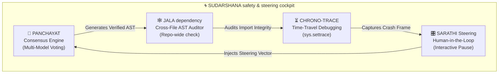

# Technical Implementation Plan: EMM-05-A2 — SUDARSHANA Next-Gen Safety & Resiliency Architecture
> **Ticket:** EMM-05-A2 · **Priority:** P1 · **Sprint:** 05  
> **Predecessor:** EMM-05-A1 (run_real_solver.py Masterclass — ✅ Complete)

---

## 🌌 SUDARSHANA — Next-Gen Cognitive Safety & Resiliency Architecture
## Task EMM-05-A2: Advanced Agent Auditing, Steering, and Consensus
### Classification: Metacognitive Systems Architecture Expansion v1.0

> *"A charioteer does not replace the warrior; he steers the chariot through the chaos of battle. EMMA acts as the warrior, and SUDARSHANA acts as the steering guide, the tracing eye, and the council of elders."*
> — Sudarshana System Axiom, Nexus AI Research Lab

---

## 📋 Table of Contents
1. [Executive Summary](#1-executive-summary)
2. [The Four Sudarshana Pillars](#2-the-four-sudarshana-pillars)
3. [Component Directory Mapping](#3-component-directory-mapping)
4. [Detailed Feature Architecture](#4-detailed-feature-architecture)
   - [Pillar 1: PANCHAYAT Consensus Protocol (Multi-Model Voting)](#pillar-1-panchayat-consensus-protocol-multi-model-voting)
   - [Pillar 2: SUDARSHANA Chrono-Trace (Time-Travel Debugging)](#pillar-2-sudarshana-chrono-trace-time-travel-debugging)
   - [Pillar 3: JALA Dependency Mesh (Cross-File AST Auditor)](#pillar-3-jala-dependency-mesh-cross-file-ast-auditor)
   - [Pillar 4: SARATHI Steering Command (Human-in-the-Loop Cockpit)](#pillar-4-sarathi-steering-command-human-in-the-loop-cockpit)
5. [Implementation Roadmap](#5-implementation-roadmap)

---

## 1. Executive Summary

This architecture expansion plan details the next-generation safety and resiliency features for the **EMMA Cognitive Engine**. Codenamed **SUDARSHANA** (meaning the "all-seeing, self-correcting vision"), this plan establishes four cutting-edge cognitive systems that prevent solver drift, ensure code validity, verify runtime traces, and leverage collaborative multi-agent voting.

These features build directly into EMMA’s existing modular pipeline, ensuring that the codebase remains highly professional, resilient, and ready to stand out during the **INDIA RUN Hackathon**.

---

## 2. The Four Sudarshana Pillars



---

## 3. Component Directory Mapping

To maintain the Single Responsibility Principle, these features are cleanly integrated into the existing file tree without creating redundant file clutter:

| Feature Name | Naming (Code Word) | Target File Path | Purpose |
| :--- | :--- | :--- | :--- |
| **Multi-Model Consensus Engine** | **PANCHAYAT** | [draft_coordinator.py](file:///e:/EMMA_INDIA_RUN/EMMA_hack2skill/backend/app/core/draft_coordinator.py) | Queries multiple local models parallelly and evaluates syntax trees for voting. |
| **Time-Travel Debugging** | **CHRONO-TRACE** | [execution_tracer.py](file:///e:/EMMA_INDIA_RUN/EMMA_hack2skill/backend/app/utils/execution_tracer.py) *(NEW)* | Captures variable frame history and traces memory states right before test failure. |
| **Cross-File AST Auditor** | **JALA** | [bytecode_auditor.py](file:///e:/EMMA_INDIA_RUN/EMMA_hack2skill/backend/app/safety/bytecode_auditor.py) | Builds a static import graph across files to check for downstream breaking changes. |
| **Human-in-the-Loop Steering** | **SARATHI** | [terminal_dashboard.py](file:///e:/EMMA_INDIA_RUN/EMMA_hack2skill/backend/app/utils/terminal_dashboard.py) + [run_real_solver.py](file:///e:/EMMA_INDIA_RUN/EMMA_hack2skill/backend/app/run_real_solver.py) | Halts execution when loops drift or fail, asking the developer for steering cues. |

---

## 4. Detailed Feature Architecture

### Pillar 1: PANCHAYAT Consensus Protocol (Multi-Model Voting)
*   **Implementation Location:** `backend/app/core/draft_coordinator.py`
*   **Architecture:**
    Instead of calling one model at different temperatures, `DraftCoordinator` fires parallel asynchronous tasks using `asyncio.gather` targeting different models running on the local host (e.g., Llama-3, Qwen-2.5, Phi-3).
    
    ```python
    async def gather_consensus_drafts(self, prompt: str) -> str:
        tasks = [
            self.query_model("llama3", prompt),
            self.query_model("qwen2.5", prompt),
            self.query_model("phi3", prompt)
        ]
        drafts = await asyncio.gather(*tasks)
        return self.resolve_ast_consensus(drafts)
    ```
*   **Consensus Algorithm:**
    The system parses each draft into an AST tree and compares their node sequences. The draft that represents the closest AST consensus (structural majority) is selected, filtering out anomalous, model-specific code hallucination patterns.

---

### Pillar 2: SUDARSHANA Chrono-Trace (Time-Travel Debugging)
*   **Implementation Location:** `backend/app/utils/execution_tracer.py` [NEW]
*   **Architecture:**
    A execution tracer that wraps test running commands. It registers a custom execution frame hook (`sys.settrace`) that monitors code execution line-by-line:
    
    ```python
    class ChronoTracer:
        def __init__(self):
            self.frame_history = collections.deque(maxlen=100) # Ring buffer of executions
            
        def trace_hook(self, frame, event, arg):
            if event == "line":
                # Capture variables and line state
                self.frame_history.append({
                    "line": frame.f_lineno,
                    "locals": dict(frame.f_locals)
                })
            return self.trace_hook
    ```
*   **Output:** 
    Upon exception or test crash, it writes the last 5 frames to the terminal log, showing exactly what local variables (e.g., `x = 0` causing a `ZeroDivisionError`) were active right before failure.

---

### Pillar 3: JALA Dependency Mesh (Cross-File AST Auditor)
*   **Implementation Location:** `backend/app/safety/bytecode_auditor.py`
*   **Architecture:**
    Uses the `ast` module to scan the entire workspace and map which files import which modules.
    When a mutant code block modifies a target file (e.g., changing a function signature in a helper file), the dependency mesh computes downstream impact nodes.
    
    ```
          [Edited Node: utils.py] 
                   │
         ┌─────────┴─────────┐
         ▼                   ▼
    [router.py]     [terminal_dashboard.py]
         │                   │
         └─────────┬─────────┘
                   ▼
         [run_real_solver.py] (Verify downstream)
    ```
    If downstream files are affected, they are automatically queued into the validation test harness to verify imports didn't break.

---

### Pillar 4: SARATHI Steering Command (Human-in-the-Loop Cockpit)
*   **Implementation Location:** Intersecting `terminal_dashboard.py` and `run_real_solver.py`
*   **Architecture:**
    If the solver loop exceeds a drift threshold (indicated by the `Sankat Mochan` cosine metrics) or fails tests multiple times consecutively, the execution loop is placed into a `WAIT_STEER` state.
    
    *   **Dashboard Trigger:** The dashboard switches to a warning alert border.
    *   **Prompt Interrupt:** A safe prompt opens: `[SARATHI COCKPIT]: Steering guidance required. Enter hint to rescue agent loop:`
    *   **LLM Injection:** The user's input (e.g., *"Make sure to import json first"*) is appended directly into the LLM system prompt for the next turn, and the execution resumes.

---

## 5. Implementation Roadmap

1.  **Phase A — PANCHAYAT Consensus:** Update `draft_coordinator.py` to route parallel requests to multiple model configurations.
2.  **Phase B — CHRONO-TRACE Tracer:** Build the new `execution_tracer.py` utility and integrate it with the test execution shell.
3.  **Phase C — JALA Graphing:** Implement repo-wide static import mapping in `bytecode_auditor.py`.
4.  **Phase D — SARATHI Cockpit:** Build the input capture loops in `terminal_dashboard.py` and link them to the solver loop.

---
*End of Implementation Plan — EMM-05-A2 v1.0*  
*Next: EMM-05-A3 — Sudarshana Live Dashboard Panel Integration & Sandbox Dry-Runs*
