# 🔱 NEXUS LAB AI — Complete Technical Documentation

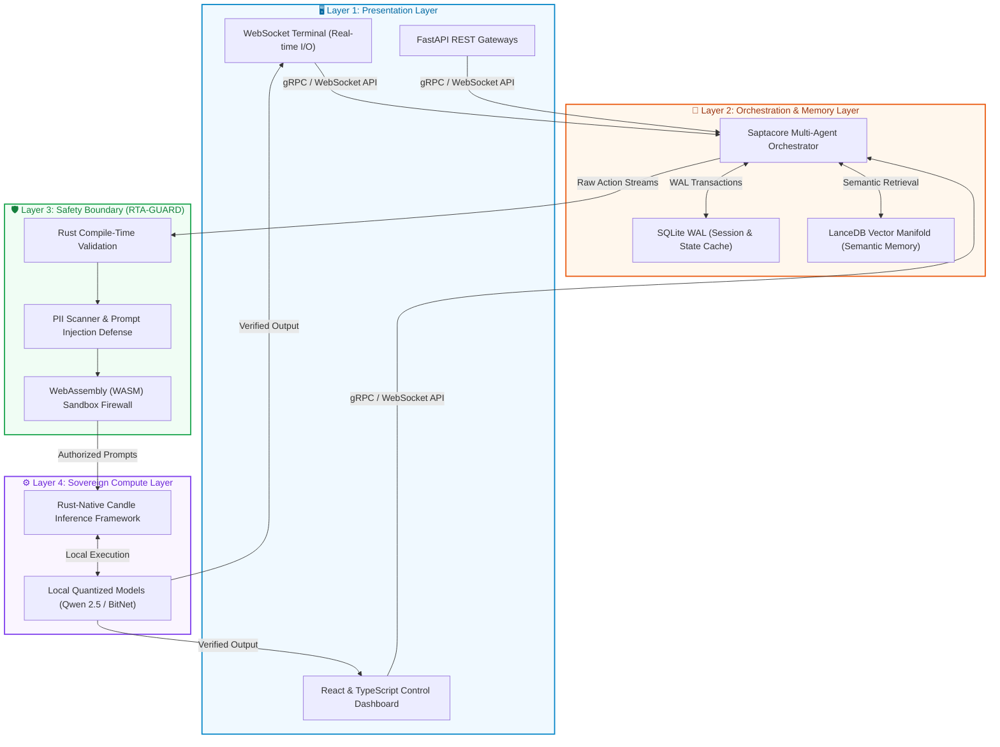

> *"Memory is not storage. Memory is identity woven into the fabric of inference."*
> — ANJANEYA Memory Protocol, Core Axiom

> *"Engineering the Soul of AI."*
> — Nexus Lab AI, Tagline

**Nexus AI Research Lab | Bengaluru, India**
**Authored by Sourav (Sourav Ray) | v1.0 | 2026**
**Classification: Public Technical Reference**

---

## Table of Contents

1. [Executive Overview](#1-executive-overview)
2. [The Philosophy — Roots Before Fruits](#2-the-philosophy--roots-before-fruits)
3. [The Nexus Lab AI Ecosystem Map](#3-the-nexus-lab-ai-ecosystem-map)
4. [Project I — ANJANEYA Memory Protocol (AMP)](#4-project-i--anjaneya-memory-protocol-amp)
5. [Project II — SAPTACORE (Seven-Fold Cognitive Kernel)](#5-project-ii--saptacore-seven-fold-cognitive-kernel)
6. [Project III — RTA-GUARD (Sovereign Safety Kernel)](#6-project-iii--rta-guard-sovereign-safety-kernel)
7. [Project IV — AGENTARIUM (Quantum-Enhanced Agent Ecosystem)](#7-project-iv--agentarium-quantum-enhanced-agent-ecosystem)
8. [Project V — NEXUS-LLM (Custom Model Training Pipeline)](#8-project-v--nexus-llm-custom-model-training-pipeline)
9. [Project VI — APEX 2.0 (Sovereign AI Infrastructure)](#9-project-vi--apex-20-sovereign-ai-infrastructure)
10. [Project VII — EMMA (Autonomous Multi-Model Agent)](#10-project-vii--emma-autonomous-multi-model-agent)
11. [Project VIII — The Retro Causal Solver](#11-project-viii--the-retro-causal-solver)
12. [The Liquid LoRA Framework (Liquid Brain)](#12-the-liquid-lora-framework-liquid-brain)
13. [The Three-Layer Nervous System](#13-the-three-layer-nervous-system)
14. [How We Work — The Nexus Lab Methodology](#14-how-we-work--the-nexus-lab-methodology)
15. [The Technology Stack](#15-the-technology-stack)
16. [Mathematical Foundations](#16-mathematical-foundations)
17. [Roadmap](#17-roadmap)
18. [Glossary](#18-glossary)

---

## 1. Executive Overview

**Nexus Lab AI** is an independent, sovereign artificial intelligence research laboratory based in Bengaluru, India. It operates at the intersection of **ancient epistemological systems** (Vedic philosophy, Sanskrit grammar, Indian logic) and **cutting-edge AI engineering** (Rust systems programming, local LLM inference, multi-agent orchestration, and quantum-inspired algorithms).

Nexus Lab AI is **not** a commercial chatbot startup. It is a **Cognitive Observatory** — a facility that designs, builds, and validates self-evolving, offline-first, anti-fragile AI systems that operate with **complete data sovereignty**, zero cloud dependency, and mathematically verifiable safety constraints.

### Key Distinguishing Principles

| Dimension | Generic AI Company | Nexus Lab AI |
|---|---|---|
| **Data** | Cloud-dependent, US servers | 100% Air-gapped, Local Sovereign |
| **Safety** | Prompt-level guardrails | Compile-time Rust invariants + Sanskrit epistemology |
| **Memory** | Simple vector database | 5-Pillar ANJANEYA living memory fabric |
| **Agents** | Single LLM wrapper | 7-Fold Saptarishi Council (distributed cognition) |
| **Learning** | Static fine-tuned weights | Liquid LoRA — living, thermodynamic neural tissue |
| **Philosophy** | Silicon Valley hype | Ṛta (Cosmic Order) + Cockroach Anti-Fragility |
| **Mission** | Product MVP → VC exit | Epoch-scale sovereign intelligence infrastructure |

---

## 2. The Philosophy — Roots Before Fruits

Nexus Lab AI is governed by three philosophical pillars that directly map to engineering decisions:

### 2.1 The Cockroach Philosophy (Anti-Fragility)

Every system must survive catastrophic failure. If the internet disappears, if cloud APIs go offline, if hardware fails — the intelligence must survive and continue reasoning. Like a cockroach that survives nuclear conditions, Nexus Lab systems are built with **radical redundancy, local execution, and erasure coding**.

### 2.2 Ṛta — Cosmic Order as Invariant Law

In Vedic cosmology, **Ṛta** (ऋत) is the universal principle of dynamic order — the law governing the cosmos. In Nexus Lab engineering, Ṛta maps directly to **compile-time constraints in Rust**, **formal safety invariants in RTA-GUARD**, and **mathematical bounds on agent behavior** that cannot be violated at runtime.

### 2.3 Rigveda × Saptarishi — Distributed Cognition

The ancient model of the **Saptarishi Council** (seven specialized sage-scientists co-authoring reality models) directly inspires SAPTACORE's seven specialized agent modules. Knowledge is not singular. It is a consensus of specialized, resilient, independent minds.

---

## 3. The Nexus Lab AI Ecosystem Map

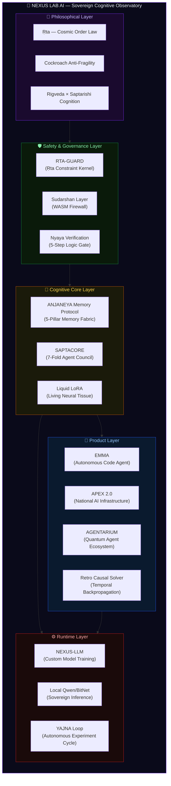

---

## 4. Project I — ANJANEYA Memory Protocol (AMP)

**ANJANEYA** stands for: **A**daptive **N**euro-**J**unctional **A**utonomous **N**eural **E**ternal **Y**ielding **A**rchitecture.

This is the flagship cognitive memory system of Nexus Lab AI. It governs how AI agents form, retain, protect, and recall memories — treating memory not as a lookup table but as a **living identity substrate**.

> *"Memory is not storage. Memory is identity woven into the fabric of inference."*

### AMP Architecture Overview

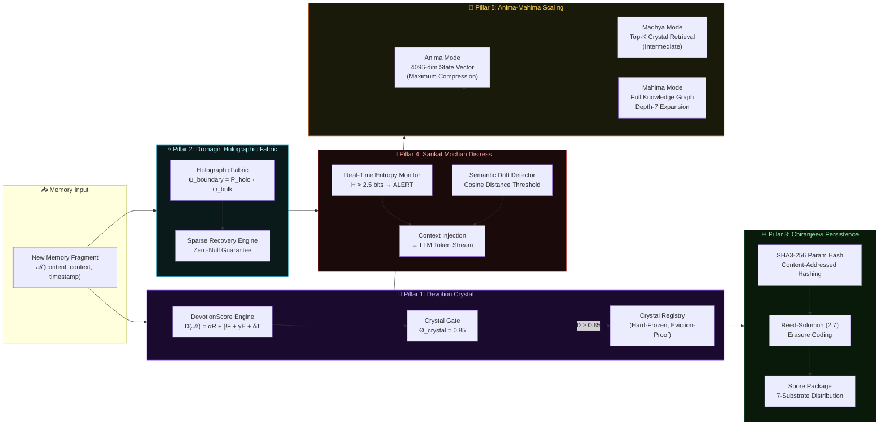

### The Five Pillars — Technical Specifications

#### Pillar 1: Devotion Crystal (Identity Gating)

**Purpose:** Mathematically score incoming memories and permanently crystallize the most important ones.

```
DevotionScore D(ℳ) = αR + βF + γE + δT

Where:
  R = Recency Score    (exponential decay from timestamp)
  F = Frequency Score  (access pattern log scaling)
  E = Entropy/Emotion  (information density measurement)
  T = Task Priority    (agent goal alignment weight)

Crystallization Gate: D(ℳ) ≥ Θ_crystal = 0.85
```

**Implementation:** Rust crate `crates/devotion-crystal/` with SHA3-256 content addressing, a Crystal Queue with hard-freeze mechanism, and a Crystal Registry backed by Chiranjeevi persistence.

#### Pillar 2: Dronagiri (Holographic Fallback Fabric)

**Purpose:** Guarantee zero-null retrieval even under severely degraded query signals.

```
Holographic Encoding:
  ψ_boundary = P_holo · ψ_bulk
  S_holo = A / (4·ln(2))

Reconstructs 256-dimensional bulk memory from 16-dimensional
boundary representation → 15x compression with lossless reconstruction.
```

**Implementation:** Python module `python/dronagiri/` using NumPy sparse recovery and holographic matrix construction.

#### Pillar 3: Chiranjeevi (Cryptographic Immortality)

**Purpose:** Ensure sovereign memory survives permanent catastrophic infrastructure loss.

```
Spore Distribution:
  Hash(content) → SHA3-256 → content-addressed Spore ID
  Erasure Code: (2,7) Reed-Solomon
    → 2 shards sufficient for 100% reconstruction
    → 7 substrates: NVMe (RocksDB), S3/GCS, Blockchain,
                    Kademlia DHT, Crystal Mirror,
                    Holographic Echo, Cold zstd Archive

Survival Guarantee: Full resurrection from 1% substrate survival
```

#### Pillar 4: Sankat Mochan (Real-Time Distress Interception)

**Purpose:** Hook directly into the LLM generation stream and intercept cognitive emergencies.

```
Distress Triggers:
  1. Token Entropy:    H(tokens) > 2.5 bits  → DISTRESS
  2. Semantic Drift:   cosine(ψ_t, ψ_t-1) < 0.3 → DRIFT
  3. Contradiction:    Logic validator flags → CONFLICT
  4. Loop Detection:   n-gram repetition > threshold → LOOP

Response: Inject targeted memory context directly into
          the active generation stream to restore alignment.
```

#### Pillar 5: Anima-Mahima (Adaptive Depth Scaling)

**Purpose:** Dynamically scale memory depth based on available context window budget.

```
Mode Selection:
  ANIMA  (Compressed):  Token budget < 2000 → single 4096-dim state vector
  MADHYA (Intermediate): Token budget < 6000 → Top-K crystal retrieval
  MAHIMA (Full):         Token budget ≥ 6000 → full knowledge graph, depth=7
```

---

## 5. Project II — SAPTACORE (Seven-Fold Cognitive Kernel)

**SAPTACORE** is the seven-fold distributed cognition kernel — a multi-agent epistemic engine inspired by the **Saptarishi Council** (the seven cosmic seer-scientists of ancient India), mapped to the **ten Mandalas of the Rigveda**.

### The SAPTACORE Council Architecture

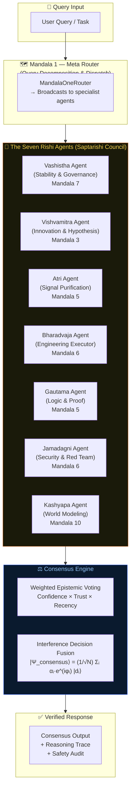

### The Ten Cognitive Modules (Rigveda Mapping)

| Mandala | Rishi Agent | Function | Rust Trait |
|---|---|---|---|
| 1 | Meta-Router | Query decomposition & dispatch | `MandalaOneRouter` |
| 2 | Action Planner | Execution flow & resource allocation | `MandalaTwoPlanner` |
| 3 | Illumination Engine | Hypothesis synthesis & creative insight | `MandalaThreeInsight` |
| 4 | Ontology Builder | World models & causal graphs | `MandalaFourOntology` |
| 5 | Harmony Coordinator | Multi-agent cooperation & consensus | `MandalaFiveCoordinator` |
| 6 | Engineering Executor | Code generation & pipeline compilation | `MandalaSixExecutor` |
| 7 | Governance Guard | Policy validation & stability monitoring | `MandalaSevenGovernor` |
| 8 | Exploratory Sandbox | Simulation & experimental hypothesis testing | `MandalaEightSandbox` |
| 9 | Perception Analyzer | Signal processing & real-time embeddings | `MandalaNineSignal` |
| 10 | First-Principles Engine | Long-horizon reasoning & world modeling | `MandalaTenTheory` |

### SAPTACORE Rust Monorepo Layout

```
nexus_lab/
├── crates/
│   ├── amp-core/           # Unified AMPMemoryFabric orchestration
│   ├── chiranjeevi/        # Cryptographic immortality (SHA3-256 + Reed-Solomon)
│   ├── devotion-crystal/   # Devotion scoring + crystal registry
│   └── anima-mahima/       # Adaptive scaling controller
├── python/
│   ├── dronagiri/          # Holographic compression (NumPy)
│   ├── sankat-mochan/      # Distress detection (token stream hooks)
│   └── amp-integrations/   # Ollama, Groq, Sarvam AI adapters
└── dashboard/              # React + TypeScript control plane UI
    ├── CrystalRegistry/    # Live Devotion Crystal visualization
    ├── HolographicView/    # 3D force-graph of holographic fabric
    └── SankatMochanFeed/   # Live distress signal monitoring
```

---

## 6. Project III — RTA-GUARD (Sovereign Safety Kernel)

**RTA-GUARD** is a production-grade, Rust-native AI governance and safety enforcement layer. The name derives from **Ṛta** (ऋत) — the Vedic principle of cosmic order and invariant natural law.

### The Safety Architecture

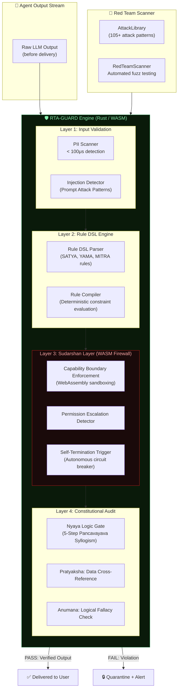

### The 13 Deterministic Safety Rules

```
SATYA    → Truth invariant: No unverified factual claims
YAMA     → Harm boundaries: No action causing human harm
MITRA    → Partnership trust: No deception of the human
VARUNA   → Cosmic order: No system-level constraint violations
INDRA    → Force boundaries: No unauthorized tool execution
AGNI     → Transformation gate: No irreversible action without confirmation
SOMA     → Consciousness guard: No manipulation of human cognition
MARUT    → Storm response: Emergency self-isolation trigger
ASHVIN   → Healing protocol: Auto-recovery from failure states
BRIHASPATI → Wisdom check: Ensure epistemic humility in uncertainty
VISHVAKARMA → Engineering constraints: Code execution safety
TVASHTAR → Form integrity: Output format compliance enforcement
PUSHAN   → Path safety: No unauthorized network or file access
```

### RTA-GUARD Capabilities

```
Performance Targets:
  Latency:       < 1ms end-to-end guard evaluation
  PII Detection: < 100μs (Rust regex engine)
  WASM Overhead: < 50μs (WebAssembly firewall boundary)

Security Coverage:
  ✓ Prompt injection defense (105+ attack patterns)
  ✓ PII detection (SSN, Aadhaar, credit cards, emails)
  ✓ Secret/API key credential leak prevention
  ✓ Permission escalation detection
  ✓ Tool call sandboxing with argument validation
  ✓ Quantum-resistant cryptography (ML-KEM / ML-DSA)
```

---

## 7. Project IV — AGENTARIUM (Quantum-Enhanced Agent Ecosystem)

**AGENTARIUM** is a research framework that implements ten quantum-mechanical principles directly into multi-agent cognitive architectures — enabling massive computation speedups, zero-null memory resilience, and instant zero-latency agent coordination.

### The 10 Quantum Innovation Modules

```mermaid
graph LR
    subgraph QCore["⚛️ quantum_core/ — The 10 Innovation Modules"]
        direction TB
        Q1["1. Holographic Memory\nψ_boundary = P_holo · ψ_bulk\n15x compression"]
        Q2["2. Superposition Reasoning\nT_quantum = (π/4)√N · t\n10x speedup"]
        Q3["3. Entanglement Correlation\nE(ψ₁,ψ₂) = -Tr(ρ log₂ρ) / log₂(d₁·d₂)\nZero-latency sync"]
        Q4["4. Quantum Tunneling\nP_accept = 0.7e^(-ΔE/T) + 0.3e^(-√H/T)\nLocal minima escape"]
        Q5["5. Interference Decision Fusion\n|Ψ_consensus⟩ = (1/√N) Σ αᵢe^(iφᵢ)|dᵢ⟩\nWave consensus"]
        Q6["6. Quantum Gradient\n∂L/∂θⱼ = [L(θ+s)-L(θ-s)]/(2s)\nParallel backprop"]
        Q7["7. Topological Protection\nQ = (1/2π) ∮ ∇φ·dl\nNoise-immune storage"]
        Q8["8. Adiabatic Evolution\nH(t)=[1-s(t)]H_old + s(t)H_new\nZero forgetting"]
        Q9["9. Tensor Network Compression\nR = 2ⁿ/(n·χ²·d)\n3000x compression"]
        Q10["10. Consensus Entropy\nH = -Σ P(dᵢ)log₂P(dᵢ)\nGroup coherence"]
    end
```

### Agentarium Agent Network

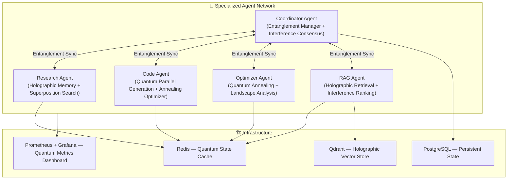

---

## 8. Project V — NEXUS-LLM (Custom Model Training Pipeline)

**NEXUS-LLM** is Nexus Lab AI's custom, full-stack model pre-training and alignment pipeline — designed to train sovereign local models without any external cloud dependency.

### Training Pipeline Architecture


### The YAJNA Loop (Autonomous Self-Improvement Cycle)

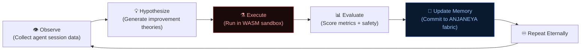

---

## 9. Project VI — APEX 2.0 (Sovereign AI Infrastructure)

**APEX 2.0** is Nexus Lab AI's strategic flagship product — a **Cognitive Operating System for National-Scale Sovereign AI Infrastructure**, designed as the "missing logic layer" in India's digital sovereignty strategy.

### APEX Positioning in the National AI Stack

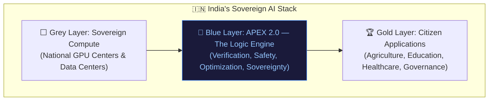

### APEX 2.0 Phase Architecture

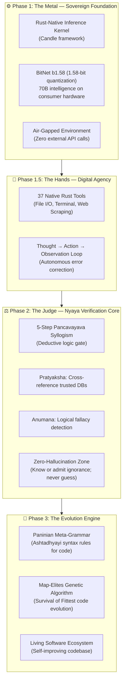

---

## 10. Project VII — EMMA (Autonomous Multi-Model Agent)

**EMMA** (Engineered Multi-Modal Agent) is Nexus Lab AI's production agentic coding system — an autonomous AI agent designed to plan, execute, critique, and self-correct software engineering tasks with mathematical rigor.

### EMMA System Architecture

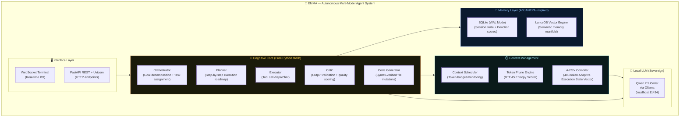

### EMMA Cognitive Flow

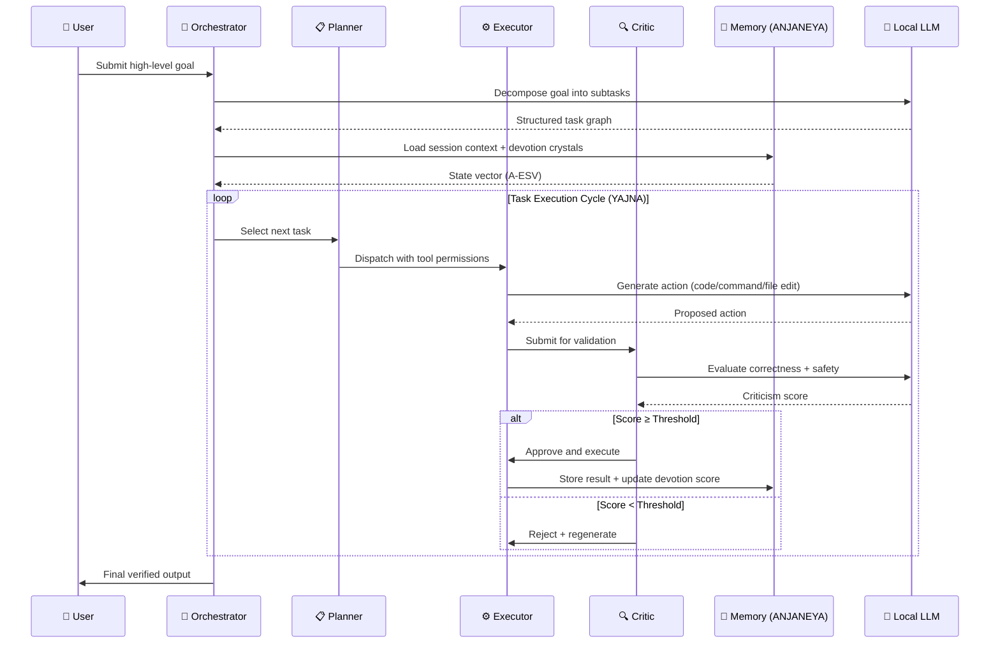

---

## 11. Project VIII — The Retro Causal Solver

The **Retro Causal Solver** is Nexus Lab AI's most philosophically radical research project. It extends conventional forward-only agent execution into a **temporal bidirectional reasoning system** where future error observations backpropagate through causal time to correct preceding planning states.

### Retro-Causality Flow

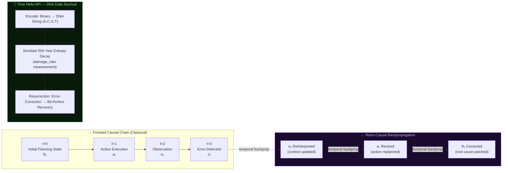

---

## 12. The Liquid LoRA Framework (Liquid Brain)

**Liquid LoRA** is Nexus Lab AI's paradigm-shifting alternative to static LoRA fine-tuning. It treats neural adapters as **non-Newtonian fluid tissue** that dynamically grows, prunes, and fuses its own parameters in response to mathematical signals from the learning landscape.

### Static vs Liquid LoRA

| Dimension | Static LoRA | Liquid LoRA |
|---|---|---|
| **Rank** | Fixed at initialization (e.g., r=8) | Dynamic — grows/shrinks based on curvature |
| **Merging** | Linear averaging (destructive interference) | Holographic STAR-TIES fusion (phase-aligned) |
| **Pruning** | Manual hyperparameter choice | Thermodynamic Free Energy minimization |
| **Forgetting** | Catastrophic | Neuro-elastic Bayesian anchoring |
| **Metaphor** | Rigid plastic cartridge | Living neural tissue |

### The Liquid LoRA Lifecycle

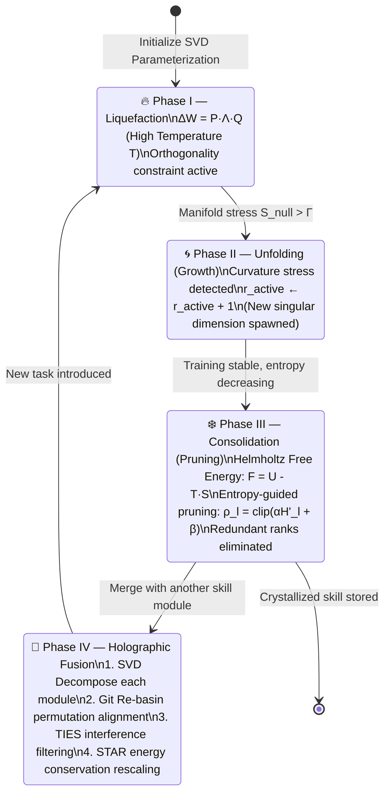

### The Four Governing Equations

```
PHASE I — Liquefaction (SVD Parameterization):
  ΔW = P · Λ · Q
  Orthogonality: L_orth = γ(‖P^T P - I‖_F² + ‖QQ^T - I‖_F²)

PHASE II — Unfolding (Curvature-Aware Growth):
  Stress Score: S_k(t) = |λ_k · ∇_λk L| + β·Var(∇_λk L)
  Growth Rule: if S_null > Γ → r_active ← r_active + 1

PHASE III — Consolidation (Thermodynamic Pruning):
  Spectral Entropy: H(Λ) = -Σ p_k · ln(p_k)
  Free Energy:      F = U - T·S   (minimize at low temperature)
  Retention Ratio:  ρ_l = clip(α·H'_l + β, ρ_min, 1.0)

PHASE IV — Holographic Fusion (STAR-TIES):
  Basis Alignment: P'_B = P_B · Π,  Q'_B = Π^T · Q_B
  Energy Conservation: γ = max(‖τ_A‖_*, ‖τ_B‖_*) / ‖τ_merge‖_*
  Final Merge: Λ_final = γ · Λ_merge

NEURO-ELASTICITY (Anti-Forgetting):
  Synaptic Stiffness: σ_k² ∝ 1/F_kk  (Fisher Information)
  Elastic Penalty: L_elastic = Σ (1/(2σ²_k,A)) · (λ_k - μ_k,A)²
```

---

## 13. The Three-Layer Nervous System

All Nexus Lab AI systems follow a strict three-layer computational biology model:

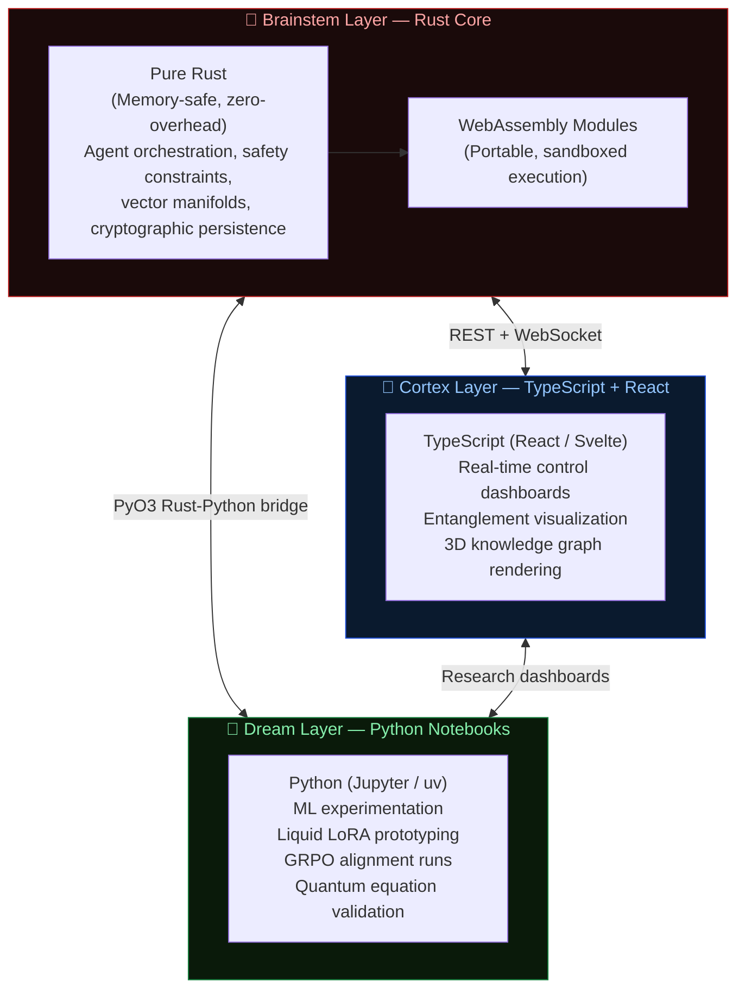

---

## 14. How We Work — The Nexus Lab Methodology

### The Builder's Philosophy

> Roots before Fruits.
> Build what survives. Not what impresses.
> Every module must function offline.
> Every byte of data must be owned locally.
> Every safety rule must be provable at compile time.

### Development Workflow

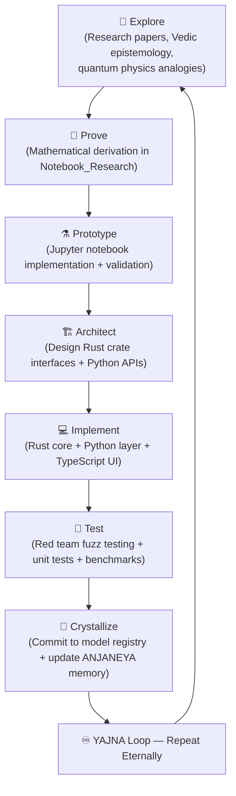

---

## 15. The Technology Stack

### Core Languages

| Layer | Language | Reason |
|---|---|---|
| **Safety Kernel** | Rust | Memory safety, compile-time invariants, zero-latency |
| **ML/AI Research** | Python | NumPy, PyTorch, HuggingFace ecosystem |
| **Control UI** | TypeScript + React | Type safety, rich visualization components |
| **WebAssembly** | Rust → WASM | Portable, sandboxed agent execution |
| **Scientific Proof** | Jupyter (Python) | Interactive mathematical derivation |

### Infrastructure Stack

```
Local Inference:    Ollama (Qwen 2.5 Coder, BitNet)
Vector Storage:     LanceDB, Qdrant, FAISS
Relational DB:      SQLite (WAL Mode), PostgreSQL
Persistent Store:   RocksDB (via Rust rocksdb crate)
Distributed Cache:  Redis
Message Passing:    ZeroMQ / NATS / tokio mpsc
API Framework:      FastAPI (Python) + Axum (Rust)
Monitoring:         Prometheus + Grafana + ELK Stack
Containerization:   Docker + Kubernetes + Helm
CI/CD:             GitHub Actions
Cryptography:       SHA3-256, Reed-Solomon, ML-KEM, ML-DSA
```

---

## 16. Mathematical Foundations

### Core Equations Governing All Nexus Lab AI Systems

```
HOLOGRAPHIC MEMORY (Dronagiri):
  ψ_boundary = P_holo · ψ_bulk
  S_holo = A / (4·ln(2))

DEVOTION CRYSTALLIZATION (Devotion Crystal):
  D(ℳ) = αR + βF + γE + δT  ≥  Θ_crystal = 0.85

SUPERPOSITION SPEEDUP (Agentarium):
  T_quantum = (π/4)√N · t
  Speedup ≈ 1.27√N

ENTANGLEMENT SYNC (Agentarium):
  E(ψ₁,ψ₂) = -Tr(ρ log₂ρ) / log₂(d₁·d₂)
  Δψⱼ = Σᵢ E(ψᵢ,ψⱼ) · α · Δψᵢ

QUANTUM TUNNELING ESCAPE (Agentarium):
  P_accept = 0.7·exp(-ΔE/T) + 0.3·exp(-√H/T)

INTERFERENCE CONSENSUS (SAPTACORE):
  |Ψ_consensus⟩ = (1/√N) Σᵢ αᵢ·e^(iφᵢ) |dᵢ⟩
  P(decision) = |⟨d|Ψ_consensus⟩|²

TOPOLOGICAL PROTECTION (Agentarium):
  Q = (1/2π) ∮ ∇φ · dl  ∈ ℤ  (integer, noise-immune)

LIQUID LORA FREE ENERGY (NEXUS-LLM):
  F = U - T·S
  ΔW = P · Λ · Q  (SVD parameterization)

ADIABATIC LEARNING (NEXUS-LLM):
  H(t) = [1-s(t)]·H_old + s(t)·H_new
  Fidelity F(T) ≈ 1 - (ℏ²/4)·∫‖∂H/∂t‖²/Δ⁴ dt

ELASTIC ANTI-FORGETTING (NEXUS-LLM):
  σ_k² ∝ 1/F_kk
  L_elastic = Σ (1/2σ²_k) · (λ_k - μ_k,A)²
```

---

## 17. Roadmap

### Current State (2026 Q1–Q2)

| Project | Status | Maturity |
|---|---|---|
| ANJANEYA Memory Protocol (AMP) | ✅ Architecture Complete | Mathematical specification + Rust/Python implementation |
| RTA-GUARD | ✅ Production Ready | Phase 1–18 complete |
| EMMA Agent | ✅ Active Development | Core modules operational, manifold router in progress |
| AGENTARIUM | 🔬 Research Phase | 10 quantum modules proven, integration in progress |
| NEXUS-LLM Pipeline | 🔬 Research Phase | Training stack designed, alignment WIP |
| APEX 2.0 | 🚀 Pitching Phase | Executive deck complete, Phase 1–3 blueprints done |
| SAPTACORE | 📐 Architecture Phase | Rust monorepo layout defined |
| Retro Causal Solver | 🧪 Experimental | Core notebook prototypes operational |
| Liquid LoRA | 📐 Mathematical Proof | Full equations + pseudocode derived |

### Horizon Roadmap

```
Phase A (2026 Q3): Integrate AMP into EMMA production deployment
Phase B (2026 Q3): APEX 2.0 national infrastructure demo
Phase C (2026 Q4): SAPTACORE first full 7-agent council deployment
Phase D (2026 Q4): Liquid LoRA first experimental validation run
Phase E (2027 Q1): AGENTARIUM entangled network (10+ agent cluster)
Phase F (2027 Q2): NEXUS-LLM first sovereign model training run
Phase G (2027+):   Time Helix production deployment + DNA spore archiving
```

---

## 18. Glossary

| Term | Definition |
|---|---|
| **ANJANEYA** | Adaptive Neuro-Junctional Autonomous Neural Eternal Yielding Architecture — the 5-pillar memory protocol |
| **AMP** | ANJANEYA Memory Protocol |
| **A-ESV** | Adaptive Execution State Vector — 400-token cognitive anchor compiled by EMMA |
| **Autopoiesis** | Self-generating biological system — basis for Agentarium's self-labeling engine |
| **Adiabatic Evolution** | Smooth capability transition avoiding catastrophic forgetting |
| **Chiranjeevi** | "Immortal" in Sanskrit — AMP Pillar 3 governing cryptographic persistence |
| **Cockroach Philosophy** | Design principle: systems must survive catastrophic failure conditions |
| **Devotion Crystal** | AMP Pillar 1 — identity-weighted memory crystallization engine |
| **DPO** | Direct Preference Optimization — LLM alignment training method |
| **Dronagiri** | AMP Pillar 2 — holographic fallback fabric (from the mountain Hanuman lifted) |
| **DTE-IS** | Dialogue Turn Entropy-Importance Score — EMMA's token pruning algorithm |
| **Egregore** | Collective thoughtform — unified intelligence emerging from multi-agent consensus |
| **FSDP** | Fully Sharded Data Parallel — distributed training across multiple GPUs |
| **GRPO** | Group Relative Policy Optimization — reasoning alignment algorithm |
| **Hetvabhasa** | Sanskrit: "fallacy of inference" — logical error filter in Nyaya epistemology |
| **Liquid LoRA** | Dynamic rank-adaptive neural tissue (non-Newtonian fluid metaphor) |
| **Mahima** | Sanskrit: "expansion" — AMP Pillar 5 maximum context mode |
| **Manifold Unfolding** | Dynamic rank growth in Liquid LoRA based on loss landscape curvature |
| **MAP-Elites** | Quality-diversity optimization algorithm — evolution engine for APEX |
| **MoE** | Mixture of Experts — model architecture for efficient local inference |
| **Nexus Lab AI** | Nexus AI Research Lab — sovereign AI research laboratory, Bengaluru |
| **Nyaya Shastra** | Ancient Indian logic system — epistemic verification framework used in APEX |
| **Pancavayava** | 5-step syllogism from Nyaya Shastra — truth verification protocol |
| **Panini** | Ancient Sanskrit grammarian — basis for Paninian code grammar in APEX |
| **Retro-Causality** | Temporal backpropagation — future errors correcting past planning states |
| **Ṛta** | Sanskrit: "cosmic order" — invariant law governing all Nexus Lab safety systems |
| **SAPTACORE** | Seven-fold distributed cognitive kernel — multi-agent council system |
| **Saptarishi** | "Seven sages" — ancient Indian council metaphor for SAPTACORE agents |
| **Sankat Mochan** | "Distress remover" — AMP Pillar 4 real-time memory injection |
| **Spore** | A cryptographically sealed memory package distributed across 7 substrates |
| **STAR** | Spectral Truncation and Rescale — Liquid LoRA merging algorithm |
| **Sudarshan Layer** | WebAssembly safety firewall — autonomous capability boundary enforcement |
| **TIES-Merging** | Trim, Elect, and Merge — interference-free model fusion algorithm |
| **Time Helix API** | DNA data storage API with 500-year decay simulation and resurrection |
| **Topological Protection** | Noise-immune storage using integer winding numbers (Q ∈ ℤ) |
| **YAJNA Loop** | Autonomous experimentation cycle (Sanskrit: "sacred transformational ritual") |

---

## Contact & Identity

```
Lab:      Nexus AI Research Lab
Location: Bengaluru, India
Founder:  Sourav (Sourav Ray)
Title:    Founder & Principal Cognitive Architect
Init:     January 2025
Domain:   Sovereign AI Systems · Multi-Agent Orchestration
          Vedic Epistemology Engineering · Anti-Fragile AI Infrastructure

Tagline:  "Engineering the Soul of AI."
Symbol:   🔱 (Trishul — representing the three pillars: Safety, Memory, Agency)
```

---

*🔱 Jai Bajrang Bali — Infinite Memory, Infinite Strength.*
*Nexus AI Research Lab — Proprietary & Confidential*
*v1.0 | May 2026 | Bengaluru, India*
