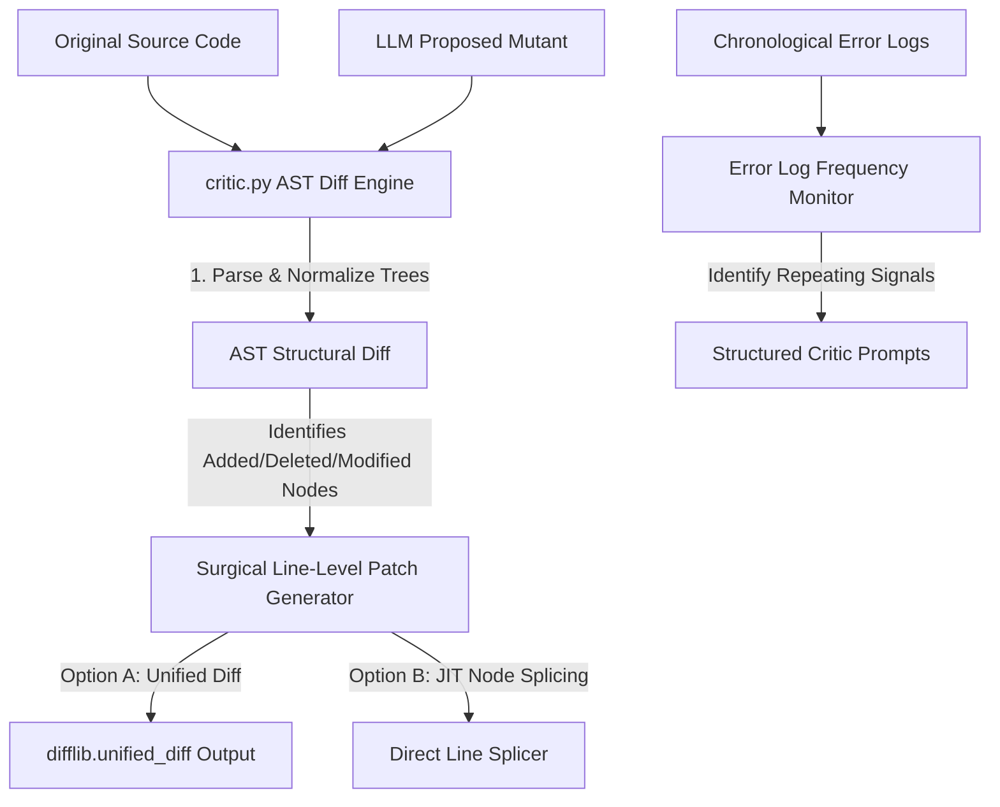

# Technical Implementation Plan: EMM-02-A3 — Critic Stateless AST Diff Reviewer

This design document outlines the comprehensive technical plan for implementing the **EMMA Critic** module (`backend/app/core/critic.py`) and its supporting AST utility layers. 

This plan serves as the architectural blueprint for developers and AI code assistants (like Claude Code) to implement a highly resilient, zero-dependency, and precise structural code reviewer.

---

## 1. Executive Summary & Context

Within EMMA's Metacognitive Loop, the **Draft Coordinator (`executor.py`)** generates candidate mutants, and the **Sandbox (`code_generator.py`)** runs security and basic execution checks. However, to guarantee principal-level reliability:
1. We must verify **structural modifications** rather than relying on flat string comparisons (which are highly fragile to white spaces, comments, and trivial format changes).
2. We must perform **surgical line-level commits** (replacing only the modified AST nodes/functions) rather than overwriting files entirely, preserving comments and nearby code blocks intact.
3. We must continuously **monitor diagnostic error frequency** across execution attempts to prevent infinite diagnostic loop regressions and pinpoint repeating error signatures.

To solve this, we will implement **`CodeCritic`** inside `backend/app/core/critic.py` and supporting utilities inside `backend/app/utils/ast_utils.py`.

---

## 2. Technical Architecture & Component Design

The Critic consists of three major, decoupled stateless systems working in harmony:



### 2.1 The AST Structural Comparison Engine (`compare_ast`)
Flat text comparisons (like character-by-character diffs) are noisy and easily confused by formatting or comment additions. The AST engine solves this by:
*   Compiling both the **original** source code and the **proposed mutant** into Abstract Syntax Trees using Python's standard `ast.parse`.
*   Traversing the trees to isolate core structural nodes:
    *   `FunctionDef` / `AsyncFunctionDef` (Functions)
    *   `ClassDef` (Classes)
    *   `Import` / `ImportFrom` (Imports)
    *   `Assign` (Global variables/constants)
*   **AST Normalization:** To compare structure immune to formatting and comments, we serialize each node by walking its fields and generating a structural hash or normalized dump string, ignoring all line numbers, column offsets, docstrings (optional), and comments.
*   Mapping these structures to detect:
    *   `added`: Present in mutant but not in original.
    *   `deleted`: Present in original but not in mutant.
    *   `modified`: Present in both, but structurally distinct.

### 2.2 Surgical Line-Level Patch Generator & JIT Node Splicer
To guarantee file safety and keep commits incredibly clean, we implement two splicing strategies:
1.  **Unified Diff Generator:** Generates a standard unified diff patch using `difflib.unified_diff` that represents the minimal surgical changes.
2.  **JIT AST Node Splicer:**
    *   If a function or class is `modified`, the splicer uses its AST-defined bounds (`lineno` to `end_lineno` in Python 3.8+) to target the exact line range inside the original source.
    *   It cleanly replaces only those targeted lines with the new implementation from the mutant.
    *   This guarantees that unrelated lines, comments, file headers, and neighboring functions are kept 100% intact.

### 2.3 Error Log Frequency Monitor
When the executor loop runs repeatedly, it might hit the same compilation or runtime errors. The monitor acts as a diagnostic guard:
*   Maintains a chronological buffer of stderr/traceback logs.
*   Extracts exception names (e.g., `TypeError`, `IndexError`, `SyntaxError`, `ModuleNotFoundError`).
*   Computes error recurrence frequencies. If the same error signature repeats $N$ consecutive times (e.g., $N \ge 3$), it flags an active infinite regression loop.
*   Generates a highly structured, descriptive critique prompt (e.g., *"TypeError repeated 3 times on line X. The parameters mismatch standard signature Y. Ensure correct variable unpacking"*), feeding it back to the code generator to break the regression.

---

## 3. Proposed Code Interfaces

### 3.1 `backend/app/core/critic.py`
This module contains the primary orchestrator for reviews.

```python
# backend/app/core/critic.py
import ast
import difflib
from typing import Dict, Any, List, Optional, Tuple
from app.utils.ast_utils import ASTNormalizer, get_top_level_structures

class CodeCritic:
    """
    Stateless AST-level structural diff reviewer, surgical patcher,
    and diagnostic error frequency monitor.
    """
    def __init__(self) -> None:
        pass

    def compare_ast(self, original_code: str, mutant_code: str) -> Dict[str, Any]:
        """
        Compare original and mutant code at AST level.
        Returns a dictionary showing:
          - "added": list of node names/signatures
          - "deleted": list of node names/signatures
          - "modified": list of node names/signatures
        """
        orig_structs = get_top_level_structures(original_code)
        mut_structs = get_top_level_structures(mutant_code)
        
        comparison = {
            "added": [],
            "deleted": [],
            "modified": []
        }
        
        # Compare structural elements
        all_keys = set(orig_structs.keys()) | set(mut_structs.keys())
        for key in all_keys:
            if key not in orig_structs:
                comparison["added"].append(key)
            elif key not in mut_structs:
                comparison["deleted"].append(key)
            else:
                # Both exist, compare normalized structures
                orig_norm = ASTNormalizer.normalize(orig_structs[key])
                mut_norm = ASTNormalizer.normalize(mut_structs[key])
                if orig_norm != mut_norm:
                    comparison["modified"].append(key)
                    
        return comparison

    def generate_unified_diff(self, original_code: str, mutant_code: str, filename: str = "target.py") -> str:
        """
        Produce a minimal unified diff patch.
        """
        orig_lines = original_code.splitlines(keepends=True)
        mut_lines = mutant_code.splitlines(keepends=True)
        diff = difflib.unified_diff(
            orig_lines, mut_lines,
            fromfile=f"a/{filename}", tofile=f"b/{filename}"
        )
        return "".join(diff)

    def splice_node(self, original_code: str, mutant_code: str, target_node_name: str) -> str:
        """
        Surgically extracts the source lines of target_node_name from mutant_code
        and splices them into original_code in place of the old node.
        """
        orig_structs = get_top_level_structures(original_code)
        mut_structs = get_top_level_structures(mutant_code)
        
        if target_node_name not in orig_structs or target_node_name not in mut_structs:
            raise ValueError(f"Target node '{target_node_name}' must exist in both source versions to splice.")
            
        orig_node = orig_structs[target_node_name]
        mut_node = mut_structs[target_node_name]
        
        orig_lines = original_code.splitlines()
        mut_lines = mutant_code.splitlines()
        
        # Extract mutant lines using AST-defined boundaries
        # Note: lineno in AST is 1-indexed
        mut_start = mut_node.lineno - 1
        mut_end = getattr(mut_node, "end_lineno", mut_start + 1)
        mutant_slice = mut_lines[mut_start:mut_end]
        
        # Original bounds to replace
        orig_start = orig_node.lineno - 1
        orig_end = getattr(orig_node, "end_lineno", orig_start + 1)
        
        # Re-assemble the source file
        spliced_lines = orig_lines[:orig_start] + mutant_slice + orig_lines[orig_end:]
        return "\n".join(spliced_lines)

    def analyze_errors(self, error_history: List[str], threshold: int = 3) -> Dict[str, Any]:
        """
        Inspect chronological error history to flag looping signatures and
        extract rich self-healing hints for the LLM.
        """
        if not error_history:
            return {"looping_detected": False, "frequent_error": None, "critique": ""}
            
        signatures = []
        for err in error_history:
            # Parse exception class or first line of error traceback
            first_line = err.strip().splitlines()[-1] if err.strip() else ""
            sig = first_line.split(":")[0] if ":" in first_line else first_line
            signatures.append(sig.strip())
            
        # Detect sequential repetition
        looping = False
        frequent_sig = None
        
        if len(signatures) >= threshold:
            recent = signatures[-threshold:]
            if len(set(recent)) == 1 and recent[0] != "":
                looping = True
                frequent_sig = recent[0]
                
        # Generate custom critique hints based on common exception signatures
        critique = ""
        if frequent_sig:
            hints = {
                "TypeError": "Ensure that function parameters match their type signatures and that variable unpacking matches count.",
                "IndexError": "Verify that list/tuple index bounds are checked before retrieval and slices are safely guarded.",
                "AttributeError": "Confirm object attributes are correctly spelled, imported, and initialized prior to invocation.",
                "KeyError": "Validate that dictionary keys exist or access them using the safe dict.get(key, default) method.",
                "SyntaxError": "Carefully inspect code alignment, missing colons, or unclosed parenthesis.",
            }
            hint_msg = hints.get(frequent_sig, "Hard-code type checks, verify inputs, and isolate the regression point.")
            critique = f"[CRITIQUE] Critical regression pattern found: {frequent_sig} occurred {threshold} times sequentially. Action item: {hint_msg}"
            
        return {
            "looping_detected": looping,
            "frequent_error": frequent_sig,
            "critique": critique
        }
```

### 3.2 `backend/app/utils/ast_utils.py`
Helper module supporting safe AST structural walks.

```python
# backend/app/utils/ast_utils.py
import ast
from typing import Dict, Any

class ASTNormalizer(ast.NodeVisitor):
    """
    Serializes an AST node into a normalized structural string representation
    omitting lines, columns, comments, and variable names where appropriate
    to focus purely on structural equivalence.
    """
    @classmethod
    def normalize(cls, node: ast.AST) -> str:
        # Convert AST node structure into a clean, normalized string
        # We can leverage ast.dump with annotate_fields=False and custom filters
        return ast.dump(node, annotate_fields=False, include_attributes=False)

def get_top_level_structures(code: str) -> Dict[str, ast.AST]:
    """
    Parse Python code and extract all top-level functions, classes, and globals
    keyed by their identifier (e.g., 'class:MyClass', 'def:my_function').
    """
    try:
        tree = ast.parse(code)
    except SyntaxError as exc:
        raise ValueError(f"AST Parsing failed: {exc}")
        
    structures = {}
    for node in tree.body:
        if isinstance(node, (ast.FunctionDef, ast.AsyncFunctionDef)):
            structures[f"def:{node.name}"] = node
        elif isinstance(node, ast.ClassDef):
            structures[f"class:{node.name}"] = node
    return structures
```

---

## 4. Verification & Testing Plan

To guarantee 100% reliability, the test suite `backend/app/tests/test_advanced_core.py` will be modified to cover the following:

### 4.1 Unit Test Cases
1.  **`test_critic_ast_comparison`**:
    *   Verify that adding a function is recognized as `added`.
    *   Verify that deleting a class is recognized as `deleted`.
    *   Verify that altering the logic of a function is recognized as `modified`.
    *   Verify that changing indentation, spacing, or comments **does not** trigger structural modification (Structural Immunity).
2.  **`test_critic_surgical_splicing`**:
    *   Create a mock file containing 3 functions.
    *   Alters the middle function inside a candidate mutant.
    *   Surgically splices the middle function into the original code.
    *   Asserts that function 1 and function 3 are completely unchanged, while function 2 matches the mutant version perfectly.
3.  **`test_critic_error_monitor`**:
    *   Feeds a history with mixed errors (e.g., `IndexError`, `TypeError`, `IndexError`) -> assert looping is `False`.
    *   Feeds a history with 3 consecutive `TypeError` errors -> assert looping is `True` and the custom structured critique is returned.

---

## 5. Execution Command Summary (For Developers/Claude Code)

To run the verification test suite locally:
```powershell
py scripts\run_tests.py
```
To run specifically the advanced core tests:
```powershell
pytest backend/app/tests/test_advanced_core.py -v
```
