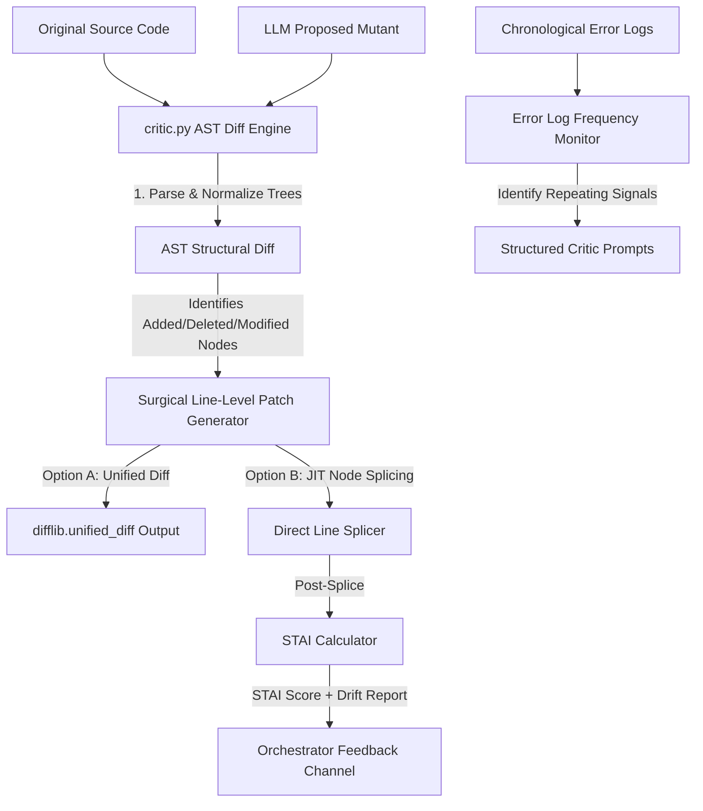

# Technical Implementation Plan: EMM-02-A3 — Critic Stateless AST Diff Reviewer

> **Revision:** 2.0 — Principal Architectural Review  
> **Status:** Production-Ready Design  
> **Scope:** `backend/app/core/critic.py` · `backend/app/utils/ast_utils.py`

This design document outlines the comprehensive technical plan for implementing the **EMMA Critic** module (`backend/app/core/critic.py`) and its supporting AST utility layers.

This plan serves as the architectural blueprint for developers and AI code assistants (like Claude Code) to implement a highly resilient, zero-dependency, and precise structural code reviewer.

---

## 1. Executive Summary & Context

Within EMMA's Metacognitive Loop, the **Draft Coordinator (`executor.py`)** generates candidate mutants, and the **Sandbox (`code_generator.py`)** runs security and basic execution checks. However, to guarantee principal-level reliability:

1. We must verify **structural modifications** rather than relying on flat string comparisons (which are highly fragile to white spaces, comments, and trivial format changes).
2. We must perform **surgical line-level commits** (replacing only the modified AST nodes/functions) rather than overwriting files entirely, preserving comments and nearby code blocks intact.
3. We must continuously **monitor diagnostic error frequency** across execution attempts to prevent infinite diagnostic loop regressions and pinpoint repeating error signatures.
4. We must **quantify structural integrity** after every splice operation using a mathematically rigorous alignment metric — the **Syntax-Tree Alignment Index (STAI)** — ensuring that no surgical patch silently degrades the module's public interface, class hierarchy, or naming paradigms.

To solve this, we implement **`CodeCritic`** inside `backend/app/core/critic.py` and supporting utilities inside `backend/app/utils/ast_utils.py`.

---

## 2. Technical Architecture & Component Design

The Critic consists of **four** major, decoupled stateless systems working in harmony:



### 2.1 The AST Structural Comparison Engine (`compare_ast`)

Flat text comparisons (like character-by-character diffs) are noisy and easily confused by formatting or comment additions. The AST engine solves this by:

- Compiling both the **original** source code and the **proposed mutant** into Abstract Syntax Trees using Python's standard `ast.parse`.
- Traversing the trees to isolate core structural nodes:
  - `FunctionDef` / `AsyncFunctionDef` (Functions and coroutines)
  - `ClassDef` (Classes, including inheritance chains and decorators)
  - `Import` / `ImportFrom` (Module-level imports)
  - `Assign` / `AnnAssign` (Global variables, typed constants)
- **AST Normalization:** To compare structure immune to formatting and comments, each node is serialized by walking its fields and generating a normalized dump string, ignoring all line numbers, column offsets, docstrings (optional), and comments.
- Mapping these structures to detect:
  - `added`: Present in mutant but not in original.
  - `deleted`: Present in original but not in mutant.
  - `modified`: Present in both, but structurally distinct.

### 2.2 Surgical Line-Level Patch Generator & JIT Node Splicer

To guarantee file safety and keep commits incredibly clean, two splicing strategies are implemented:

1. **Unified Diff Generator:** Generates a standard unified diff patch using `difflib.unified_diff` that represents the minimal surgical changes. This output is human-readable, VCS-compatible, and safe to log.
2. **JIT AST Node Splicer:**
   - If a function or class is `modified`, the splicer uses its AST-defined bounds (`lineno` to `end_lineno` in Python 3.8+) to target the exact line range inside the original source.
   - It cleanly replaces only those targeted lines with the new implementation from the mutant.
   - This guarantees that unrelated lines, comments, file headers, and neighboring functions are kept **100% intact**.
   - Immediately after splicing, the result is passed to the **STAI Calculator** (Section 6) before any file write is permitted.

### 2.3 Error Log Frequency Monitor

When the executor loop runs repeatedly, it might hit the same compilation or runtime errors. The monitor acts as a diagnostic guard:

- Maintains a chronological buffer of stderr/traceback logs.
- Extracts exception names (e.g., `TypeError`, `IndexError`, `SyntaxError`, `ModuleNotFoundError`).
- Computes error recurrence frequencies. If the same error signature repeats *N* consecutive times (e.g., *N* ≥ 3), it flags an active infinite regression loop.
- Generates a highly structured, descriptive critique prompt (e.g., *"TypeError repeated 3 times on line X. The parameters mismatch standard signature Y. Ensure correct variable unpacking"*), feeding it back to the code generator to break the regression.

### 2.4 Syntax-Tree Alignment Index (STAI) — Overview

The STAI is a scalar metric in the range **[0.0, 1.0]** computed immediately after every JIT splice operation. It quantifies the degree to which the post-splice module preserves the structural identity of the original source. Full specification is provided in **Section 6**.

---

## 3. Proposed Code Interfaces

### 3.1 `backend/app/core/critic.py`

This module contains the primary orchestrator for all review operations.

```python
# backend/app/core/critic.py
import ast
import difflib
from typing import Dict, Any, List, Optional, Tuple
from app.utils.ast_utils import ASTNormalizer, get_top_level_structures, count_all_ast_nodes

class CodeCritic:
    """
    Stateless AST-level structural diff reviewer, surgical patcher,
    diagnostic error frequency monitor, and STAI integrity reporter.

    All methods are pure and stateless — no instance state is mutated
    between calls. This guarantees safe concurrent use across async
    executor loops without locking.
    """
    def __init__(self) -> None:
        pass

    def compare_ast(self, original_code: str, mutant_code: str) -> Dict[str, Any]:
        """
        Compare original and mutant code at the AST structural level.

        Returns a dictionary with three keys:
          - "added":    list of node keys present in mutant but not original.
          - "deleted":  list of node keys present in original but not mutant.
          - "modified": list of node keys present in both but structurally distinct.

        Node keys follow the format "<kind>:<name>", e.g. "def:process_batch",
        "class:DataPipeline". This namespacing prevents accidental collisions
        between a function and class sharing the same identifier.
        """
        orig_structs = get_top_level_structures(original_code)
        mut_structs = get_top_level_structures(mutant_code)

        comparison: Dict[str, List[str]] = {
            "added": [],
            "deleted": [],
            "modified": [],
        }

        all_keys = set(orig_structs.keys()) | set(mut_structs.keys())
        for key in all_keys:
            if key not in orig_structs:
                comparison["added"].append(key)
            elif key not in mut_structs:
                comparison["deleted"].append(key)
            else:
                orig_norm = ASTNormalizer.normalize(orig_structs[key])
                mut_norm  = ASTNormalizer.normalize(mut_structs[key])
                if orig_norm != mut_norm:
                    comparison["modified"].append(key)

        return comparison

    def generate_unified_diff(
        self,
        original_code: str,
        mutant_code: str,
        filename: str = "target.py",
    ) -> str:
        """
        Produce a minimal unified diff patch between original and mutant source.

        The patch is suitable for display in CI logs, storage in audit trails,
        or direct application via `patch(1)`.
        """
        orig_lines = original_code.splitlines(keepends=True)
        mut_lines  = mutant_code.splitlines(keepends=True)
        diff = difflib.unified_diff(
            orig_lines, mut_lines,
            fromfile=f"a/{filename}",
            tofile=f"b/{filename}",
        )
        return "".join(diff)

    def splice_node(
        self,
        original_code: str,
        mutant_code: str,
        target_node_name: str,
    ) -> str:
        """
        Surgically extract the source lines of `target_node_name` from
        `mutant_code` and splice them into `original_code` in place of the
        corresponding original node.

        Both source versions must contain a top-level structure keyed by
        `target_node_name`; raises `ValueError` otherwise.

        After splicing, callers **must** invoke `calculate_stai` on the
        returned source before committing it to disk (enforced at the
        orchestrator layer via the STAI gate described in Section 6).
        """
        orig_structs = get_top_level_structures(original_code)
        mut_structs  = get_top_level_structures(mutant_code)

        if target_node_name not in orig_structs or target_node_name not in mut_structs:
            raise ValueError(
                f"Target node '{target_node_name}' must exist in both source "
                "versions to perform a surgical splice."
            )

        orig_node = orig_structs[target_node_name]
        mut_node  = mut_structs[target_node_name]

        orig_lines = original_code.splitlines()
        mut_lines  = mutant_code.splitlines()

        # AST lineno attributes are 1-indexed; convert to 0-indexed slices.
        mut_start   = mut_node.lineno - 1
        mut_end     = getattr(mut_node, "end_lineno", mut_start + 1)
        mutant_slice = mut_lines[mut_start:mut_end]

        orig_start = orig_node.lineno - 1
        orig_end   = getattr(orig_node, "end_lineno", orig_start + 1)

        spliced_lines = orig_lines[:orig_start] + mutant_slice + orig_lines[orig_end:]
        return "\n".join(spliced_lines)

    def calculate_stai(
        self,
        original_code: str,
        spliced_code: str,
    ) -> Dict[str, Any]:
        """
        Compute the Syntax-Tree Alignment Index (STAI) for a spliced result.

        Returns a structured report conforming to the STAI schema defined in
        Section 6. The orchestrator must treat any STAI below the configured
        threshold (default 0.85) as a structural drift alert and abort the
        pending filesystem commit.
        """
        orig_structs   = get_top_level_structures(original_code)
        spliced_structs = get_top_level_structures(spliced_code)

        total_original = len(orig_structs)
        if total_original == 0:
            return {
                "stai": 1.0,
                "identical_nodes": 0,
                "total_original_nodes": 0,
                "drift_detected": False,
                "drift_details": [],
                "verdict": "PASS — original source had no top-level structures to compare.",
            }

        identical_count = 0
        drift_details: List[str] = []

        for key, orig_node in orig_structs.items():
            if key not in spliced_structs:
                drift_details.append(f"MISSING: '{key}' was deleted from spliced result.")
                continue
            orig_norm    = ASTNormalizer.normalize(orig_node)
            spliced_norm = ASTNormalizer.normalize(spliced_structs[key])
            if orig_norm == spliced_norm:
                identical_count += 1
            else:
                drift_details.append(f"MODIFIED: '{key}' structure diverged post-splice.")

        stai_score   = identical_count / total_original
        drift_flag   = stai_score < 1.0
        verdict_tag  = "PASS" if stai_score >= 0.85 else "FAIL — structural drift exceeds tolerance"

        return {
            "stai": round(stai_score, 6),
            "identical_nodes": identical_count,
            "total_original_nodes": total_original,
            "drift_detected": drift_flag,
            "drift_details": drift_details,
            "verdict": verdict_tag,
        }

    def analyze_errors(
        self,
        error_history: List[str],
        threshold: int = 3,
    ) -> Dict[str, Any]:
        """
        Inspect a chronological list of stderr/traceback strings to detect
        repeating error signatures that indicate an infinite regression loop.

        Returns a structured critique dict with:
          - "looping_detected": bool
          - "frequent_error":   the repeating exception class name, or None
          - "critique":         an actionable natural-language prompt fragment
                                ready for injection into the LLM system prompt
        """
        if not error_history:
            return {"looping_detected": False, "frequent_error": None, "critique": ""}

        signatures: List[str] = []
        for err in error_history:
            first_line = err.strip().splitlines()[-1] if err.strip() else ""
            sig = first_line.split(":")[0].strip() if ":" in first_line else first_line.strip()
            signatures.append(sig)

        looping      = False
        frequent_sig: Optional[str] = None

        if len(signatures) >= threshold:
            recent = signatures[-threshold:]
            if len(set(recent)) == 1 and recent[0]:
                looping      = True
                frequent_sig = recent[0]

        critique = ""
        if frequent_sig:
            hints: Dict[str, str] = {
                "TypeError":            "Ensure that function parameters match their type signatures and that variable unpacking matches count.",
                "IndexError":           "Verify that list/tuple index bounds are checked before retrieval and slices are safely guarded.",
                "AttributeError":       "Confirm object attributes are correctly spelled, imported, and initialized prior to invocation.",
                "KeyError":             "Validate that dictionary keys exist or access them using the safe dict.get(key, default) method.",
                "SyntaxError":          "Carefully inspect code alignment, missing colons, or unclosed parentheses.",
                "ModuleNotFoundError":  "Confirm the import path is correctly spelled and the module is installed in the active virtual environment.",
                "RecursionError":       "Introduce a base-case guard or iteration-depth counter to terminate recursive descent.",
                "ValueError":           "Validate all input arguments against their expected domains before processing.",
            }
            hint_msg = hints.get(
                frequent_sig,
                "Hard-code type checks, verify inputs, and isolate the regression point.",
            )
            critique = (
                f"[CRITIQUE] Critical regression pattern found: {frequent_sig} "
                f"occurred {threshold} times sequentially. "
                f"Action item: {hint_msg}"
            )

        return {
            "looping_detected": looping,
            "frequent_error":   frequent_sig,
            "critique":         critique,
        }
```

### 3.2 `backend/app/utils/ast_utils.py`

Helper module supporting safe AST structural walks and node counting.

```python
# backend/app/utils/ast_utils.py
import ast
from typing import Dict

class ASTNormalizer(ast.NodeVisitor):
    """
    Serializes an AST node into a normalized structural string representation,
    omitting line numbers, column offsets, comments, and end positions so that
    purely structural equivalence can be evaluated independent of formatting.
    """
    @classmethod
    def normalize(cls, node: ast.AST) -> str:
        """
        Return a canonical structural string for `node` using ast.dump with
        all position attributes suppressed. Two nodes are structurally
        equivalent if and only if their normalized strings are identical.
        """
        return ast.dump(node, annotate_fields=False, include_attributes=False)


def get_top_level_structures(code: str) -> Dict[str, ast.AST]:
    """
    Parse Python source `code` and extract all top-level functions, async
    functions, and classes, keyed by "<kind>:<name>" (e.g. "def:train_model",
    "class:DataLoader").

    Raises `ValueError` on `SyntaxError` so callers receive a clean,
    typed exception rather than a bare parser traceback.
    """
    try:
        tree = ast.parse(code)
    except SyntaxError as exc:
        raise ValueError(f"AST parsing failed: {exc}") from exc

    structures: Dict[str, ast.AST] = {}
    for node in tree.body:
        if isinstance(node, (ast.FunctionDef, ast.AsyncFunctionDef)):
            structures[f"def:{node.name}"] = node
        elif isinstance(node, ast.ClassDef):
            structures[f"class:{node.name}"] = node

    return structures


def count_all_ast_nodes(code: str) -> int:
    """
    Return the total count of every AST node in the parse tree of `code`,
    used by the STAI deep-walk variant (Section 6.3) when top-level
    structure counts alone are insufficient for fine-grained drift detection.

    Raises `ValueError` on `SyntaxError`.
    """
    try:
        tree = ast.parse(code)
    except SyntaxError as exc:
        raise ValueError(f"AST parsing failed: {exc}") from exc

    return sum(1 for _ in ast.walk(tree))
```

---

## 4. Verification & Testing Plan

To guarantee 100% reliability, the test suite `backend/app/tests/test_advanced_core.py` will be extended to cover the following cases:

### 4.1 Unit Test Cases

**`test_critic_ast_comparison`**
- Verify that adding a new function is recognized as `added`.
- Verify that deleting a class is recognized as `deleted`.
- Verify that altering the logic of a function body is recognized as `modified`.
- Verify that changing indentation, spacing, or comments **does not** trigger structural modification (structural immunity guarantee).

**`test_critic_surgical_splicing`**
- Create a mock source file containing 3 functions.
- Alter the middle function inside a candidate mutant.
- Surgically splice the middle function into the original source.
- Assert that function 1 and function 3 are completely unchanged.
- Assert that function 2 matches the mutant version byte-for-byte.

**`test_critic_error_monitor`**
- Feed a history with mixed errors (`IndexError`, `TypeError`, `IndexError`) → assert `looping_detected` is `False`.
- Feed a history with 3 consecutive `TypeError` entries → assert `looping_detected` is `True` and the structured critique is returned.
- Feed an empty history → assert all fields return safe defaults without exception.

**`test_critic_stai_score`** *(new in Revision 2.0)*
- Feed a splice that modifies exactly one of four top-level functions → assert STAI = 0.75.
- Feed a splice that makes no structural changes → assert STAI = 1.0.
- Feed a splice that removes a class entirely → assert `drift_detected` is `True` and verdict is `FAIL`.
- Feed source with zero top-level structures → assert STAI = 1.0 and `drift_detected` is `False` (degenerate edge case).

---

## 5. Execution Command Summary

To run the full verification test suite locally:

```powershell
py scripts\run_tests.py
```

To run specifically the advanced core tests with verbose output:

```powershell
pytest backend/app/tests/test_advanced_core.py -v
```

To run only the STAI-related tests in isolation:

```powershell
pytest backend/app/tests/test_advanced_core.py -v -k "stai"
```

---

## 6. The Syntax-Tree Alignment Index (STAI)

### 6.1 Motivation & Problem Statement

Surgical splicing is intentionally narrow by design — it replaces only the targeted AST node's line range. However, a class hierarchy, decorator chain, or function signature in an adjacent node can still be silently broken if:

- The mutant introduces an import that shadows a name relied upon by an untouched class.
- A renamed base class propagates a structural inconsistency beyond the target splice boundary.
- A helper function required by untouched methods is inadvertently deleted from the mutant slice.

String-level diffs cannot catch these cases. The **Syntax-Tree Alignment Index (STAI)** resolves this by computing a mathematically rigorous scalar that quantifies how much of the original module's structural identity is preserved in the post-splice result.

### 6.2 Mathematical Definition

Let:

- **N_original** = the set of all top-level structural AST nodes in the original source (functions, async functions, classes), each identified by its normalized structural fingerprint `ASTNormalizer.normalize(node)`.
- **N_identical** ⊆ **N_original** = the subset of nodes whose normalized fingerprint in the post-splice source is **exactly identical** to the corresponding fingerprint in the original.

The STAI is defined as:

```
STAI = |N_identical| / |N_original|
```

**Range and interpretation:**

| STAI Value | Interpretation |
|---|---|
| 1.0 | Perfect structural preservation. Only the targeted node changed; all others are identical. |
| 0.85 – < 1.0 | Acceptable drift. One or two peripheral nodes differ; orchestrator logs a warning. |
| 0.50 – < 0.85 | Significant drift. Multiple structural nodes have changed; commit is blocked and LLM is re-prompted. |
| < 0.50 | Catastrophic drift. The splice has fundamentally restructured the module; the mutant is rejected entirely. |

**Edge case — empty original:** When `|N_original| = 0` (e.g., a module containing only top-level expressions), the STAI is defined as `1.0` to prevent division by zero and to reflect that there is no structural identity to violate.

### 6.3 Deep-Walk Variant (STAI-DW)

For modules where top-level node count alone provides insufficient resolution (e.g., a file containing only a single large class), an extended variant traverses the **entire** AST tree using `ast.walk`:

```
STAI-DW = |W_identical| / |W_original|
```

Where **W** represents the count of every node yielded by `ast.walk` (including sub-nodes: `arguments`, `Return`, `BinOp`, `Compare`, etc.), normalized individually. This provides sub-function structural resolution at the cost of higher computation. The orchestrator selects between STAI and STAI-DW based on the `top_level_count` field of the diff report:

- `top_level_count >= 3` → use standard **STAI** (efficient, sufficient resolution).
- `top_level_count < 3` → use **STAI-DW** (fine-grained, necessary for sparse modules).

### 6.4 STAI Report Schema

Every call to `CodeCritic.calculate_stai(original_code, spliced_code)` returns a structured dictionary conforming to the following schema:

```python
{
    "stai": float,                # Scalar in [0.0, 1.0], rounded to 6 decimal places
    "identical_nodes": int,       # |N_identical|
    "total_original_nodes": int,  # |N_original|
    "drift_detected": bool,       # True if STAI < 1.0
    "drift_details": List[str],   # Per-node drift descriptions, e.g.:
                                  #   "MISSING: 'class:DataPipeline' was deleted from spliced result."
                                  #   "MODIFIED: 'def:train' structure diverged post-splice."
    "verdict": str,               # "PASS" or "FAIL — structural drift exceeds tolerance"
}
```

### 6.5 Integration with the Orchestrator Commit Gate

The orchestrator enforces a mandatory **STAI Gate** between `splice_node` and any filesystem write. The gate logic is as follows:

```
1. Call splice_node(original_code, mutant_code, target_node_name)
   → produces: spliced_code

2. Call calculate_stai(original_code, spliced_code)
   → produces: stai_report

3. If stai_report["stai"] >= STAI_THRESHOLD (default 0.85):
       → Proceed to atomic_commit (write to disk)
       → Log stai_report at INFO level
   Else:
       → ABORT commit
       → Append stai_report["drift_details"] to error_history
       → Re-invoke LLM with structured drift critique:
             "[STAI GATE FAILURE] STAI={score:.4f}. Structural drift detected in the
              following nodes: {drift_details}. The patch must not alter the signatures,
              inheritance, or decorators of nodes outside the target scope."
       → Increment regression counter; if counter >= 3, escalate to analyze_errors()
```

This gate ensures that `code_generator.py`'s atomic commit mechanism is only ever reached by patches that have passed **both** the sandbox security audit **and** the structural integrity check — maintaining the EMMA filesystem's invariant that no committed file may silently degrade its module's public contract.

### 6.6 STAI Threshold Configuration

The default STAI acceptance threshold of **0.85** is chosen to tolerate intentional structural changes (e.g., a splice that modifies a targeted function and legitimately removes one helper), while blocking unintended cascading drift. This threshold is exposed as a configurable constant in `backend/app/core/critic.py`:

```python
# Default STAI threshold below which the orchestrator commit gate fires.
STAI_COMMIT_THRESHOLD: float = 0.85
```

Domain-specific deployments with stricter interface stability requirements (e.g., public library modules or API surface files) should raise this to **0.95** or **1.0** via environment variable override:

```python
import os
STAI_COMMIT_THRESHOLD: float = float(os.environ.get("EMMA_STAI_THRESHOLD", "0.85"))
```

---

*End of Implementation Plan — Revision 2.0*
