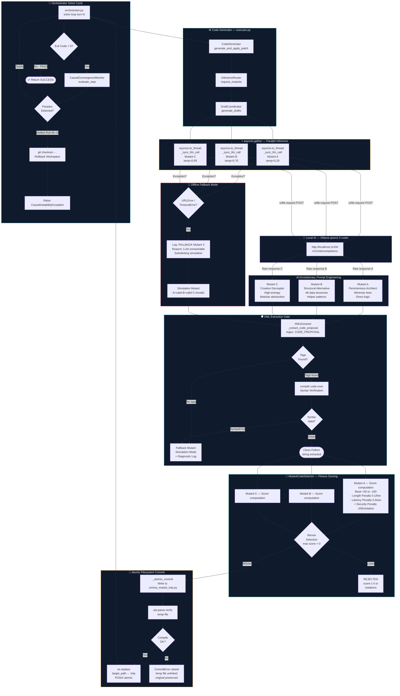

# 🌌 EMMA COGNITIVE CORE — UPGRADED VERTICAL SIGNAL FLOW
### Classification: Production-Grade Architectural Specification v2.0
### File: E:\EMMA_INDIA_RUN\emma_architecture_v2_vertical.md

This document contains the complete, upgraded vertical system signal flow diagram for Task **EMM-02-A2**. It is optimized for vertical scrolling and full-screen readability.

---

## 🗺️ System Signal Flow Diagram

---

## 🔍 Subgraph Summaries

* **ORCHESTRATOR:** Monitors the run cycle and forces workspace rollback if paradox loops are encountered.
* **CODEGEN:** Gateway adapting raw generation queries into structured drafts.
* **PARALLEL & LLM:** Thread-safe parallel execution pipelines making concurrent requests to local Ollama endpoints.
* **PROMPTS:** Specific system templates mapped to low, medium, and high temperature variations.
* **XML & OFFLINE:** Extraction, parser, and error safety nets guaranteeing robust offline simulations.
* **SANDBOX:** Real-time scoring computations validating mutant viability.
* **COMMIT:** Atomic IO execution avoiding directory corruption.
