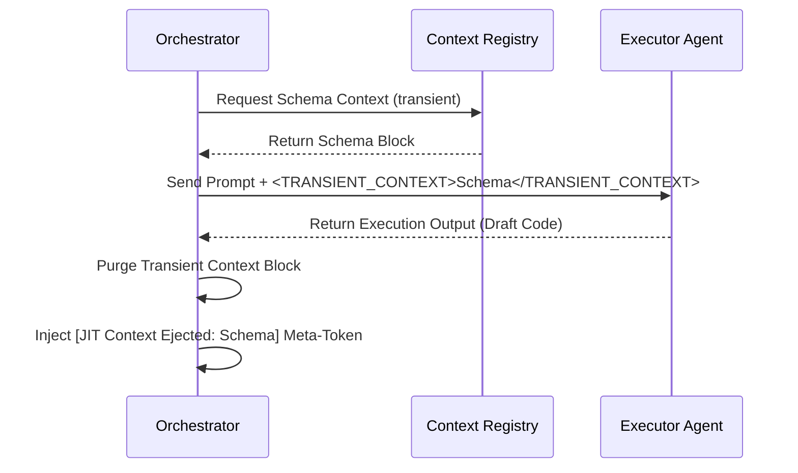

# Advanced Implementation Plan: Dynamic Metacognitive Context Compaction for EMMA

To enable robust, recursive self-improvement loops on local, resource-constrained LLMs (running via Ollama or LM Studio with 8K–16K token limits), EMMA implements an active memory management system. This document outlines the technical specification and implementation roadmap for **Dynamic Metacognitive Context Compaction**.

---

## 1. Just-In-Time (JIT) Context Injection Engine

### 1.1 Objective
Prevent prompt bloat by ensuring large static assets (database schemas, long utility source code files, or API docs) are only present in the context window during the exact execution step that requires them.

### 1.2 Mechanism
*   **The Context Registry:** The Orchestrator maintains a registry of available "Context Modules." Each module has an ID, a dependency map, and a lazy-loading reference.
*   **Transient Injection Hooks:** Before invoking a specialized agent (e.g., Executor), the Orchestrator inspects the current step's dependency flags. It injects the context block under a strict tag sequence (`<TRANSIENT_CONTEXT>` ... `</TRANSIENT_CONTEXT>`).
*   **Post-Step Ejection:** Immediately upon receiving the specialized agent's output, the Orchestrator sweeps the message history, removing the raw transient context blocks and replacing them with a tiny metadata token, e.g., `[JIT Context Ejected: postgresql_schema_v1]`.



---

## 2. Sliding State-Vector Compaction Pipeline

### 2.1 Objective
Maintain planning coherence and prevent agent crashes or context overflows during long-running execution loops by condensing execution histories.

### 2.2 Core Specification
*   **The Trigger:** A background monitor measures the active context token count on every step. When usage hits **70% of the maximum model capacity** (e.g., 5,600 tokens in an 8K model), it triggers the Compaction pipeline.
*   **The State Vector Schema:** The compaction process translates the linear history into a highly structured JSON **Execution State Vector**:
    ```json
    {
      "global_goal": "Integrate legacy PostgreSQL DB with secure OAuth 2.0 portal",
      "current_directory_state": {
        "files_modified": ["src/db/connector.py", "config/oauth.json"],
        "active_branch": "feature/oauth-integration"
      },
      "checklist_status": {
        "completed": ["Task 1: Schema Introspection", "Task 2: Draft Token Exchange Flow"],
        "pending": ["Task 3: Implement Endpoint Mapping", "Task 4: Sandbox Integration Tests"]
      },
      "last_execution_state": {
        "status": "FAIL",
        "last_failure_log": "401 Unauthorized: Invalid legacy token prefix format",
        "attempted_correction_patch": "replace 'Bearer' with 'Token' prefix"
      }
    }
    ```
*   **Summarization Prompt:** A specialized, high-speed local model runs a targeted summarization task on the raw chat history, extracting and updating the state vector fields.
*   **Purge Cycle:** Once compiled, the raw chat messages (terminal outputs, stdout logs, intermediate LLM discussions) are cleared from the active prompt. The prompt is initialized with the compiled **Execution State Vector**, reclaiming over **75% of the context window** instantly.

---

## 3. AST-Level Structural Diff Prompts

### 3.1 Objective
Stop the costly and inefficient practice of passing 500-line source code files back and forth between Critic and Executor agents, which rapidly fills the local context window.

### 3.2 Mechanism
*   **AST Analysis:** When the Executor runs code in the sandbox and encounters an assertion error, the **Critic Agent** uses a local AST (Abstract Syntax Tree) parser (e.g., Python's `ast` library) to locate the exact node/function where the failure occurred.
*   **Diff-Only Payload:** Instead of returning the full file to the Executor, the Critic generates a localized diff block specifying:
    1.  The target file path.
    2.  The start and end lines of the failing block.
    3.  A targeted diff showing the current failed code and the proposed replacement patch.
*   **Prompt Structure:** The Executor receives a lightweight prompt:
    ```
    Goal: Modify 'src/db/connector.py' to resolve assertion failure.
    Target Block Line 142-148:
    <<<< CURRENT
    def get_auth_header(token):
        return f"Bearer {token}"
    ==== PROPOSED
    def get_auth_header(token):
        return f"Token {token}"
    >>>> RATIONALE: Legacy DB connector requires 'Token' prefix, not standard 'Bearer' prefix.
    ```
*   **Local File Application:** The Executor applies only this localized patch to its workspace, maintaining a tiny, efficient prompt footprint.

---

## 4. Widescreen PowerPoint Slide Integration

This advanced context architecture will be featured prominently in **Slide 4 (Pillar 1: Intrinsic Metacognition)** of the pitch deck to demonstrate highly sophisticated engineering awareness to the judges:

```
[Key Visual Callout on Slide 4]
"Metacognitive Context Compaction: Active context pruning, JIT schema injection, and AST-level diffs, allowing infinite self-correction loops to run successfully on local 8K-token models."
```

---

## 5. Development Timeline (Days 11–18)

| Day | Feature Block | Deliverable |
| :---: | :--- | :--- |
| **Day 11** | JIT Registry System | Implement Orchestrator Context Registry and transient tag parsing scripts. |
| **Day 12** | Local Token Monitor | Build active token counter and 70% capacity trigger system. |
| **Day 13** | State Vector Parser | Implement JSON State Vector parser and local model summarization prompt. |
| **Day 14** | History Purge Engine | Test prompt state wiping and context restoration from State Vector. |
| **Day 15** | AST Parser Hook | Integrate Python `ast` library to pinpoint source code failures. |
| **Day 16** | Localized Diff Generator | Write Critic's AST-diff extraction and patching pipeline. |
| **Day 17** | End-to-End Loop Test | Run a simulated 15-iteration self-correction loop under strict 8K token limits. |
| **Day 18** | Dashboard Visualization | Connect backend compaction events to the Command Center Console thought stream. |
