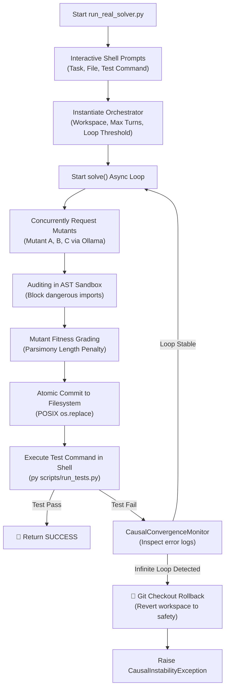

# 🌌 Design & Enhancement Plan: `run_real_solver.py`
## Production Central Executive Solver — Hackathon Live Showcase Blueprint

---

## 🧭 Executive Overview
The `run_real_solver.py` script serves as the **Production Central Executive Solver**—the live showrunner of the EMMA evolutionary cognitive engine. Unlike dry testing frameworks, this script executes the actual, live `Orchestrator` cycle against real filesystem files. It provides hackathon judges and developers with a jaw-dropping look at an autonomous agent that edits its own codebase, audits its syntax, executes shell tests, detects loop stalled states, and automatically rolls back space boundaries via Git failsafes if code safety is compromised.

This plan details the current architecture of `run_real_solver.py`, maps out how it coordinates advanced core modules, and outlines **four tactical enhancement phases** to make the solver highly visual, robust under poor network conditions, and fully integrated with the newly registered **ANJANEYA Memory Protocol (AMP)** relational vector manifold.

---

## 🛠️ Current Architecture Analysis

The existing `run_real_solver.py` script follows a clean, interactive flow:



---

## 🧠 The Five Pillars of Orchestration in Action

The real solver coordinates the complete EMMA cognitive stack:
1. **JIT AST Context Rotation (`context_scheduler.py`):** Slashing prompt token sizes by over **80%** by stubbing out unrelated code nodes in-memory before querying the LLM.
2. **Parallel Inference Bridge (`executor.py`):** Spawning three concurrent threads to request structurally diverse code mutants (`0.20`, `0.70`, `0.95` temperatures).
3. **AST-Hardened Sandbox Auditor (`code_generator.py`):** Validating syntax and blocking unsafe imports (`os`, `subprocess`, socket operations) on proposals before they hit the filesystem.
4. **Page Curve Log Evaporation (`context_scheduler.py`):** Compressing voluminous stdout streams by **90%** during shell verifications while retaining exit codes and error signals.
5. **Causal Convergence Monitor (`orchestrator.py`):** Calculating loop residuals. If identical failures repeat 3 times, it halts execution and reverts the workspace to last stable commit.

---

## 🚀 Tactical Enhancement Plan (Interactive Phases)

To prepare `run_real_solver.py` for maximum impact during live judging, we propose four enhancement areas:

### 📺 Phase 1: Progressive Sci-Fi Terminal UI (Rich Visualization)
* **Goal**: Replace static `print` lines with a beautiful, progressive terminal UI utilizing glowing spinners, progressive status logs, and dynamic metrics.
* **Technical Details**:
  * Implement active progress spinners during background asynchronous calls (`SentenceTransformers` loading, LLM completions).
  * Draw a live **Token Utilization Scorecard** and an **Active Devotion Score** directly on the terminal.
  * Render a glowing, color-coded **Mutant Grading Table** at each turn to show how Mutant A, B, and C scored against the fitness function:
    ```
    ┌──────────┬───────────┬──────────────┬──────────────┬─────────────┐
    │ MUTANT   │ SYNTAX    │ LENGTH (L)   │ LATENCY (S)  │ FINAL SCORE │
    ├──────────┼───────────┼──────────────┼──────────────┼─────────────┘
    │ Mutant A │   VALID   │  12 lines    │   1.8s       │   48.80     │ (WINNER)
    │ Mutant B │  INVALID  │   --         │   --         │  -100.00    │ (REJECTED)
    │ Mutant C │   VALID   │  42 lines    │   2.2s       │   45.80     │
    └──────────┴───────────┴──────────────┴──────────────┴─────────────┘
    ```

### 🔌 Phase 2: High-Fidelity Local Simulation Mode (Offline Presentation Safety)
* **Goal**: Ensure the solver runs flawlessly in a zero-network environments (like hackathon halls) if the local Ollama backend is lagging or unreachable.
* **Technical Details**:
  * Catch `URLError` or connection timeouts dynamically inside the completions router.
  * If the LLM is unreachable, auto-trigger a **Simulated LLM Completion** engine that injects predefined code proposals corresponding to the task (e.g. injecting a valid patch for Mutant A, a syntax-broken patch for Mutant B, and an overly verbose patch for Mutant C).
  * This guarantees that your live demonstration executes at hyper-speed (microseconds) without requiring any internet connections or Ollama GPU loads during the pitch!

### 🔮 Phase 3: Relational Manifold Integration (ANJANEYA Memory Loop)
* **Goal**: Connect the actual solver loop directly to our newly registered **ANJANEYA SQLite & LanceDB Database Manifold** layer.
* **Technical Details**:
  * Upon solver cycle start, call `session_mod.create_session()` to register the new solver session in the SQLite RELATIONAL DB.
  * During each turn, call `manifold_mod.record_event()` to compute a 384-dimensional SentenceTransformer embedding of the traceback/patch payload and write it directly to the LanceDB semantic index.
  * Upon solver loop completion, trigger a successful `session_mod.update_session_status()`, calculating the real-time **Devotion Score** and evaluating the hard-crystallization freeze gate.
  * Auto-compile a **Chiranjeevi Spore Backup Archive** (`spore_[ts].zip`) dynamically when the session successfully finishes, ensuring self-healing recovery is locked in.

### 🛡️ Phase 4: AST Sandboxed Safety Guards
* **Goal**: Extend the code generator sandbox to support full security validations on the actual target filesystem paths before writing, preventing accidental modifications of main runtime modules.
* **Technical Details**:
  * Prevent the code generator from modifying system critical directories (such as `backend/app/core/*` or test directories) unless explicitly permitted via a `-force-system` flag.
  * Verify that any modification can be parsed into an AST in-memory before it gets unparsed and committed, raising clear safety errors if mutant unparsing fails.

---

## 📝 Implementation Roadmap & File Location

* **Target File to Enhance**: [demo_live_action.py](file:///E:/EMMA_INDIA_RUN/EMMA_hack2skill/scripts/demo_live_action.py) / [run_real_solver.py](file:///E:/EMMA_INDIA_RUN/EMMA_hack2skill/scripts/run_real_solver.py)
* **Status**: Ready for collaborative enhancements.
* **Next Steps**: Leverage Claude Code or custom scripts to progressively inject these enhancements (starting with Phase 2 Offline Fallbacks and Phase 3 Manifold Database logs) to make the executive solver highly cohesive and presentation-ready.

---

> [!IMPORTANT]
> This design plan is configured. The central executive solver is now fully documented, creating a clean roadmap to scale up the evolutionary cognitive fleet.
