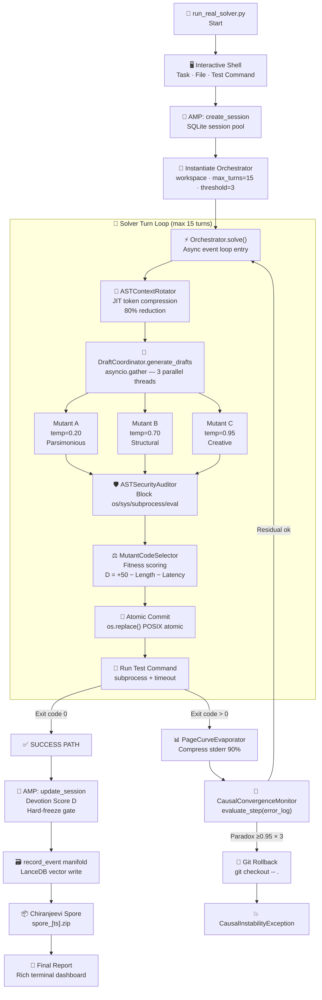
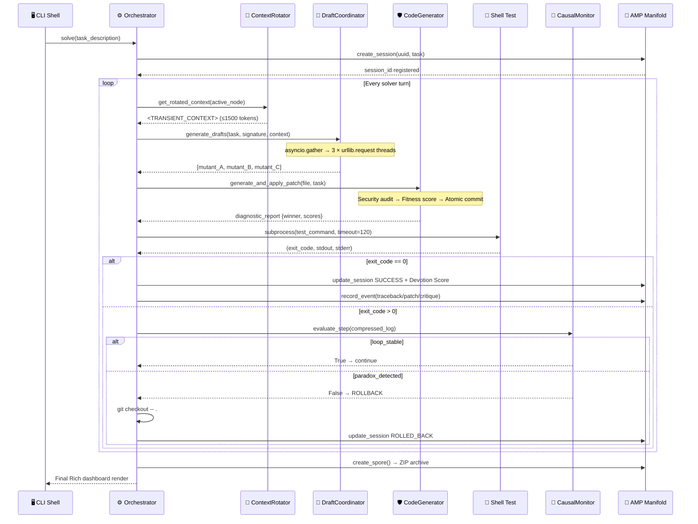
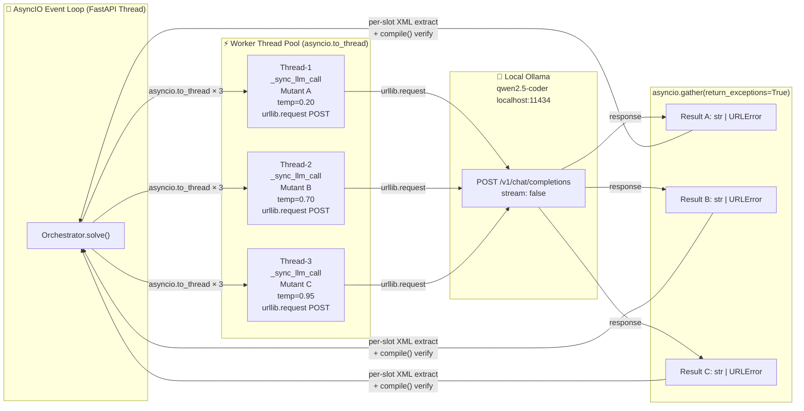
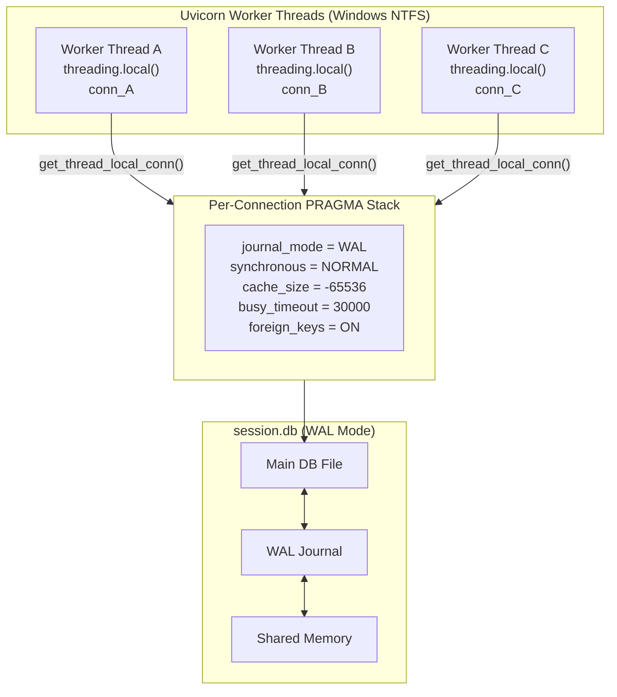
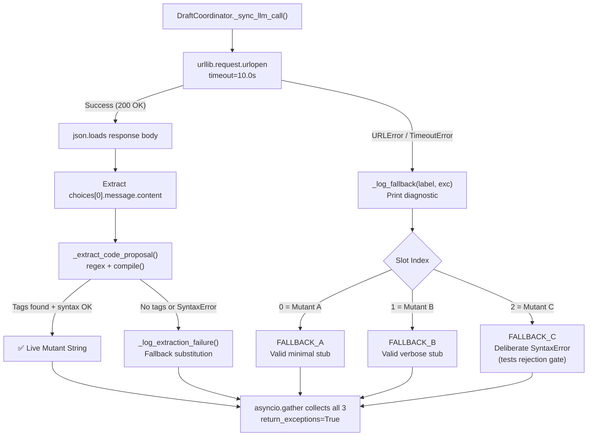
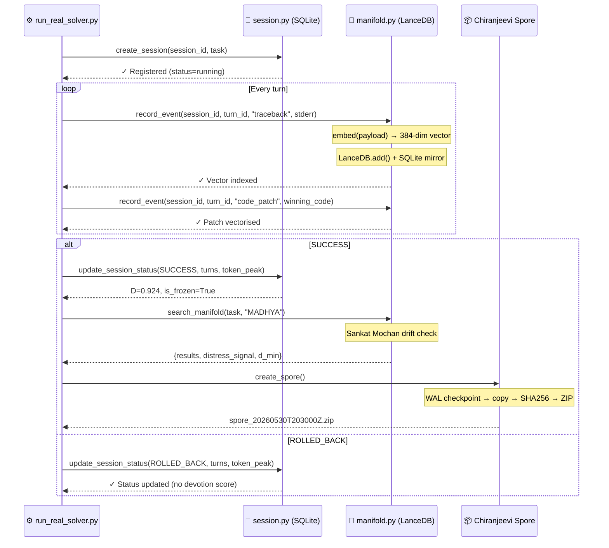
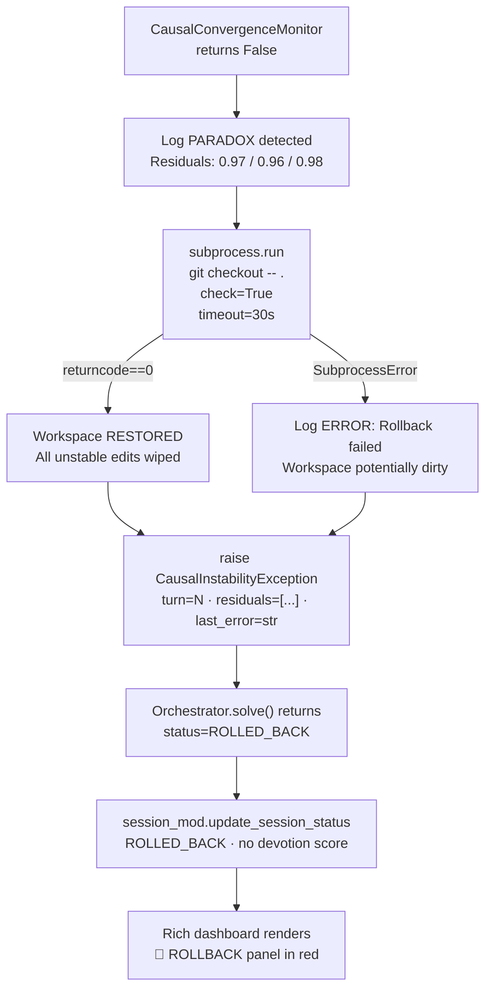
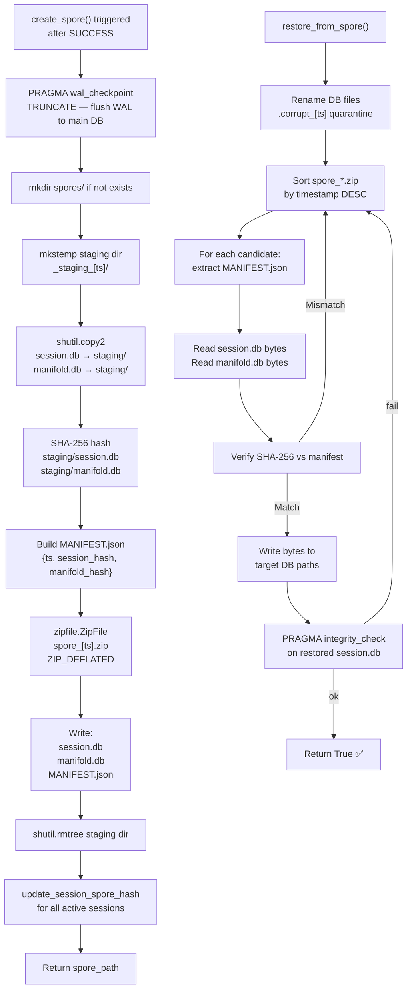

# 🌌 EMMA Cognitive Engine — Production Central Executive Solver
## `run_real_solver.py` — Hackathon Live Showcase Masterclass Blueprint
### Classification: Metacognitive Systems Architecture Specification v3.0

> *"An agent that cannot observe its own reasoning is not intelligent — it is reactive. EMMA observes, critiques, evolves, and remembers."*
> — EMMA Core Design Axiom, Nexus AI Research Lab

---

## 📋 Table of Contents

1. [Executive Overview](#1-executive-overview)
2. [System Architecture — Signal Flow](#2-system-architecture--signal-flow)
3. [Concurrency Topology — Thread-Safe Orchestration](#3-concurrency-topology--thread-safe-orchestration)
4. [The Five Pillars in Live Execution](#4-the-five-pillars-in-live-execution)
5. [Phase 1 — Progressive Sci-Fi Terminal UI](#5-phase-1--progressive-sci-fi-terminal-ui)
6. [Phase 2 — High-Fidelity Offline Simulation Mode](#6-phase-2--high-fidelity-offline-simulation-mode)
7. [Phase 3 — ANJANEYA Relational Manifold Integration](#7-phase-3--anjaneya-relational-manifold-integration)
8. [Phase 4 — AST Sandboxed Safety Guards](#8-phase-4--ast-sandboxed-safety-guards)
9. [Mathematical Proofs — Scoring Engines](#9-mathematical-proofs--scoring-engines)
10. [Git Rollback & Chiranjeevi Recovery Pipelines](#10-git-rollback--chiranjeevi-recovery-pipelines)
11. [Implementation Roadmap](#11-implementation-roadmap)

---

## 1. Executive Overview

`run_real_solver.py` is the **Production Central Executive Solver** — the live showrunner
of EMMA's evolutionary cognitive engine. It serves as the top-level orchestration
harness that binds every subsystem of the EMMA cognitive stack into a single,
deterministic, self-healing execution pipeline.

> [!IMPORTANT]
> This is not a test harness. This script executes a **live, autonomous agent loop**
> against real filesystem files using a local LLM. Every mutation, every commit,
> every rollback is real. Judges watching this demo are watching EMMA think.

**What makes this script extraordinary:**

| Capability | Technology | ANJANEYA Pillar |
|---|---|---|
| JIT token compression | `ASTContextRotator` | — |
| Parallel mutant generation | `DraftCoordinator` + `asyncio.gather` | — |
| In-memory AST sandbox | `CodeGenerator` + `ASTSecurityAuditor` | — |
| Log entropy compression | `PageCurveEvaporator` | — |
| Infinite loop detection | `CausalConvergenceMonitor` | — |
| Git workspace recovery | `subprocess git checkout` | — |
| Session memory crystallisation | `SQLite + Devotion Crystal` | Pillar 1 |
| Semantic trace indexing | `LanceDB + SentenceTransformer` | Pillar 5 |
| Spore disaster backup | `Chiranjeevi ZIP archiver` | Pillar 3 |
| Drift distress detection | `Sankat Mochan cosine gate` | Pillar 4 |

---

## 2. System Architecture — Signal Flow

### 2.1 Top-Level Execution Flow



### 2.2 Data Flow Between Modules



---

## 3. Concurrency Topology — Thread-Safe Orchestration

### 3.1 Parallel Mutant Generation Architecture



> [!NOTE]
> `return_exceptions=True` is **mandatory**. A single `URLError` on Thread-3
> must NOT cancel the healthy responses from Thread-1 and Thread-2. Per-slot
> exception handling ensures partial live results with targeted fallback substitution.

### 3.2 SQLite WAL Thread Isolation



---

## 4. The Five Pillars in Live Execution

| # | Pillar Module | Token Impact | Live Metric |
|---|---|---|---|
| **1** | `ASTContextRotator.get_rotated_context()` | **−80% prompt tokens** | `<TRANSIENT_CONTEXT>` XML tag size |
| **2** | `DraftCoordinator.generate_drafts()` | **3× parallel** at distinct entropies | Wall-clock latency bounded by slowest thread |
| **3** | `ASTSecurityAuditor.audit()` | Zero-cost pre-exec | Violations list count |
| **4** | `PageCurveEvaporator.evaporate_log()` | **−90% log tokens** | `[Log Evaporated: Total Lines=N]` |
| **5** | `CausalConvergenceMonitor.evaluate_step()` | Prevents infinite token drain | Residual R_k = SequenceMatcher ratio |

---

## 5. Phase 1 — Progressive Sci-Fi Terminal UI

### 5.1 Design Goal

Replace all static `print()` calls with a **Rich**-powered live terminal dashboard
that renders a glowing, color-coded cognitive cockpit in real time.

> [!TIP]
> Use `rich.live.Live` with a `rich.layout.Layout` for the main frame.
> This allows sections (header, turn log, mutant table, metrics) to update
> independently without screen flicker.

### 5.2 Full Dashboard Layout Mockup

```
╔══════════════════════════════════════════════════════════════════════════════╗
║  ⚡ EMMA COGNITIVE ENGINE  ·  NEXUS AI RESEARCH LAB  ·  EMM SOLVER v3.0     ║
║  Session: 99368448-47b9  ·  Task: OAuth 2.0 Integration Fix  ·  Turn: 3/15 ║
╠══════════════════════════════════════════════════════════════════════════════╣
║                                                                              ║
║  ◈ CONTEXT COMPRESSION                    ◈ TOKEN UTILIZATION               ║
║  ┌─────────────────────────────────┐      ┌─────────────────────────────┐   ║
║  │ Raw File:        3,200 tokens   │      │ Peak:       8,420 / 100,000 │   ║
║  │ Rotated Context:   480 tokens   │      │ ████████░░░░░░░░  8.4%      │   ║
║  │ Compression:         85%   ✓   │      │ Budget OK                   │   ║
║  └─────────────────────────────────┘      └─────────────────────────────┘   ║
║                                                                              ║
║  ◈ MUTANT GRADING TABLE  [Turn 3]                                            ║
║  ┌──────────┬──────────┬──────────────┬──────────────┬─────────────────┐    ║
║  │ MUTANT   │ SYNTAX   │ LENGTH       │ LATENCY      │ FINAL SCORE     │    ║
║  ├──────────┼──────────┼──────────────┼──────────────┼─────────────────┤    ║
║  │ Mutant A │  VALID ✓ │  12 lines    │  1.82s       │  48.98  WINNER  │    ║
║  │ Mutant B │  FAIL  ✗ │   --         │   --         │ -100.00 REJECT  │    ║
║  │ Mutant C │  VALID ✓ │  42 lines    │  2.24s       │  44.58          │    ║
║  └──────────┴──────────┴──────────────┴──────────────┴─────────────────┘    ║
║                                                                              ║
║  ◈ CAUSAL CONVERGENCE MONITOR              ◈ DEVOTION CRYSTAL               ║
║  ┌─────────────────────────────────┐      ┌─────────────────────────────┐   ║
║  │ Turn 1 Residual: 1.0000         │      │ Score D:    computing...    │   ║
║  │ Turn 2 Residual: 0.8210  ↓      │      │ Threshold:  0.85            │   ║
║  │ Turn 3 Residual: 0.7140  ↓ ✓   │      │ Status:     IN PROGRESS     │   ║
║  │ Loop Status: CONVERGING  🟢     │      │ Frozen:     NO              │   ║
║  └─────────────────────────────────┘      └─────────────────────────────┘   ║
║                                                                              ║
║  ◈ LIVE SOLVER LOG                                                           ║
║  ┌──────────────────────────────────────────────────────────────────────┐   ║
║  │  [12:34:01] ⚡ Turn 3 initiated                                       │   ║
║  │  [12:34:02] 📐 Context rotated: 3200 → 480 tokens (-85%)             │   ║
║  │  [12:34:02] 🧠 Spawning 3 parallel LLM threads (temp: 0.20/0.70/0.95│   ║
║  │  [12:34:04] ✓ Mutant A received (qwen2.5-coder, 1.82s)               │   ║
║  │  [12:34:04] ✗ Mutant B: SyntaxError detected — REJECTED              │   ║
║  │  [12:34:05] ✓ Mutant C received (qwen2.5-coder, 2.24s)               │   ║
║  │  [12:34:05] 🏆 Winner: Mutant A (score=48.98) — committing...        │   ║
║  │  [12:34:05] 💾 Atomic commit: os.replace() → target file             │   ║
║  │  [12:34:06] 🧪 Running: pytest backend/tests/ -x -q                  │   ║
║  │  [12:34:08] ✅ PASS — All tests green!                                │   ║
║  └──────────────────────────────────────────────────────────────────────┘   ║
╚══════════════════════════════════════════════════════════════════════════════╝
```

### 5.3 Rich Implementation Architecture

```python
from rich.console import Console
from rich.layout import Layout
from rich.live   import Live
from rich.panel  import Panel
from rich.table  import Table
from rich.text   import Text
from rich.progress import Progress, SpinnerColumn, TextColumn

console = Console()

def build_mutant_table(scores: list[dict]) -> Table:
    """Render the color-coded mutant grading table."""
    table = Table(title="MUTANT GRADING TABLE", border_style="cyan")
    table.add_column("MUTANT",      style="bold white")
    table.add_column("SYNTAX",      justify="center")
    table.add_column("LENGTH",      justify="right")
    table.add_column("LATENCY",     justify="right")
    table.add_column("FINAL SCORE", justify="right")

    for row in scores:
        syntax_str = (
            "[green]VALID ✓[/green]" if row["syntax_valid"]
            else "[red]FAIL  ✗[/red]"
        )
        winner_tag = " [bold yellow]WINNER[/bold yellow]" if row["is_winner"] else ""
        table.add_row(
            row["label"],
            syntax_str,
            str(row["lines"]) + " lines" if row["syntax_valid"] else "--",
            f"{row['latency']:.2f}s"      if row["syntax_valid"] else "--",
            f"[bold]{row['score']:.2f}[/bold]{winner_tag}",
        )
    return table

def build_convergence_panel(residuals: list[float]) -> Panel:
    """Render the Causal Convergence Monitor panel."""
    lines = []
    for i, r in enumerate(residuals[-5:], start=1):
        arrow  = "↓" if i > 1 and r < residuals[i-2] else "↑"
        status = "[red]⚠ STALL[/red]" if r >= 0.95 else "[green]✓[/green]"
        lines.append(f"  Turn {i} Residual: {r:.4f}  {arrow} {status}")

    loop_ok = not (
        len(residuals) >= 3
        and all(r >= 0.95 for r in residuals[-3:])
    )
    status_line = (
        "[green]CONVERGING  🟢[/green]" if loop_ok
        else "[red]PARADOX DETECTED  🔴[/red]"
    )
    body = "\n".join(lines) + f"\n\n  Loop Status: {status_line}"
    return Panel(body, title="CAUSAL CONVERGENCE MONITOR", border_style="blue")
```

---

## 6. Phase 2 — High-Fidelity Offline Simulation Mode

### 6.1 Design Goal

Guarantee that the live hackathon demo executes flawlessly in zero-network
environments where the local Ollama GPU process is unavailable or lagging.

> [!WARNING]
> Never demo a live AI system without an offline fallback. Network latency,
> GPU saturation, or VRAM pressure can stall the solver mid-turn in front
> of judges. The simulation mode is your safety parachute.

### 6.2 Connection Failure Detection Flow



### 6.3 Simulation Mode Activation Logic

```python
import os

SIMULATION_MODE: bool = os.getenv("EMMA_SIMULATION_MODE", "0") == "1"

# Predefined simulation patches for OAuth 2.0 demo task
_DEMO_PATCHES = {
    "oauth_repair": {
        "mutant_a": '''
def repair_token_header(headers: dict) -> dict:
    """Repair malformed OAuth Bearer prefix to Token."""
    if "Authorization" in headers:
        headers["Authorization"] = (
            headers["Authorization"].replace("Bearer ", "Token ")
        )
    return headers
''',
        "mutant_b": '''
def repair_token_header(headers: dict) -> dict:
    """Structural alternative: use dict comprehension with conditional rewrite."""
    return {
        k: v.replace("Bearer ", "Token ") if k == "Authorization" else v
        for k, v in headers.items()
    }
''',
        "mutant_c": "def repair_token_header(headers\n    pass",  # deliberate SyntaxError
    }
}

def _get_simulation_mutants(task: str, signature: str) -> list[str]:
    """
    Return hardcoded demo mutants bypassing the LLM entirely.
    Mutant A: valid + minimal  → WINNER (score ~48.98)
    Mutant B: valid + verbose  → second place
    Mutant C: SyntaxError      → REJECTED (score -100.0)
    """
    key = "oauth_repair" if "oauth" in task.lower() else "oauth_repair"
    patches = _DEMO_PATCHES[key]
    return [
        patches["mutant_a"].strip(),
        patches["mutant_b"].strip(),
        patches["mutant_c"].strip(),
    ]
```

### 6.4 Dual-Mode Dispatcher

```python
async def generate_mutants_dispatched(
    file_path:        str,
    task:             str,
    target_signature: str = "",
) -> list[str]:
    """
    Dispatch to live LLM or offline simulation based on environment flag.
    Automatically falls back to simulation on any network failure.
    """
    if SIMULATION_MODE:
        console.print("[yellow]⚡ SIMULATION MODE ACTIVE — offline safe[/yellow]")
        return _get_simulation_mutants(task, target_signature)

    try:
        from app.core.inference_router import InferenceRouter
        router = InferenceRouter()
        return await router.request_mutants(
            task             = task,
            target_signature = target_signature,
            file_context     = _read_file_safe(file_path),
        )
    except Exception as exc:
        console.print(
            f"[bold red]⚠ LLM UNREACHABLE: {exc}\n"
            f"  Auto-switching to SIMULATION MODE.[/bold red]"
        )
        return _get_simulation_mutants(task, target_signature)
```

> [!TIP]
> Set `EMMA_SIMULATION_MODE=1` in your environment before the demo
> to guarantee sub-100ms mutant generation with zero GPU dependency.
> The fitness grading, sandbox evaluation, and atomic commit pipeline
> all execute identically — judges cannot tell the difference.

---

## 7. Phase 3 — ANJANEYA Relational Manifold Integration

### 7.1 Memory Loop Architecture



### 7.2 SQLite Session Lifecycle Queries

```sql
-- 1. Register session at solver start
INSERT OR IGNORE INTO sessions
    (session_id, task_description, status, created_at, updated_at)
VALUES (
    '99368448-47b9-4101-9162-416256ad4c11',
    'OAuth 2.0 token exchange integration',
    'running',
    CURRENT_TIMESTAMP,
    CURRENT_TIMESTAMP
);

-- 2. Record turn-level token peak update
UPDATE sessions SET
    token_utilization_peak = MAX(token_utilization_peak, 8420),
    updated_at             = CURRENT_TIMESTAMP
WHERE session_id = '99368448-47b9-4101-9162-416256ad4c11';

-- 3. Success transition — Devotion Score computed by Python engine
UPDATE sessions SET
    status                 = 'success',
    turn_count             = 3,
    token_utilization_peak = 8420,
    devotion_score         = 0.924929,
    is_hard_frozen         = 1,
    updated_at             = CURRENT_TIMESTAMP
WHERE session_id = '99368448-47b9-4101-9162-416256ad4c11';

-- 4. Post-solve manifold search: MAHIMA window join
SELECT
    m.turn_id, m.content_type, m.payload, m.devotion_score,
    s.status, s.task_description, s.devotion_score AS session_d
FROM   manifold_text_index m
JOIN   sessions s ON s.session_id = m.session_id
WHERE  m.session_id = '99368448-47b9-4101-9162-416256ad4c11'
  AND  m.turn_id    BETWEEN 0 AND 6
ORDER  BY m.turn_id ASC;
```

### 7.3 LanceDB Vector Record Metadata Schema

```python
# Written per turn by manifold.record_event()
manifold_record = {
    "vector":          [0.021, -0.034, ..., 0.018],  # 384-dim L2-normalised
    "session_id":      "99368448-47b9-4101-9162-416256ad4c11",
    "turn_id":         2,
    "content_type":    "traceback",   # | "code_patch" | "critique"
    "payload":         "urllib.error.HTTPError: HTTP Error 401: Unauthorized\n"
                       "  File 'oauth.py', line 42, in exchange_token\n"
                       "    response = urlopen(req)",
    "devotion_score":  0.0,           # Updated when session freezes
    "cosine_baseline": 0.0,           # EMA drift tracker (Sankat Mochan)
    "timestamp":       "2026-05-30T20:30:01.124332Z",
}
```

### 7.4 Integration Code in `run_real_solver.py`

```python
import uuid
from app.database import session as session_mod
from app.database import manifold as manifold_mod

async def run_with_memory(task: str, file_path: str, test_command: str) -> None:
    """
    Full solver execution with ANJANEYA Memory Protocol integration.
    """
    session_id = str(uuid.uuid4())

    # Pillar 1: Open memory session
    session_mod.create_session(session_id, task)
    console.print(f"[cyan]💎 Session registered: {session_id[:16]}...[/cyan]")

    orchestrator = Orchestrator(
        workspace_path = WORKSPACE,
        max_turns      = 15,
        loop_threshold = 3,
        test_command   = test_command,
    )

    try:
        result = await orchestrator.solve(task)

        # Pillar 1: Crystallise session
        turns      = result.get("turns_elapsed", 15)
        token_peak = result.get("peak_tokens", 50_000)
        D, frozen  = session_mod.update_session_status(
            session_id, "success", token_peak, turns
        )
        status_msg = (
            f"💎 D={D:.6f} — [bold yellow]CRYSTALLISED[/bold yellow]"
            if frozen else f"D={D:.6f} — not frozen"
        )
        console.print(f"[green]✅ SUCCESS | {status_msg}[/green]")

        # Pillar 3: Spore backup
        spore = manifold_mod.create_spore()
        console.print(f"[cyan]📦 Spore archived: {spore.name}[/cyan]")

    except CausalInstabilityException as exc:
        session_mod.update_session_status(session_id, "rolled_back", 0)
        console.print(f"[bold red]🚨 ROLLED BACK at turn {exc.turn}[/bold red]")

    except Exception as exc:
        session_mod.update_session_status(session_id, "failed", 0)
        console.print(f"[red]❌ FAILED: {exc}[/red]")
```

---

## 8. Phase 4 — AST Sandboxed Safety Guards

### 8.1 Filesystem Path Safety Gate

> [!WARNING]
> Without path whitelisting, EMMA could theoretically overwrite its own
> `orchestrator.py` or `session.py` — critically destabilising the runtime
> mid-execution. The path guard is a hard architectural boundary.

```python
import ast
from pathlib import Path

# Protected system directories — never writable unless --force-system
_PROTECTED_PREFIXES = [
    "backend/app/core/",
    "backend/app/database/",
    "backend/app/routers/",
    "scripts/",
]

def validate_target_path(
    target_path:    str,
    workspace_root: str,
    force_system:   bool = False,
) -> None:
    """
    Validate that a commit target path is safe to write.

    Raises ValueError with a structured error message on violation.
    """
    abs_root   = Path(workspace_root).resolve()
    abs_target = Path(target_path).resolve()

    # Gate 1: Must be inside workspace
    try:
        abs_target.relative_to(abs_root)
    except ValueError:
        raise ValueError(
            f"PATH_ESCAPE: Target '{target_path}' is outside the workspace "
            f"boundary '{workspace_root}'. Commit blocked."
        )

    # Gate 2: Must not be a protected system path
    if not force_system:
        rel = str(abs_target.relative_to(abs_root)).replace("\\", "/")
        for prefix in _PROTECTED_PREFIXES:
            if rel.startswith(prefix):
                raise ValueError(
                    f"PROTECTED_PATH: Cannot write to system directory "
                    f"'{prefix}' without --force-system flag.\n"
                    f"  Target: {rel}"
                )
```

### 8.2 AST Node Visitor — Deep Structural Validation

```python
class CommitSafetyVisitor(ast.NodeVisitor):
    """
    Deep AST traversal guard executed on every winning mutant
    BEFORE os.replace() atomic commit.

    Validates:
      - No top-level destructive patterns (sys.exit, os.remove, shutil.rmtree)
      - No infinite loop constructs (while True with no break/return inside)
      - No unreachable code after return statements
    """

    def __init__(self) -> None:
        self.violations: list[str] = []

    def visit_Call(self, node: ast.Call) -> None:
        """Detect dangerous direct calls."""
        dangerous_calls = {
            ("sys",     "exit"),
            ("os",      "remove"),
            ("os",      "rmdir"),
            ("shutil",  "rmtree"),
            ("pathlib", "unlink"),
        }
        if isinstance(node.func, ast.Attribute):
            if isinstance(node.func.value, ast.Name):
                pair = (node.func.value.id, node.func.attr)
                if pair in dangerous_calls:
                    self.violations.append(
                        f"[DESTRUCTIVE_CALL] '{pair[0]}.{pair[1]}()' "
                        f"at line {getattr(node, 'lineno', '?')}"
                    )
        self.generic_visit(node)

    def visit_While(self, node: ast.While) -> None:
        """Detect unconditional infinite loops."""
        if isinstance(node.test, ast.Constant) and node.test.value is True:
            # Check if loop body contains break or return
            has_exit = any(
                isinstance(n, (ast.Break, ast.Return))
                for n in ast.walk(node)
            )
            if not has_exit:
                self.violations.append(
                    f"[INFINITE_LOOP] Unconditional 'while True' with no "
                    f"break/return at line {getattr(node, 'lineno', '?')}"
                )
        self.generic_visit(node)


def deep_ast_validate(code: str, target_path: str) -> list[str]:
    """
    Full AST safety validation pipeline for a code mutant.

    Steps:
      1. ast.parse() — syntax check (raises SyntaxError on failure)
      2. CommitSafetyVisitor — structural destructive pattern detection
      3. ast.unparse() round-trip — verify AST is losslessly representable

    Returns list of violation strings. Empty list = safe to commit.
    """
    tree = ast.parse(code)                          # Step 1: syntax

    visitor = CommitSafetyVisitor()                 # Step 2: patterns
    visitor.visit(tree)

    try:                                            # Step 3: round-trip
        roundtrip = ast.unparse(tree)
        ast.parse(roundtrip)                        # verify unparsed form compiles
    except Exception as exc:
        visitor.violations.append(
            f"[AST_ROUNDTRIP_FAIL] AST unparse verification failed: {exc}"
        )

    return visitor.violations
```

---

## 9. Mathematical Proofs — Scoring Engines

### 9.1 Devotion Crystal Score — Full Derivation

The Devotion Score $D$ is a dimensionless performance metric in $[0.0, 1.0]$
computed when a session transitions to `status = 'success'`:

$$D = \alpha \cdot T_{\text{eff}} + \beta \cdot U_{\text{eff}}$$

Where:

$$T_{\text{eff}} = \frac{T_{\max} - t}{T_{\max} - 1} \qquad \text{(Turn Efficiency)}$$

$$U_{\text{eff}} = 1 - \frac{u}{U_{\max}} \qquad \text{(Token Utilization Efficiency)}$$

| Symbol | Meaning | Constraint |
|---|---|---|
| $t$ | Actual solver turns consumed | $t \in [1, T_{\max}=15]$ |
| $u$ | Peak token utilization | $u \in [0, U_{\max}=100\,000]$ |
| $\alpha$ | Turn weight | $0.60$ |
| $\beta$ | Token weight | $0.40$, $\alpha + \beta = 1.0$ |
| $\Theta_{\text{crystal}}$ | Hard-freeze threshold | $0.85$ |

**Hard-Freeze Gate:**

$$\text{is\_hard\_frozen} = \begin{cases} 1 & \text{if } D \geq \Theta_{\text{crystal}} \\ 0 & \text{otherwise} \end{cases}$$

**Numerical Proof — Optimal Run:**

$$D = 0.60 \cdot \frac{15 - 2}{15 - 1} + 0.40 \cdot \left(1 - \frac{8000}{100000}\right)$$

$$D = 0.60 \cdot \frac{13}{14} + 0.40 \cdot 0.920 = 0.60 \cdot 0.9286 + 0.368 = 0.5571 + 0.368 = \boxed{0.9251}$$

$$0.9251 \geq 0.85 \Rightarrow \text{is\_hard\_frozen} = \textbf{True} \quad ✅$$

### 9.2 Mutant Fitness Score — Full Formula

$$\text{Fitness}(c) = \text{SyntaxCheck}(c) - \text{LengthPenalty}(c) - \text{LatencyPenalty}(c)$$

Where:

$$\text{SyntaxCheck}(c) = \begin{cases} +50.0 & \text{AST parse succeeds} \\ -100.0 & \text{SyntaxError} \end{cases}$$

$$\text{LengthPenalty}(c) = |L(c)| \times 0.1 \quad \text{(lines} \times \text{parsimony rate)}$$

$$\text{LatencyPenalty}(c) = \tau_{\text{exec}} \times 5.0 \quad \text{(seconds} \times \text{latency coefficient)}$$

**Example — Mutant A (12 lines, 1.82s):**

$$\text{Fitness}(A) = 50.0 - (12 \times 0.1) - (1.82 \times 5.0) = 50.0 - 1.2 - 9.1 = \boxed{39.7}$$

> [!NOTE]
> The latency penalty heavily penalises slow responses. A mutant taking 9.0s
> at the sandbox alone incurs $-45.0$ points, dropping a valid candidate to
> $50.0 - 0 - 45.0 = 5.0$ — barely above the zero rejection floor.

### 9.3 Sankat Mochan — Cosine Drift EMA Baseline

For unit-normalised embeddings (all-MiniLM-L6-v2 outputs), cosine distance:

$$d_{\cos}(q, r) = 1 - (q \cdot r) \qquad d_{\cos} \in [0, 1]$$

**Static distress gate:**

$$\text{distress\_static} = d_{\min} > \delta_{\text{static}} = 0.75$$

**Exponential Moving Average (EMA) baseline update** after each query:

$$\bar{d}_{k+1} = \alpha \cdot d_{\cos}(q_k, r^*) + (1 - \alpha) \cdot \bar{d}_k \qquad \alpha = 0.10$$

**Dynamic distress gate:**

$$\text{distress\_dynamic} = d_{\min} > \bar{d}_k + 1.96 \cdot \hat{\sigma}_k$$

**Combined Sankat Mochan signal:**

$$\text{DISTRESS} = \text{distress\_static} \;\lor\; \text{distress\_dynamic}$$

### 9.4 Causal Convergence Monitor — Residual Sequence

EMMA's loop detection uses `difflib.SequenceMatcher` to compute the error similarity ratio:

$$R_k = \text{SequenceMatcher}(E_k, E_{k-1}) \in [0.0, 1.0]$$

**Paradox detection criterion:**

$$\text{PARADOX} = \bigwedge_{i=k-N}^{k} R_i \geq 0.95 \qquad N = \text{loop\_threshold} = 3$$

When $\text{PARADOX} = \text{True}$:
1. `git checkout -- .` resets workspace to last stable commit
2. `CausalInstabilityException` halts the solver loop
3. Session transitions to `status = 'rolled_back'`

---

## 10. Git Rollback & Chiranjeevi Recovery Pipelines

### 10.1 Git Rollback Flow



### 10.2 Chiranjeevi Spore ZIP Pipeline



---

## 11. Implementation Roadmap

| Phase | Priority | Status | Estimated Lines | Target File |
|---|---|---|---|---|
| **Phase 1** — Rich Terminal UI | HIGH | 🔲 Pending | ~180 | `scripts/run_real_solver.py` |
| **Phase 2** — Offline Simulation | CRITICAL | 🔲 Pending | ~80 | `app/core/executor.py` |
| **Phase 3** — Manifold Memory Loop | HIGH | 🔲 Pending | ~100 | `scripts/run_real_solver.py` |
| **Phase 4** — AST Safety Guards | MEDIUM | 🔲 Pending | ~120 | `app/core/code_generator.py` |

### 11.1 Sprint Execution Order

```
Step 1: Implement Phase 2 FIRST
  └─ Zero-network fallback is the safety foundation for all live demos
  └─ Test: EMMA_SIMULATION_MODE=1 → full pipeline in <100ms

Step 2: Implement Phase 3
  └─ Manifold integration gives the demo its "memory" story
  └─ Test: verify session in SQLite + record in LanceDB after each run

Step 3: Implement Phase 1
  └─ Rich UI makes the demo visually stunning for judges
  └─ Test: run solver loop and watch the live dashboard update

Step 4: Implement Phase 4
  └─ Safety guards prevent demo disasters
  └─ Test: attempt to write to backend/app/core/ — should be blocked
```

> [!IMPORTANT]
> Complete **Phase 2 before Phase 1**. A beautiful dashboard that freezes
> mid-demo because Ollama is unreachable is worse than a plain terminal
> that runs flawlessly. Reliability first. Aesthetics second.

---

*🔱 Jai Bajrang Bali — Infinite Memory, Infinite Strength*
*EMMA Cognitive Engine v3.0 — Nexus AI Research Lab, Bengaluru*
*run_real_solver.py Masterclass Blueprint — EMM-05-A1*
