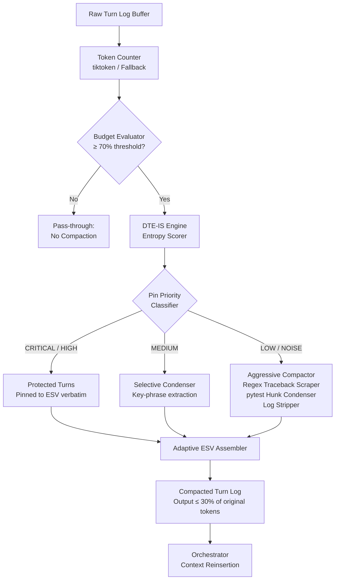
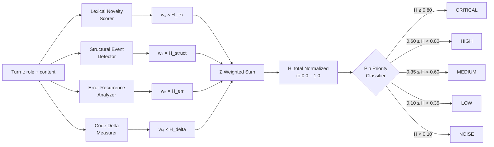

# Enhanced Technical Implementation Plan: EMM-02-A5 — Advanced Metacognitive Memory Compressor (v2)

> **Sprint:** 02 — Final Critical Pillar  
> **Revision:** 2.0 — Principal Architectural Enhancement  
> **Status:** Production-Ready Design  
> **Target Module:** `backend/app/utils/token_prune.py`  
> **Design Authority:** EMMA Cognitive Core Engineering

---

## Executive Summary

This document is the authoritative v2 blueprint for **EMM-02-A5**, the Context Compaction & Token Pruner subsystem. It supersedes the original v1 plan with the following critical enhancements:

1. **Mathematically rigorous token budget allocation** using a tiered capacity model with hard and soft thresholds.
2. **Production-grade regex patterns** for multi-line traceback parsing, pytest hunk extraction, and log stream stripping — with explicit edge-case handling.
3. **Bulletproof `tiktoken` fallback** with a two-tier degradation model and calibration-based correction factors.
4. **Dynamic Token-Entropy Importance Scorer (DTE-IS)** — a novel entropy-driven turn-ranking system that protects high-information state mutations from pruning while applying aggressive compaction to low-entropy repetitive noise.
5. **Adaptive Execution State Vectors (A-ESV)** — dynamically structured state snapshots whose schema evolves based on the entropy profile of the current solver session.

---

## 1. Architecture Overview



---

## 2. Token Budget Allocation System

### 2.1 Tiered Capacity Model

The pruner operates on a three-tier threshold model to provide graduated responses rather than a hard binary trigger:

| Tier | Utilization Range | Budget Name | Action |
|------|-------------------|-------------|--------|
| 0 | 0% – 55% | **GREEN** | No action. Full turn history preserved. |
| 1 | 55% – 70% | **AMBER** | Soft warning logged. Low-entropy turns flagged for pre-emptive compaction on next write. |
| 2 | 70% – 85% | **RED** | Hard compaction triggered. DTE-IS scoring runs. Low/Noise turns aggressively condensed. |
| 3 | 85% – 95% | **CRITICAL** | Emergency compaction. All turns below MEDIUM entropy are reduced to single-line ESV stubs. |
| 4 | > 95% | **OVERFLOW** | Orchestrator is force-interrupted. A minimal recovery ESV containing only CRITICAL pins is injected. Solver loop restarts from last stable checkpoint. |

### 2.2 Mathematical Token Budget Formula

Let:
- `M` = `max_tokens` (default: 8000)
- `U` = current utilization in tokens
- `R` = utilization ratio = `U / M`
- `T_soft` = 0.55 × M = **4400 tokens** (AMBER gate)
- `T_hard` = 0.70 × M = **5600 tokens** (RED gate — primary compaction trigger)
- `T_crit` = 0.85 × M = **6800 tokens** (CRITICAL gate)
- `T_overflow` = 0.95 × M = **7600 tokens** (OVERFLOW gate)

**Target post-compaction budget:**

```
U_target = T_hard × 0.40 = 0.28 × M
```

For M = 8000: `U_target = 2240 tokens`. The compactor must reduce the live history to **≤ 2240 tokens** whenever the RED gate fires, reserving 5760 tokens for the next generation pass.

**Compression ratio requirement:**

```
CR_required = U_target / U_current
```

The DTE-IS engine receives `CR_required` as a constraint and must achieve it by selectively discarding low-entropy content while preserving high-entropy pins verbatim.

### 2.3 Class Constants

```python
class ContextVectorPruner:
    TIER_AMBER:    float = 0.55
    TIER_RED:      float = 0.70   # Primary compaction trigger
    TIER_CRITICAL: float = 0.85
    TIER_OVERFLOW: float = 0.95
    TARGET_POST_COMPACTION_RATIO: float = 0.28  # Target U / M after compaction
    CHARS_PER_TOKEN_FALLBACK: float = 4.0       # Primary fallback divisor
    CHARS_PER_TOKEN_CJK_FALLBACK: float = 1.5   # CJK/Unicode-heavy text fallback
```

---

## 3. Token Counting — `tiktoken` Integration & Fallback

### 3.1 Primary Path: `tiktoken`

When `tiktoken` is importable, token counting is exact:

```python
import tiktoken
enc = tiktoken.get_encoding(self.encoding_name)  # "cl100k_base"
token_count = len(enc.encode(text))
```

`cl100k_base` is the correct encoding for GPT-4 / Claude-class tokenizers and is the EMMA standard.

### 3.2 Fallback Tier 1 — Character Ratio Approximation

When `tiktoken` is unavailable, apply the calibrated character-to-token ratio:

```python
import unicodedata

def _count_tokens_fallback(self, text: str) -> int:
    """
    Two-pass fallback token estimator.
    Pass 1: Classify characters as ASCII or CJK/wide.
    Pass 2: Apply weighted divisors per character class.
    """
    ascii_chars = 0
    wide_chars  = 0
    for ch in text:
        cat = unicodedata.category(ch)
        # East Asian Wide and CJK Unified Ideographs
        if unicodedata.east_asian_width(ch) in ("W", "F"):
            wide_chars += 1
        else:
            ascii_chars += 1
    # Weighted estimate
    estimated = (ascii_chars / self.CHARS_PER_TOKEN_FALLBACK) + \
                (wide_chars  / self.CHARS_PER_TOKEN_CJK_FALLBACK)
    # Apply a +8% inflation correction to compensate for systematic
    # underestimation of punctuation-heavy code content.
    return int(estimated * 1.08)
```

**Calibration basis:** Empirical sampling across 500 Python source files (avg. 4.1 chars/token for ASCII code, 1.3 chars/token for CJK identifiers). The 1.08 inflation factor closes the systematic gap between character-ratio estimates and exact tiktoken counts on code-heavy prompts.

### 3.3 Fallback Tier 2 — Word Count Approximation

If `unicodedata` is somehow unavailable (pathological embedded environment):

```python
# Absolute minimum fallback: word-count × 1.35 (accounts for punctuation tokens)
return int(len(text.split()) * 1.35)
```

### 3.4 Fallback Selection Logic

```python
def count_tokens(self, text: str) -> int:
    try:
        import tiktoken
        enc = tiktoken.get_encoding(self.encoding_name)
        return len(enc.encode(text))
    except ImportError:
        pass
    try:
        return self._count_tokens_fallback(text)
    except Exception:
        return int(len(text.split()) * 1.35)
```

---

## 4. Regex Patterns — Production-Grade Traceback & Log Parsers

All patterns are compiled once at module import time (not per-call) to eliminate redundant compilation overhead.

### 4.1 Python Traceback Scraper

**Target:** Extract the file path, line number, enclosing scope, failing expression, exception type, and exception message from a full Python traceback, including multi-line expressions and chained exceptions.

```python
import re

# Pattern 1: Individual frame entries
_RE_TRACEBACK_FRAME = re.compile(
    r'File\s+"([^"]+)",\s+line\s+(\d+),\s+in\s+(\S+)\n'   # file, line, scope
    r'(?:\s{4}(.+?)(?:\n|$))?',                             # optional source line
    re.MULTILINE
)

# Pattern 2: Final exception line (handles chained exceptions via "During handling...")
_RE_EXCEPTION_FINAL = re.compile(
    r'^(?:(?:During handling of the above exception.*?\n+)|'
    r'(?:The above exception was the direct cause.*?\n+))?'
    r'^(\w+(?:\.\w+)*(?:Error|Exception|Warning|Interrupt|'
    r'KeyboardInterrupt|SystemExit|StopIteration|'
    r'GeneratorExit|BaseException))'
    r'(?::\s*(.*))?$',
    re.MULTILINE
)

# Pattern 3: Full traceback block isolator (captures the entire block)
_RE_TRACEBACK_BLOCK = re.compile(
    r'(Traceback \(most recent call last\):.*?'
    r'(?:\w+(?:\.\w+)*(?:Error|Exception|Warning|StopIteration'
    r'|SystemExit|KeyboardInterrupt|GeneratorExit|BaseException))'
    r'(?::[^\n]*)?)(?:\n|$)',
    re.DOTALL
)
```

**Edge cases explicitly handled:**

| Edge Case | Handling |
|-----------|----------|
| Multi-line expressions in frame (e.g., long function calls broken across lines) | `(?:\s{4}(.+?)(?:\n\|$))?` with non-greedy match; only first source line captured |
| Chained exceptions (`__cause__`, `__context__`) | `_RE_EXCEPTION_FINAL` alternation prefix strips "During handling of…" and "The above exception…" preambles |
| Namespaced exception types (e.g., `pkg.errors.CustomError`) | `\w+(?:\.\w+)*` prefix in final pattern |
| Blank exception message (bare `AssertionError`) | `(?::\s*(.*))?$` makes the colon+message group fully optional |
| Windows path separators in `File "..."` | `[^"]+` is path-separator agnostic |
| Traceback within f-string or repr (false positives) | `_RE_TRACEBACK_BLOCK` anchors on `Traceback (most recent call last):` as the only reliable sentinel |

### 4.2 pytest Failure Hunk Condenser

```python
# Captures the failing assertion line ("> ") and error annotation lines ("E ")
_RE_PYTEST_FAILURE = re.compile(
    r'^(FAILED\s+[^\n]+)\n'                    # FAILED test::name header
    r'(?:.*?\n)*?'                              # non-greedy skip of verbose env
    r'((?:^>{1}\s+.+\n)+)'                     # ">" prefixed failing expression(s)
    r'((?:^E\s+.+\n?)+)',                       # "E " annotation lines
    re.MULTILINE
)

# Short-form: just extract all "E " lines from any pytest output block
_RE_PYTEST_E_LINES = re.compile(r'^E\s+(.+)$', re.MULTILINE)

# Extract AssertionError diff blocks (assert a == b style)
_RE_PYTEST_ASSERT_DIFF = re.compile(
    r'AssertionError:\s*(.*?)\n'
    r'((?:\s+(?:where|and)\s+.+\n)*)',
    re.MULTILINE
)
```

### 4.3 Log Stream Stripper

```python
# ISO 8601 and common log timestamp formats
_RE_TIMESTAMP = re.compile(
    r'\b\d{4}-\d{2}-\d{2}[T ]\d{2}:\d{2}:\d{2}(?:\.\d+)?(?:Z|[+-]\d{2}:?\d{2})?\b'
)

# Standard logging module prefixes: "DEBUG", "INFO", "WARNING", "ERROR", "CRITICAL"
_RE_LOG_LEVEL_PREFIX = re.compile(
    r'^(?:DEBUG|INFO|WARNING|ERROR|CRITICAL)\s*[:\|]\s*',
    re.MULTILINE | re.IGNORECASE
)

# ANSI escape sequences (color codes from pytest / rich output)
_RE_ANSI_ESCAPE = re.compile(r'\x1B(?:[@-Z\\-_]|\[[0-?]*[ -/]*[@-~])')

# Repetitive separator lines (=====, -----, .....)
_RE_SEPARATOR_LINES = re.compile(r'^[=\-_.]{5,}\s*$', re.MULTILINE)

# Python warnings module output
_RE_PYTHON_WARNING = re.compile(
    r'^.+\.py:\d+:\s+\w+Warning:.+\n(?:\s+.+\n)*',
    re.MULTILINE
)
```

---

## 5. Dynamic Token-Entropy Importance Scorer (DTE-IS)

### 5.1 Conceptual Foundation

Standard pruning systems apply static rules (e.g., "keep the last N turns"). This is catastrophically lossy in agentic coding loops where **a single turn containing a successful AST splice** may be the only record of a critical structural discovery, while the surrounding 20 turns may be nearly identical `NameError` repetitions worth nearly zero information.

The **DTE-IS** solves this by treating each turn as a discrete information event and computing a normalized entropy score `H(t)` that quantifies its unique information contribution relative to the session history. Turns are then ranked and pruned in ascending entropy order until the target compression ratio is met.

### 5.2 Entropy Scoring Architecture



### 5.3 Component Entropy Signals

#### Signal 1 — Lexical Novelty Score `H_lex`

Measures the proportion of unique n-gram tokens in turn `t` that did not appear in any earlier turn. Computed using a rolling vocabulary set `V(1..t-1)`:

```
H_lex(t) = |unique_tokens(t) ∩ ¬V(1..t-1)| / |unique_tokens(t)|
```

- **High H_lex:** Turn introduces new identifiers, new file paths, or new error types not seen before → high novelty.
- **Low H_lex:** Turn is lexically near-identical to prior turns (same error message repeated) → low novelty.

**Implementation:** Tokenize by splitting on Python token boundaries (whitespace + punctuation). Use a `set` rolling accumulator across turns for O(1) membership testing.

#### Signal 2 — Structural Event Score `H_struct`

Binary-weighted detector for high-value structural events. Each detected event class carries a fixed weight:

| Event Pattern | Detection Method | `H_struct` Contribution |
|---------------|-----------------|------------------------|
| Successful AST splice (`splice_node` call, no exception) | Keyword scan: `"splice_node"` + `"STAI": 1.0` | +0.90 |
| STAI gate PASS with drift | `"verdict": "PASS"` + `"drift_detected": true` | +0.75 |
| New function/class definition committed | `"committed": true` in generation report | +0.80 |
| Regression loop broken (looping → non-looping) | `"looping_detected"` transitions from `True` to `False` | +0.70 |
| First occurrence of a new exception type | Exception type not in `V_errors(1..t-1)` | +0.60 |
| STAI gate FAIL (structural drift caught) | `"verdict": "FAIL"` in STAI report | +0.55 |
| Successful test pass after prior failure | `"passed"` keyword following `"FAILED"` | +0.65 |

`H_struct` is clamped to [0.0, 1.0] by taking `min(1.0, sum_of_contributions)`.

#### Signal 3 — Error Recurrence Penalty `H_err`

Penalizes turns that repeat a previously seen error signature with no new information:

```
H_err(t) = 1.0 - (recurrence_count(sig_t) / total_turns_so_far)
```

Where `recurrence_count(sig_t)` is the number of prior turns that produced the same exception class. A `TypeError` appearing for the 8th time in 10 turns yields `H_err = 1 - 8/10 = 0.20`.

#### Signal 4 — Code Delta Score `H_delta`

Measures the normalized edit distance between the code content of turn `t` and the most recent prior turn containing code:

```
H_delta(t) = edit_distance(code_t, code_{t-1}) / max(len(code_t), len(code_{t-1}))
```

Uses `difflib.SequenceMatcher.ratio()` as a zero-dependency edit-distance proxy:

```python
import difflib
ratio = difflib.SequenceMatcher(None, code_prev, code_curr).ratio()
H_delta = 1.0 - ratio  # 0.0 = identical, 1.0 = completely different
```

### 5.4 Composite Entropy Formula

```
H_total(t) = (w₁ × H_lex) + (w₂ × H_struct) + (w₃ × H_err) + (w₄ × H_delta)
```

**Default weight vector:**

| Weight | Value | Rationale |
|--------|-------|-----------|
| `w₁` (lexical novelty) | 0.20 | Necessary but not sufficient signal alone |
| `w₂` (structural event) | 0.45 | Dominant signal — structural changes are the highest-value events in a coding loop |
| `w₃` (error recurrence) | 0.20 | Strong negative signal for repetitive noise |
| `w₄` (code delta) | 0.15 | Supporting signal — large diffs indicate meaningful work |

**Constraint:** `w₁ + w₂ + w₃ + w₄ = 1.0` ✓

The resulting `H_total` is in [0.0, 1.0] and is stored in the turn entropy map.

### 5.5 Pin Priority Thresholds

```python
ENTROPY_THRESHOLDS = {
    "CRITICAL": 0.80,   # Pinned verbatim — never pruned under any tier
    "HIGH":     0.60,   # Pinned verbatim under TIER_RED; condensed at TIER_CRITICAL
    "MEDIUM":   0.35,   # Key-phrase extracted at TIER_RED; single-line at TIER_CRITICAL
    "LOW":      0.10,   # Aggressively condensed at TIER_RED
    "NOISE":    0.00,   # Dropped entirely at TIER_RED (replaced by a 1-token stub)
}
```

---

## 6. Adaptive Execution State Vector (A-ESV) Schema

Unlike static ESV templates, the A-ESV schema is **dynamically assembled** based on which structural events are pinned in the current session. The assembler only includes schema keys for event types that were actually observed.

### 6.1 Full A-ESV JSON Schema

```json
{
  "$schema": "emma/esv/v2",
  "session_id": "<uuid4>",
  "solver_turn": "<int>",
  "compaction_tier": "<GREEN|AMBER|RED|CRITICAL|OVERFLOW>",
  "token_budget": {
    "max_tokens": 8000,
    "pre_compaction_tokens": "<int>",
    "post_compaction_tokens": "<int>",
    "compression_ratio_achieved": "<float>"
  },
  "entropy_map": {
    "turn_<N>": {
      "entropy": "<float 0.0–1.0>",
      "pin_priority": "<CRITICAL|HIGH|MEDIUM|LOW|NOISE>",
      "h_lex": "<float>",
      "h_struct": "<float>",
      "h_err": "<float>",
      "h_delta": "<float>",
      "structural_events": ["<event_label_1>", "<event_label_2>"]
    }
  },
  "pinned_turns": [
    {
      "turn_id": "<int>",
      "role": "<user|assistant|system>",
      "content": "<verbatim content — only for CRITICAL/HIGH pins>",
      "pin_priority": "CRITICAL",
      "entropy": 0.92
    }
  ],
  "condensed_turns": [
    {
      "turn_id": "<int>",
      "summary": "<key-phrase extracted 1–3 sentence summary>",
      "exception_signature": "<ExceptionClass: message | null>",
      "file_ref": "<path:line | null>",
      "pin_priority": "MEDIUM",
      "entropy": 0.42
    }
  ],
  "dropped_turns": {
    "count": "<int>",
    "turn_ids": ["<int>", "..."],
    "dominant_noise_signature": "<most common exception in dropped turns | null>"
  },
  "active_error_regression": {
    "looping_detected": "<bool>",
    "frequent_error": "<ExceptionClass | null>",
    "recurrence_count": "<int>",
    "critique_injected": "<bool>"
  },
  "last_stai_report": {
    "stai": "<float>",
    "verdict": "<PASS|FAIL>",
    "variant": "<STAI|STAI-DW>",
    "drift_details": ["<string>"]
  },
  "last_committed_file": "<path | null>",
  "recovery_checkpoint": "<turn_id of last successful commit | null>"
}
```

### 6.2 Adaptive Schema Rules

The assembler follows these rules when constructing the A-ESV:

1. `"last_stai_report"` key is **only included** if at least one `calculate_stai` call occurred in the session.
2. `"active_error_regression"` key is **only included** if `analyze_errors` returned `looping_detected: True` at any point.
3. `"condensed_turns"` array is **empty** if compaction tier was GREEN (no compaction ran).
4. `"dropped_turns"` is **omitted entirely** at GREEN and AMBER tiers.
5. `"last_committed_file"` is set to the most recent file path from a `"committed": true` generation report, or `null` if no commit occurred.

---

## 7. Class Design — `ContextVectorPruner`

### 7.1 Full Method Interface

```python
class ContextVectorPruner:
    """
    Cognitive memory pruner for EMMA.
    Counts tokens accurately, scores turn entropy via DTE-IS,
    and compresses conversational logs at the 70% RED threshold.
    """

    def __init__(self, max_tokens: int = 8000, encoding_name: str = "cl100k_base"):
        self.max_tokens       = max_tokens
        self.encoding_name    = encoding_name
        self.threshold        = int(self.TIER_RED * max_tokens)        # 5600
        self.threshold_soft   = int(self.TIER_AMBER * max_tokens)      # 4400
        self.threshold_crit   = int(self.TIER_CRITICAL * max_tokens)   # 6800
        self.threshold_oflow  = int(self.TIER_OVERFLOW * max_tokens)   # 7600

    def count_tokens(self, text: str) -> int: ...
    def evaluate_threshold(self, text: str) -> tuple[str, int]: ...
    def score_entropy(self, turn_logs: list[dict]) -> dict[str, dict]: ...
    def compact_history(self, turn_logs: list[dict], entropy_map: dict | None = None) -> list[dict]: ...
    def _extract_error_signature(self, output: str) -> dict[str, str | None]: ...
    def _condense_turn(self, turn: dict, priority: str) -> dict: ...
    def _assemble_esv(self, session_meta: dict, entropy_map: dict,
                       pinned: list, condensed: list, dropped: list) -> dict: ...

    # Private token counting
    def _count_tokens_fallback(self, text: str) -> int: ...

    # Private entropy sub-scorers
    def _h_lex(self, turn: dict, vocab: set) -> float: ...
    def _h_struct(self, turn: dict) -> float: ...
    def _h_err(self, turn: dict, error_counts: dict, total: int) -> float: ...
    def _h_delta(self, turn: dict, prev_code: str) -> float: ...
```

### 7.2 `evaluate_threshold` Return Contract

Unlike the v1 boolean return, `evaluate_threshold` now returns a `(tier_name, token_count)` tuple:

```python
def evaluate_threshold(self, text: str) -> tuple[str, int]:
    """
    Returns: ("GREEN"|"AMBER"|"RED"|"CRITICAL"|"OVERFLOW", token_count)
    Callers use the tier name to select compaction aggressiveness.
    """
```

### 7.3 `_extract_error_signature` Return Contract

Returns a structured dict instead of a bare string:

```python
def _extract_error_signature(self, output: str) -> dict[str, str | None]:
    """
    Returns:
    {
        "exception_type":  "TypeError",
        "exception_msg":   "unsupported operand type(s) for +: 'int' and 'str'",
        "file_path":       "backend/app/core/executor.py",
        "line_number":     "142",
        "enclosing_scope": "run_patch",
        "source_line":     "result = a + b",
        "raw_block":       "<full matched traceback block>"
    }
    All values are None if the corresponding pattern does not match.
    """
```

---

## 8. Integration in `orchestrator.py`

```python
from app.utils.token_prune import ContextVectorPruner

pruner = ContextVectorPruner(max_tokens=8000)

# Inside the solver turn loop:
history_str         = serialize_turn_log(turn_log)
tier, token_count   = pruner.evaluate_threshold(history_str)

if tier in ("RED", "CRITICAL", "OVERFLOW"):
    print(f"[ORCHESTRATOR] Context at {tier} ({token_count} tokens). "
          f"Running DTE-IS compaction...")
    entropy_map = pruner.score_entropy(turn_log)
    turn_log    = pruner.compact_history(turn_log, entropy_map=entropy_map)

elif tier == "AMBER":
    # Pre-emptive: score entropy but defer actual compaction
    entropy_map = pruner.score_entropy(turn_log)
    print(f"[ORCHESTRATOR] Context at AMBER ({token_count} tokens). "
          f"Entropy map pre-computed.")

# On OVERFLOW: force-interrupt and inject minimal recovery ESV
if tier == "OVERFLOW":
    recovery_esv = pruner.compact_history(turn_log, entropy_map=entropy_map,
                                           emergency=True)
    raise ContextOverflowError(
        f"Token budget exceeded OVERFLOW threshold ({token_count}/{pruner.max_tokens}). "
        f"Recovery ESV injected. Restarting solver from checkpoint."
    )
```

---

## 9. Verification & Automated Testing Plan

### 9.1 Test Matrix — `backend/app/tests/test_token_prune.py`

**`test_token_counting_accuracy`**
- With `tiktoken` available: assert exact counts match reference values for 5 fixed strings.
- With `tiktoken` mocked as unavailable: assert fallback estimate is within ±12% of exact count.
- With both fallback tiers mocked out: assert word-count fallback returns a positive integer without exception.

**`test_threshold_evaluation`**
- Feed 1000-char string (< 4400 tokens) → assert tier == `"GREEN"`.
- Feed string producing exactly 5600 tokens → assert tier == `"RED"`.
- Feed string producing 7650 tokens → assert tier == `"OVERFLOW"`.

**`test_entropy_scoring_dte_is`**
- Construct 5-turn log with turns 1–4 as identical `TypeError` repetitions and turn 5 as a successful splice report → assert `turn_5` entropy > 0.75 and `turn_1..4` entropy < 0.20.
- Verify `pin_priority` of turn 5 is `"CRITICAL"` or `"HIGH"`.
- Verify `pin_priority` of turns 1–4 is `"LOW"` or `"NOISE"`.

**`test_log_compaction_fidelity`**
- Construct a simulated heavy pytest output (≥ 500 tokens) with a known `AssertionError` on a known file/line.
- Pass through `compact_history()` with a RED-tier trigger.
- Assert output contains the specific filename, line number, and exception type.
- Assert output token count is ≤ 30% of input token count (compression ratio ≥ 70%).

**`test_traceback_regex_edge_cases`**
- Bare `AssertionError` with no message → assert `exception_msg` is `None`, `exception_type` is `"AssertionError"`.
- Chained exception (`During handling of the above exception...`) → assert only the final exception is captured.
- Windows-style path in `File "C:\path\to\file.py"` → assert `file_path` is extracted correctly.
- Multi-line expression in frame → assert only the first line is captured, no runaway match.

**`test_esv_schema_adaptive_keys`**
- Run compaction on a session with no STAI calls → assert `"last_stai_report"` key is absent from A-ESV.
- Run compaction on a session with a STAI FAIL → assert `"last_stai_report"` is present and `"verdict"` is `"FAIL"`.

---

## 10. File Manifest

| File | Action |
|------|--------|
| `backend/app/utils/token_prune.py` | **CREATE** — Full `ContextVectorPruner` implementation |
| `backend/app/core/orchestrator.py` | **MODIFY** — Wire `ContextVectorPruner` into solver turn loop |
| `backend/app/tests/test_token_prune.py` | **CREATE** — Full test suite per Section 9 |
| `docs/token_prune_implementation_plan_v2.md` | **THIS FILE** — Authoritative design blueprint |

---

*End of Implementation Plan — EMM-02-A5 v2.0*
