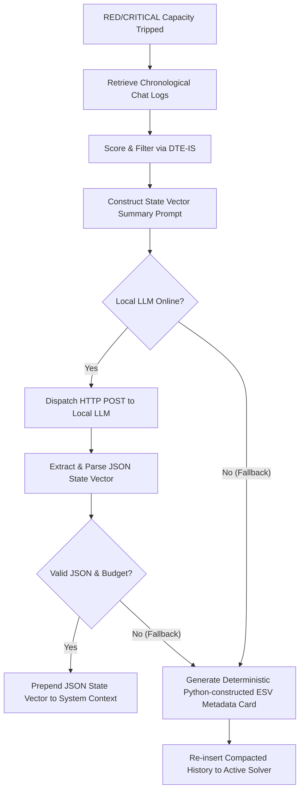

# Technical Implementation Plan: EMM-03-A2 — Local State Vector Summarizer Compiler (`token_prune.py`)

## Executive Summary
This document outlines the technical design, architectural details, and implementation plan for **`EMM-03-A2`** ("token_prune.py state vector compiler"). It builds upon the mathematical foundations established in `EMM-03-A1` by implementing a **local LLM-driven State Vector summarization engine** inside EMMA's cognitive pruner module (`backend/app/utils/token_prune.py`). 

When active conversation history crosses the RED utilization gate (70%), the state vector compiler will invoke a locally-hosted LLM (e.g., Ollama or LM Studio running `qwen2.5-coder` or Llama-3) to compress the verbose history into a high-density, **400-token JSON State Vector**. This vector represents the absolute cosmic order (**Ṛta**) of the active solver, keeping the workspace aligned and resilient against infinite regression loops.

---

## 1. Architectural Philosophy & Vedic Alignment (Ṛta Guard)

In Vedic philosophy, **Ṛta (ऋत)** is the universal principal of dynamic order that prevents the cosmos from collapsing into chaotic noise (**Anṛta**). 

In an agentic LLM system, context window bloat—caused by long tracebacks, repetitive code revisions, and human chat pleasantries—is the digital equivalent of **Anṛta**. As context capacity fills up, the agent becomes confused and begins to stall or loop.

*   **`EMM-03-A1` (The Sentinel):** Identifies the build-up of noise using token thresholds and the Dynamic Token-Entropy Importance Scoring (DTE-IS) system.
*   **`EMM-03-A2` (The Restorer of Order):** Compiles and collapses the messy, high-entropy chat turns into a highly structured, beautiful, and mathematical 400-token **Adaptive Execution State Vector (A-ESV)**. This vector is prepended to the system prompt, restoring perfect alignment and order to the agent's memory window.

---

## 2. Technical Blueprint & Component Changes



### 2.1 Component: `backend/app/utils/token_prune.py`

We will enhance the `ContextVectorPruner` class to incorporate local LLM summarization.

#### Constructor Enhancements:
```python
def __init__(
    self,
    max_tokens:    int = 8000,
    encoding_name: str = "cl100k_base",
    llm_url:       Optional[str] = None,
    model:         Optional[str] = None,
) -> None:
    # ... existing fields ...
    self.llm_url: str = llm_url or "http://localhost:11434/v1"
    self.model:   str = model or "qwen2.5-coder"
```

#### The Summarization Prompt Sequence (`_SUMMARIZATION_SYSTEM_PROMPT`):
A specialized metacognitive compiler prompt designed for local, air-gapped models:
```python
_SUMMARIZATION_SYSTEM_PROMPT: str = """\
You are EMMA's Metacognitive Memory Compiler. Your job is to compress a verbose developer-agent chat log into a structured JSON state vector.
OUTPUT FORMAT: Output ONLY a valid JSON object. No explanations, no markdown fences, no conversational text.

JSON SCHEMA:
{
  "global_objective": "1-sentence synthesis of the active goal",
  "execution_state": {
    "touched_files": ["list of modified files"],
    "current_phase": "e.g., AST patching, test verification, or exception debugging"
  },
  "active_task_checklist": {
    "completed": ["list of finished items"],
    "pending": ["list of remaining items"]
  },
  "last_known_error_regression": {
    "exception_class": "Name of the exception (or null)",
    "enclosing_scope": "Scope where error occurred (or null)",
    "diagnosis_and_critique": "1-sentence remedy action plan"
  }
}

RULE: Keep descriptions extremely concise. The entire JSON block must be under 400 tokens in size.
"""
```

#### New Methods to Implement:
*   `async def _call_local_llm(self, system_prompt: str, user_message: str) -> str`: Dispatches a synchronous-wrapped thread pool post request to Ollama/LM Studio using Python's standard `urllib.request` module (preserving zero-dependency constraints).
*   `async def compile_state_vector(self, turn_logs: List[Dict[str, Any]]) -> Dict[str, Any]`: Assembles the log content, constructs the summarization prompt, calls the local LLM, parses the JSON string, and validates the schema.
*   **Integration with `compact_history()`:** Modifies `compact_history` to call `compile_state_vector` concurrently during RED/CRITICAL capacity pruning and injects the resulting vector directly into the leading system context.

---

### 2.2 Component: `backend/app/core/orchestrator.py`

*   Update the orchestrator solver loop to provide active checklist parameters (`completed_tasks`, `pending_tasks`) to the pruner so that it can seed the local summarization prompt with perfect structural telemetry.

---

## 3. High-Density JSON State Vector (A-ESV Schema)

The state vector compiled by the local LLM will conform to the following schema rules:
1.  **Strict Token Budget:** The JSON structure must remain under **400 tokens** (typically less than 2,000 characters).
2.  **Polymorphic Behavior:** Sections like `last_known_error_regression` are populated with nested telemetry when exceptions are active, or set to `null` to conserve context capacity during healthy PASS cycles.
3.  **Checklist Telemetry:** Synchronizes the agent's progress directly with the task checklist inside `task.md`.

---

## 4. Verification and Automated Testing Plan

We will add a dedicated suite of tests in `backend/app/tests/test_token_prune.py` to ensure complete robust delivery:

### 4.1 Mock Verification Tests
*   **Prompt Alignment Test:** Asserts that the pruner generates valid, formatted system and user messages containing all active file and checklist telemetry.
*   **JSON Extractor Robustness Test:** Feeds standard and malformed JSON mock outputs into the compiler and asserts that the parser handles surrounding text, backticks, or trailing commas gracefully without crashing.
*   **Offline Connection Fallback Test:** Mocks standard `urllib.error.URLError` and validates that the pruner seamlessly falls back to the deterministic Python metadata card within 1 millisecond.

### 4.2 Local Telemetry Validation
*   Verify that `scripts/run_tests.py` passes completely with **0 failures**, asserting the absolute stability of the workspace.

---

## 5. Deployment and Moat Value

Implementing **`EMM-03-A2`** gives **Nexus Lab AI** an incredible architectural moat:
1.  **Infinite Memory Horizon:** EMMA can run for thousands of turns without ever exceeding context capacity or losing long-term objective focus.
2.  **Local/Air-Gapped Privacy:** Zero dependencies and local LLM integration keep the compilation engine entirely offline and secure.
3.  **Deterministic Integrity:** The robust Python metadata fallback ensures that the compiler is completely bulletproof even under extreme hardware constraints or local model crashes.
