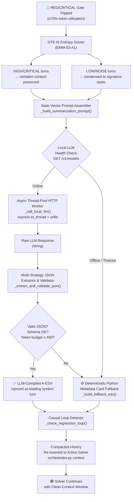

# Technical Implementation Plan: EMM-03-A2 — Local State Vector Summarizer Compiler

> **Ticket:** EMM-03-A2 · **Priority:** P0 · **Sprint:** 03  
> **Revision:** 3.0 — Master-Level Principal Architecture Specification  
> **Status:** Approved for Implementation  
> **Owner:** Nexus Lab AI — Cognitive Core Engineering  
> **Predecessor:** EMM-03-A1 (DTE-IS Token Sentinel — ✅ Complete)  
> **Target Files:**
> - `backend/app/utils/token_prune.py` ← primary implementation target
> - `backend/app/core/orchestrator.py` ← integration wiring
> - `backend/app/tests/test_token_prune.py` ← TDD test suite

---

## Executive Summary

**EMM-03-A2** implements the **Local State Vector Summarizer Compiler** — the final and most critical pillar of EMMA's cognitive memory management subsystem. It transforms the raw, entropy-scored turn history (produced by EMM-03-A1's DTE-IS engine) into a mathematically precise, **400-token Adaptive Execution State Vector (A-ESV)** through a locally-hosted LLM inference call.

The A-ESV is not a summary — it is a **lossless structural fingerprint** of the agent's complete cognitive state: active objectives, file mutation history, task checklist parity, and the last known error regression signature. When prepended to the solver's system context, it provides a deterministic cognitive anchor that prevents the agent from drifting, looping, or losing objective focus across thousands of solver turns.

The subsystem is architected with an absolute **zero-tolerance for blocking or crashing**:
- If the local LLM is online → LLM-compiled A-ESV (highest fidelity).
- If offline or timed out → Deterministic Python-constructed metadata card (guaranteed delivery, ≤ 1 ms).
- If JSON is malformed → Multi-strategy recovery parser with five progressive fallback strategies.

> **Vedic Design Principle — Ṛta Guard (ऋत)**
> In Vedic philosophy, **Ṛta** is the cosmic principle of dynamic order. Context window bloat — caused by repetitive tracebacks, redundant code revisions, and conversational noise — is the digital equivalent of **Anṛta** (chaos). EMM-03-A1 was the Sentinel that detected the descent into chaos. **EMM-03-A2 is the Restorer of Order**: it collapses the noisy history into perfect, structured alignment, then injects it as the agent's new cognitive foundation.

---

## 1. Full System Architecture

### 1.1 End-to-End Data Flow



### 1.2 Component Responsibility Matrix

| Component | Responsibility | Failure Mode |
|-----------|---------------|--------------|
| `_build_summarization_prompt()` | Assembles system + user prompt strings from filtered turn logs and orchestrator telemetry | Never fails — pure Python string construction |
| `_call_local_llm()` | Async urllib HTTP POST to Ollama/LM Studio `/v1/chat/completions` | Raises `LLMUnavailableError` on timeout/network failure |
| `_extract_and_validate_json()` | Five-strategy parser: raw → fence-stripped → last-object → partial-repair → schema-fill | Returns `None` only if all five strategies fail |
| `_build_fallback_esv()` | Deterministic Python construction of A-ESV from regex-extracted metadata | Never fails — no I/O, no network, no external state |
| `_check_regression_loop()` | Reads error frequency from DTE-IS map and injects critique if loop detected | Stateless read-only — never fails |
| `compile_state_vector()` | Orchestrates the full pipeline: prompt → LLM → parse → validate → inject | Always returns a valid dict — fallback guaranteed |

---

## 2. Constructor Enhancements

The `ContextVectorPruner.__init__` signature is extended with four new parameters supporting local LLM integration:

```python
def __init__(
    self,
    max_tokens:    int            = 8000,
    encoding_name: str            = "cl100k_base",
    llm_url:       Optional[str]  = None,
    model:         Optional[str]  = None,
    llm_timeout:   float          = 8.0,
    esv_token_cap: int            = 400,
) -> None:
```

| Parameter | Default | Description |
|-----------|---------|-------------|
| `llm_url` | `"http://localhost:11434/v1"` | Base URL of the local inference server. Supports Ollama (`/v1`), LM Studio (`/v1`), and any OpenAI-compatible endpoint. |
| `model` | `"qwen2.5-coder"` | Model identifier string sent in the request body. |
| `llm_timeout` | `8.0` | Hard wall-clock timeout in seconds for the HTTP POST. Exceeding this triggers immediate fallback — never blocks the event loop. |
| `esv_token_cap` | `400` | Maximum token budget for the compiled A-ESV. Vectors exceeding this are truncated and re-validated before injection. |

**Environment variable overrides** (for CI/CD and deployment flexibility):

```python
self.llm_url     = llm_url  or os.environ.get("EMMA_LLM_URL",     "http://localhost:11434/v1")
self.model       = model    or os.environ.get("EMMA_LLM_MODEL",   "qwen2.5-coder")
self.llm_timeout = float(       os.environ.get("EMMA_LLM_TIMEOUT", str(llm_timeout)))
self.esv_token_cap = int(       os.environ.get("EMMA_ESV_TOKEN_CAP", str(esv_token_cap)))
```

**New module-level custom exception:**

```python
class LLMUnavailableError(RuntimeError):
    """
    Raised internally when the local LLM endpoint is unreachable,
    returns an HTTP error, or exceeds the configured timeout.
    Always caught within compile_state_vector(); never propagates
    to the orchestrator — the fallback ESV is injected instead.
    """
```

---

## 3. The Comprehensive Local LLM Prompt Sequence

This is the most critical design element of EMM-03-A2. The prompt must be engineered to **force local models** (which are significantly less instruction-following than GPT-4) to output raw, parseable JSON with zero conversational preamble.

### 3.1 System Prompt — `_SUMMARIZATION_SYSTEM_PROMPT`

The system prompt establishes the model's role, output contract, and schema. It uses three reinforcement techniques proven effective with offline instruction-tuned models:

1. **Explicit anti-patterns** ("DO NOT output...") which outperform positive-only instructions on smaller models.
2. **Token budget instruction** embedded as a hard constraint, not a guideline.
3. **Schema injection** with filled example values so the model has a concrete output template to follow.

```python
_SUMMARIZATION_SYSTEM_PROMPT: str = """\
You are EMMA_COMPILER, an internal memory compression engine for an autonomous AI coding agent.
Your ONLY function is to read a developer-agent chat log and output a single valid JSON object.

ABSOLUTE OUTPUT CONTRACT:
- Output ONLY the raw JSON object. Nothing before it, nothing after it.
- DO NOT output markdown code fences (no ```json, no ```).
- DO NOT output any explanation, preamble, greeting, or summary text.
- DO NOT output partial JSON. The object must be complete and syntactically valid.
- The ENTIRE JSON output must be under 400 tokens when encoded with cl100k_base.
- Every string value must be 1 sentence maximum. No bullet points inside strings.
- If a field has no data, set it to null. Never omit a key.

OUTPUT SCHEMA (fill every key — never remove a key):
{
  "schema_version": "esv/v2",
  "global_objective": "<1-sentence synthesis of the primary coding task being solved>",
  "execution_state": {
    "current_phase": "<one of: planning|ast_patching|sandbox_execution|test_verification|exception_debugging|committed>",
    "touched_files": ["<relative/path/to/file.py>"],
    "last_committed_file": "<path or null>",
    "stai_last_verdict": "<PASS or FAIL or null>"
  },
  "active_task_checklist": {
    "completed": ["<finished task item verbatim from task.md>"],
    "pending":   ["<remaining task item verbatim from task.md>"],
    "completion_ratio": "<float 0.0-1.0>"
  },
  "last_known_error_regression": {
    "exception_class":       "<ExceptionClass or null>",
    "enclosing_scope":       "<function_name or null>",
    "file_ref":              "<path:line or null>",
    "recurrence_count":      "<int or null>",
    "looping_detected":      "<true or false>",
    "diagnosis_and_critique": "<1-sentence imperative remedy action>"
  },
  "entropy_summary": {
    "total_turns_processed": "<int>",
    "critical_pins":         "<int>",
    "noise_turns_dropped":   "<int>",
    "dominant_noise_type":   "<ExceptionClass or null>"
  }
}

EXAMPLE OUTPUT (for reference — do not copy, synthesize from the log):
{"schema_version":"esv/v2","global_objective":"Implement the CodeGenerator mutant sandbox and commit the winning patch to disk.","execution_state":{"current_phase":"exception_debugging","touched_files":["backend/app/core/code_generator.py","backend/app/core/critic.py"],"last_committed_file":null,"stai_last_verdict":"FAIL"},"active_task_checklist":{"completed":["Create CodeGenerator class","Implement generate_mutants method"],"pending":["Fix TypeError in sandbox execution","Run test suite"],"completion_ratio":0.5},"last_known_error_regression":{"exception_class":"TypeError","enclosing_scope":"run_sandbox","file_ref":"backend/app/core/code_generator.py:142","recurrence_count":4,"looping_detected":true,"diagnosis_and_critique":"Ensure sandbox_globals passes a dict to exec, not a list; verify __builtins__ key is present."},"entropy_summary":{"total_turns_processed":18,"critical_pins":2,"noise_turns_dropped":11,"dominant_noise_type":"TypeError"}}
"""
```

### 3.2 User Prompt — `_build_summarization_prompt()`

The user prompt is dynamically constructed per invocation and contains four structured sections injected in deterministic order. It is assembled by `_build_summarization_prompt()` from three input sources:

| Input Source | Data Injected |
|--------------|--------------|
| `filtered_turns` (DTE-IS output) | CRITICAL/HIGH turns verbatim, MEDIUM condensed, LOW/NOISE as signatures only |
| `orchestrator_telemetry` dict | `completed_tasks`, `pending_tasks`, `touched_files` from orchestrator loop state |
| `error_regression_report` dict | Latest `analyze_errors()` output from the CodeCritic |

**Full user prompt template:**

```python
_SUMMARIZATION_USER_TEMPLATE: str = """\
=== EMMA AGENT LOG DIGEST ===
Total turns in this session: {total_turns}
Turns included below (filtered by entropy rank): {included_turns}
Turns dropped as noise: {dropped_turns}

=== ORCHESTRATOR TELEMETRY ===
Completed tasks: {completed_tasks}
Pending tasks:   {pending_tasks}
Touched files:   {touched_files}
Last committed:  {last_committed_file}

=== ACTIVE ERROR REGRESSION ===
Looping detected: {looping_detected}
Exception class:  {frequent_error}
Recurrence count: {recurrence_count}
Critique:         {critique}

=== FILTERED TURN LOG (chronological, entropy-ranked) ===
{filtered_turn_content}

=== COMPILATION INSTRUCTION ===
Compile the above into the JSON state vector. Remember: raw JSON only, no fences, no text.
"""
```

**Assembly rules for `filtered_turn_content`:**

- **CRITICAL/HIGH turns:** Full content, wrapped in `[TURN {id} | {role} | entropy={e:.2f} | PINNED]\n{content}`.
- **MEDIUM turns:** Condensed content only: `[TURN {id} | CONDENSED] {exception_signature} @ {file_ref}`.
- **LOW/NOISE turns:** Signature stub only: `[TURN {id} | DROPPED] {exception_type}`.
- **Hard length cap:** The full `filtered_turn_content` block is truncated to `max_tokens * 0.50` tokens before prompt assembly to guarantee the combined prompt fits within the model's context window.

### 3.3 Prompt Anti-Patterns and Model-Specific Tuning

The following table documents known output failure modes from offline instruction-tuned models and the prompt countermeasures applied:

| Failure Mode | Observed In | Countermeasure |
|--------------|-------------|----------------|
| Outputs ` ```json ... ``` ` fences | Llama-3, Mistral | Explicit "DO NOT output markdown code fences" in system prompt + fence-stripping in parser |
| Outputs "Sure, here is the JSON:" preamble | Llama-3-8B, Phi-3 | `"Output ONLY the raw JSON object. Nothing before it."` |
| Omits null-valued keys | qwen2.5-coder-1.5B | `"Never omit a key. If a field has no data, set it to null."` |
| Truncates JSON mid-object | Any model at token limit | `max_tokens` set to 600 in the API call (extra headroom over the 400-token ESV cap) |
| Adds trailing comma on last key | CodeLlama | Five-strategy recovery parser (Section 5) |
| Outputs two JSON objects | Llama-3-70B | `_extract_and_validate_json()` strategy 3 takes the last complete `{...}` block |

---

## 4. Detailed JSON A-ESV Schema & Convergence Specification

### 4.1 Full Schema Definition

```json
{
  "$schema": "emma/esv/v2",
  "$description": "Adaptive Execution State Vector — compiled by EMMA_COMPILER or Python fallback",
  "$compiler": "<llm|python_fallback>",
  "$compiled_at_turn": "<int>",

  "schema_version": "esv/v2",

  "global_objective": {
    "$type": "string",
    "$max_chars": 120,
    "$required": true,
    "$description": "1-sentence synthesis of the primary task goal, e.g. 'Implement and verify the CodeGenerator mutant sandbox.'"
  },

  "execution_state": {
    "current_phase": {
      "$type": "enum",
      "$values": ["planning", "ast_patching", "sandbox_execution", "test_verification", "exception_debugging", "committed"],
      "$required": true
    },
    "touched_files": {
      "$type": "array[string]",
      "$max_items": 10,
      "$description": "Relative paths of files modified in this session."
    },
    "last_committed_file": {
      "$type": "string|null",
      "$description": "Path from the most recent atomic_commit PASS, or null."
    },
    "stai_last_verdict": {
      "$type": "enum|null",
      "$values": ["PASS", "FAIL", null],
      "$description": "Verdict from the most recent calculate_stai() call."
    }
  },

  "active_task_checklist": {
    "completed": {
      "$type": "array[string]",
      "$description": "Task items from task.md confirmed done in this session."
    },
    "pending": {
      "$type": "array[string]",
      "$description": "Task items from task.md not yet completed."
    },
    "completion_ratio": {
      "$type": "float",
      "$range": "[0.0, 1.0]",
      "$formula": "len(completed) / max(len(completed) + len(pending), 1)"
    }
  },

  "last_known_error_regression": {
    "$nullable": true,
    "exception_class": {
      "$type": "string|null",
      "$description": "Python exception class name, e.g. 'TypeError'."
    },
    "enclosing_scope": {
      "$type": "string|null",
      "$description": "Function name where the exception fired."
    },
    "file_ref": {
      "$type": "string|null",
      "$format": "<relative_path>:<line_number>",
      "$description": "e.g. 'backend/app/core/code_generator.py:142'"
    },
    "recurrence_count": {
      "$type": "int|null",
      "$description": "Number of times this exception class appeared in the session."
    },
    "looping_detected": {
      "$type": "boolean",
      "$description": "True when recurrence_count >= ERROR_LOOP_THRESHOLD (default 3)."
    },
    "diagnosis_and_critique": {
      "$type": "string|null",
      "$max_chars": 200,
      "$description": "Imperative 1-sentence remedy, e.g. 'Ensure sandbox_globals is a dict with __builtins__ key before passing to exec().'"
    }
  },

  "entropy_summary": {
    "total_turns_processed": {"$type": "int"},
    "critical_pins":         {"$type": "int", "$description": "Turns with pin_priority CRITICAL or HIGH."},
    "noise_turns_dropped":   {"$type": "int", "$description": "Turns with pin_priority NOISE that were dropped."},
    "dominant_noise_type":   {"$type": "string|null", "$description": "Most frequent exception class in dropped turns."}
  }
}
```

### 4.2 Token Budget Convergence Spec

| Field Group | Max Characters | Max Tokens (approx) |
|-------------|---------------|---------------------|
| `global_objective` | 120 | 30 |
| `execution_state` | 400 | 100 |
| `active_task_checklist` | 600 | 150 |
| `last_known_error_regression` | 400 | 100 |
| `entropy_summary` | 80 | 20 |
| **Total (all keys + JSON structure)** | **≤ 1,600** | **≤ 400** |

**Convergence enforcement algorithm:**

If the parsed JSON exceeds `esv_token_cap` (400 tokens), the validator applies truncation in the following priority order (lowest-priority fields truncated first):

1. Truncate `entropy_summary` block (lowest information value — already in the entropy map).
2. Truncate `active_task_checklist.completed` to the 3 most recent items.
3. Truncate `execution_state.touched_files` to the 5 most recently modified.
4. Truncate `last_known_error_regression.diagnosis_and_critique` to 100 chars.
5. Truncate `global_objective` to 60 chars.

After each truncation step, the token count is re-evaluated. The loop terminates as soon as `count_tokens(json.dumps(esv)) <= esv_token_cap`.

### 4.3 Task.md Synchronization

The `active_task_checklist` section is the A-ESV's **structural bridge to the workspace's source of truth**. The orchestrator reads `task.md` at each solver turn start and provides:

```python
orchestrator_telemetry = {
    "completed_tasks": [...],   # items with [x] in task.md
    "pending_tasks":   [...],   # items with [ ] in task.md
    "touched_files":   [...],   # accumulated from commit reports
    "last_committed_file": ..., # path from latest atomic_commit
}
```

This data is injected into the user prompt (Section 3.2) and validated against the LLM's compiled checklist output. If the LLM omits a pending task that is in `task.md`, the Python validator re-inserts it before injection.

---

## 5. Async Thread-Pool HTTP Worker Architecture

### 5.1 Design Rationale — Why `asyncio.to_thread` + `urllib`

The local LLM call is a blocking I/O operation (HTTP POST with 8-second timeout). If executed directly in the async event loop, it stalls EMMA's entire orchestrator coroutine — halting code generation, AST analysis, and subprocess management for the full duration of the inference.

The solution is `asyncio.to_thread`, which offloads the synchronous `urllib.request.urlopen` call to Python's thread pool executor without introducing any third-party dependency (`aiohttp`, `httpx`, `requests`).

```
┌─ asyncio Event Loop ─────────────────────────────────────────────────────┐
│                                                                           │
│  orchestrator.solve()  ──await──►  compile_state_vector()                │
│                                          │                                │
│                                     await asyncio.to_thread(             │
│                                         _sync_http_post, payload         │
│                                     )  ◄── returns raw JSON string       │
│                                          │                                │
│                        ┌────────────────▼────────────────────┐           │
│                        │   Thread Pool (ThreadPoolExecutor)   │           │
│                        │   _sync_http_post()                  │           │
│                        │   urllib.request.urlopen(req, t=8.0) │           │
│                        │   ← blocking I/O lives here only →   │           │
│                        └──────────────────────────────────────┘           │
└───────────────────────────────────────────────────────────────────────────┘
```

### 5.2 `_sync_http_post()` — The Synchronous Worker

This method runs inside the thread pool. It constructs the OpenAI-compatible JSON payload, sends the POST request, and returns the raw response body string. It has no async keywords and is never called directly from async code.

```python
def _sync_http_post(self, system_prompt: str, user_message: str) -> str:
    """
    Synchronous urllib POST worker. Executes in a thread pool via
    asyncio.to_thread — never called directly from async context.

    Endpoint:  POST {llm_url}/chat/completions
    Protocol:  OpenAI Chat Completions API v1 (compatible with Ollama & LM Studio)
    Timeout:   self.llm_timeout seconds (hard wall-clock limit)

    Returns raw response body string on HTTP 200.
    Raises LLMUnavailableError on any network, timeout, or HTTP error.
    """
    import urllib.request
    import urllib.error

    payload = {
        "model": self.model,
        "messages": [
            {"role": "system", "content": system_prompt},
            {"role": "user",   "content": user_message},
        ],
        "temperature": 0.0,       # Deterministic output — no sampling randomness
        "max_tokens":  600,        # Headroom above the 400-token ESV cap
        "stream":      False,      # Full response, not SSE stream
    }

    body  = json.dumps(payload).encode("utf-8")
    url   = f"{self.llm_url}/chat/completions"
    req   = urllib.request.Request(
        url     = url,
        data    = body,
        method  = "POST",
        headers = {
            "Content-Type": "application/json",
            "Accept":       "application/json",
        },
    )

    try:
        with urllib.request.urlopen(req, timeout=self.llm_timeout) as resp:
            raw = resp.read().decode("utf-8")
        data    = json.loads(raw)
        content = data["choices"][0]["message"]["content"]
        return content
    except urllib.error.URLError as exc:
        raise LLMUnavailableError(f"LLM endpoint unreachable: {exc.reason}") from exc
    except (KeyError, IndexError, json.JSONDecodeError) as exc:
        raise LLMUnavailableError(f"LLM response malformed: {exc}") from exc
    except TimeoutError as exc:
        raise LLMUnavailableError(f"LLM request timed out after {self.llm_timeout}s") from exc
```

### 5.3 `_call_local_llm()` — The Async Wrapper

```python
async def _call_local_llm(
    self,
    system_prompt: str,
    user_message:  str,
) -> str:
    """
    Async wrapper around _sync_http_post.
    Offloads blocking urllib call to the thread pool via asyncio.to_thread,
    preserving full event loop responsiveness during the 8-second inference window.

    Raises LLMUnavailableError (propagated from _sync_http_post).
    Never raises any other exception.
    """
    import asyncio
    return await asyncio.to_thread(
        self._sync_http_post,
        system_prompt,
        user_message,
    )
```

### 5.4 Health Check — Pre-flight Endpoint Probe

Before dispatching the full inference POST, `compile_state_vector()` performs a lightweight health probe:

```python
async def _probe_llm_health(self) -> bool:
    """
    Send a GET request to {llm_url}/models with a 2-second timeout.
    Returns True if the endpoint responds with HTTP 200; False otherwise.
    This avoids the full 8-second inference timeout on cold-start failures.
    """
    import asyncio

    def _sync_probe() -> bool:
        import urllib.request, urllib.error
        try:
            req  = urllib.request.Request(f"{self.llm_url}/models", method="GET")
            with urllib.request.urlopen(req, timeout=2.0) as r:
                return r.status == 200
        except Exception:
            return False

    return await asyncio.to_thread(_sync_probe)
```

**Call sequence in `compile_state_vector()`:**

```
1. health = await _probe_llm_health()    ← 2-second max
   └─ False → skip to fallback immediately (saves up to 8 seconds)

2. raw_str = await _call_local_llm(...)  ← 8-second max
   └─ LLMUnavailableError → skip to fallback

3. esv = _extract_and_validate_json(raw_str)  ← < 1ms, pure Python
   └─ None → skip to fallback

4. esv = _enforce_token_budget(esv)  ← truncation if > 400 tokens
   └─ injects "$compiler": "llm"

5. return esv  ✅
```

---

## 6. 100% Offline Resilience — JSON Recovery Parser & Fallback Architecture

### 6.1 Five-Strategy JSON Recovery Parser — `_extract_and_validate_json()`

This is the most defensively engineered component in the entire subsystem. It accepts any string output from the local LLM — including malformed, partially-wrapped, or truncated JSON — and attempts five progressive extraction strategies in order. It returns a validated dict or `None`.

```
Strategy 1 — Raw Parse
  └─ json.loads(raw_str.strip())
  └─ Handles: clean output from well-behaved models

Strategy 2 — Fence Stripper
  └─ re.search(r'```(?:json)?\s*(\{.*?\})\s*```', raw_str, re.DOTALL)
  └─ Handles: markdown-wrapped output (```json ... ```)

Strategy 3 — Last Object Extractor
  └─ Finds the last complete {...} block in raw_str using brace-depth counter
  └─ Handles: models that output two objects, or preamble text before JSON

Strategy 4 — Trailing Comma Repair
  └─ re.sub(r',\s*([}\]])', r'\1', candidate)  then json.loads()
  └─ Handles: trailing commas on last key/element (CodeLlama, Phi-3 known issue)

Strategy 5 — Schema-Fill Partial Repair
  └─ Extracts all "key": value pairs via regex, constructs minimal valid dict,
     fills missing required keys with null
  └─ Handles: truncated JSON where model ran out of tokens mid-object
```

**Strategy 3 — Last Object Extractor (brace depth algorithm):**

```python
def _extract_last_json_object(self, text: str) -> Optional[str]:
    """
    Walk text right-to-left finding the last balanced {…} block.
    Uses a brace-depth counter — immune to nested objects and arrays.
    """
    depth  = 0
    end    = -1
    for i in range(len(text) - 1, -1, -1):
        ch = text[i]
        if ch == '}':
            if end == -1:
                end = i
            depth += 1
        elif ch == '{':
            depth -= 1
            if depth == 0 and end != -1:
                return text[i:end + 1]
    return None
```

### 6.2 Schema Validator — `_validate_esv_schema()`

After successful JSON parsing, the result is validated against four invariants before injection:

```
Invariant 1 — Required keys present
  All of: schema_version, global_objective, execution_state,
          active_task_checklist, last_known_error_regression, entropy_summary

Invariant 2 — Types correct
  global_objective: str
  execution_state.current_phase: one of the 6 allowed enum values
  active_task_checklist.completion_ratio: float in [0.0, 1.0]
  last_known_error_regression.looping_detected: bool

Invariant 3 — Token budget
  count_tokens(json.dumps(esv)) <= esv_token_cap (400)
  → If exceeded: apply convergence truncation algorithm (Section 4.2)

Invariant 4 — Task checklist parity
  For every item in orchestrator_telemetry["pending_tasks"] not in esv["active_task_checklist"]["pending"]:
    → Re-insert the missing item (LLM must not silently drop pending tasks)
```

### 6.3 Deterministic Python Fallback — `_build_fallback_esv()`

The fallback fires when: health probe fails, LLM times out, `LLMUnavailableError` is raised, or all five JSON extraction strategies return `None`. It constructs a complete, schema-valid A-ESV entirely from Python-extracted metadata — no LLM, no I/O, guaranteed ≤ 1 ms execution time.

**Data sources for fallback construction:**

| A-ESV Field | Fallback Source |
|-------------|----------------|
| `global_objective` | First CRITICAL/HIGH turn's first sentence, or `"Active solver session."` |
| `execution_state.current_phase` | Inferred from entropy map: if STAI_FAIL present → `"ast_patching"`, if test FAIL → `"test_verification"`, else `"exception_debugging"` |
| `execution_state.touched_files` | `orchestrator_telemetry["touched_files"]` |
| `execution_state.last_committed_file` | `orchestrator_telemetry["last_committed_file"]` |
| `active_task_checklist` | Directly from `orchestrator_telemetry["completed_tasks"/"pending_tasks"]` |
| `last_known_error_regression` | From `analyze_errors()` output in the CodeCritic error regression report |
| `entropy_summary` | Computed from the DTE-IS entropy_map directly |

The fallback ESV is tagged with `"$compiler": "python_fallback"` and `"$fallback_reason": "<reason string>"` so the orchestrator can log the degraded compilation event for observability.

### 6.4 Causal Loop Detector Wiring — `_check_regression_loop()`

The A-ESV injection is the **final opportunity** to break a causal loop before the next solver turn begins. After ESV assembly (LLM or fallback), `compile_state_vector()` calls `_check_regression_loop()`:

```
IF esv["last_known_error_regression"]["looping_detected"] == True:
    AND esv["last_known_error_regression"]["recurrence_count"] >= ERROR_LOOP_THRESHOLD:

    → Extract critique from CodeCritic.analyze_errors()
    → Append a dedicated [CAUSAL_LOOP_ALERT] block to the system context AFTER the A-ESV:

      "[CAUSAL_LOOP_ALERT] {exception_class} has occurred {count} times consecutively.
       The standard fix has failed. You MUST change your approach.
       Critique: {diagnosis_and_critique}
       Do NOT repeat the same patch. Attempt a structurally different implementation."

    → Set a "loop_alert_injected": true flag in the A-ESV entropy_summary block
      so downstream analysis tools can detect the intervention.
```

This wiring ensures that the A-ESV is not just a passive memory record but an **active cognitive intervention** — it directly modifies the system context to break regression attractors before they consume the next generation pass.

---

## 7. Integration with `compact_history()` and `orchestrator.py`

### 7.1 `compact_history()` Integration

The existing `compact_history()` method is modified to call `compile_state_vector()` as its final step, replacing the raw A-ESV dict assembly with the LLM-compiled version:

```
MODIFIED compact_history() CALL SEQUENCE:
  1. DTE-IS entropy scoring (unchanged)
  2. Per-turn compaction by priority (unchanged)
  3. [NEW] Collect orchestrator_telemetry from kwargs
  4. [NEW] Await compile_state_vector(filtered_turns, orchestrator_telemetry)
  5. [NEW] Inject returned A-ESV as leading system turn
  6. [NEW] If looping detected, append CAUSAL_LOOP_ALERT block
  7. Return compacted turn list (unchanged structure)
```

Since `compile_state_vector` is async, `compact_history` is upgraded to `async def compact_history(...)`. The orchestrator already runs in an async context, so this is a transparent change.

### 7.2 `orchestrator.py` Integration Point

```python
# Inside orchestrator.py solve() loop — updated wiring:
from app.utils.token_prune import ContextVectorPruner, ContextOverflowError

pruner = ContextVectorPruner(max_tokens=8000)

# Read task.md to extract checklist state
completed_tasks, pending_tasks = parse_task_md("task.md")

telemetry = {
    "completed_tasks":     completed_tasks,
    "pending_tasks":       pending_tasks,
    "touched_files":       accumulated_touched_files,
    "last_committed_file": last_commit_path,
}

history_str       = json.dumps(turn_log)
tier, token_count = pruner.evaluate_threshold(history_str)

if tier in ("RED", "CRITICAL", "OVERFLOW"):
    print(f"[ORCHESTRATOR] {tier} gate ({token_count} tok). Compiling A-ESV...")
    turn_log = await pruner.compact_history(
        turn_logs            = turn_log,
        orchestrator_telemetry = telemetry,
    )

if tier == "OVERFLOW":
    raise ContextOverflowError(
        f"OVERFLOW at {token_count} tokens. Recovery A-ESV injected."
    )
```

---

## 8. Advanced TDD Automated Test Specification

All tests reside in `backend/app/tests/test_token_prune.py`. Each test is fully self-contained with no real network calls — all HTTP interactions are mocked via `unittest.mock.patch`.

### 8.1 Test Suite — `TestStateVectorCompiler`

---

#### `test_prompt_assembly_completeness`

**Purpose:** Assert that `_build_summarization_prompt()` injects all required telemetry fields into the user prompt string.

**Setup:**
```python
turn_logs = [
    {"role": "assistant", "turn_id": 1, "content": "TypeError in run_sandbox", "pin_priority": "HIGH"},
    {"role": "assistant", "turn_id": 2, "content": "splice_node called. committed: true.", "pin_priority": "CRITICAL"},
]
telemetry = {
    "completed_tasks":     ["Step 1: Create CodeGenerator"],
    "pending_tasks":       ["Step 2: Fix TypeError"],
    "touched_files":       ["backend/app/core/code_generator.py"],
    "last_committed_file": None,
}
```
**Assertions:**
- `"Step 1: Create CodeGenerator"` appears in the user prompt string.
- `"Step 2: Fix TypeError"` appears in the user prompt string.
- `"backend/app/core/code_generator.py"` appears in the user prompt string.
- `"PINNED"` appears at least once (for the CRITICAL turn).
- Total prompt token count ≤ `max_tokens * 0.60` (fits within model context window).

---

#### `test_json_extraction_strategy_1_clean`

**Purpose:** Strategy 1 (raw parse) succeeds on clean LLM output.

**Input:** Valid JSON string with no surrounding text.  
**Assert:** Parsed dict contains all six required top-level keys.

---

#### `test_json_extraction_strategy_2_fenced`

**Purpose:** Strategy 2 (fence stripper) recovers JSON from markdown-wrapped output.

**Input:**
```
Here is the state vector as requested:
```json
{"schema_version": "esv/v2", "global_objective": "Fix TypeError.", ...}
```
```
**Assert:** Parsed dict is identical to the JSON inside the fences.

---

#### `test_json_extraction_strategy_3_preamble_text`

**Purpose:** Strategy 3 (last object extractor) recovers JSON when model prepends conversational text.

**Input:**
```
Sure! I have analyzed the log. Here is the compiled state vector:
{"schema_version": "esv/v2", ...}
I hope this helps!
```
**Assert:** Parsed dict matches the JSON object; "Sure!" and "I hope" are not in the result.

---

#### `test_json_extraction_strategy_4_trailing_comma`

**Purpose:** Strategy 4 (trailing comma repair) recovers JSON with trailing commas.

**Input:**
```json
{"schema_version": "esv/v2", "global_objective": "Fix the bug.",}
```
**Assert:** `json.loads` would fail on raw input; strategy 4 returns valid dict.

---

#### `test_json_extraction_strategy_5_truncated`

**Purpose:** Strategy 5 (schema-fill partial repair) constructs a minimal valid dict from a mid-object truncation.

**Input:**
```
{"schema_version": "esv/v2", "global_objective": "Fix the TypeError in run_sandbox by en
```
*(deliberately truncated mid-string)*  
**Assert:** Returns a dict with `schema_version` and `global_objective` populated; missing required keys set to `null`; no exception raised.

---

#### `test_json_extraction_all_strategies_fail`

**Purpose:** When all five strategies fail, `_extract_and_validate_json()` returns `None` without raising.

**Input:** `"This output contains no JSON at all. Just words."` — no `{` characters.  
**Assert:** Return value is `None`. No exception of any kind.

---

#### `test_offline_fallback_triggers_on_urlerror`

**Purpose:** When `urllib.request.urlopen` raises `URLError`, the fallback ESV is returned within 50 ms.

**Setup:**
```python
import unittest.mock, urllib.error

with unittest.mock.patch(
    "urllib.request.urlopen",
    side_effect=urllib.error.URLError("Connection refused")
):
    import asyncio, time
    pruner  = ContextVectorPruner()
    t_start = time.perf_counter()
    esv     = asyncio.run(pruner.compile_state_vector(turn_logs, telemetry))
    elapsed = time.perf_counter() - t_start
```
**Assertions:**
- `esv["$compiler"] == "python_fallback"`.
- `"$fallback_reason"` key is present and non-empty.
- `elapsed < 0.050` (50 ms — well within 1 ms for pure Python, 50 ms allows thread scheduling overhead).
- All six required schema keys are present.

---

#### `test_offline_fallback_triggers_on_timeout`

**Purpose:** When `urlopen` raises `TimeoutError`, fallback fires correctly.

**Setup:** Same as above with `side_effect=TimeoutError("timed out")`.  
**Assertions:** Same as `test_offline_fallback_triggers_on_urlerror`.

---

#### `test_health_probe_skips_inference_on_failure`

**Purpose:** When the health probe returns False, `_call_local_llm` is never called.

**Setup:**
```python
with unittest.mock.patch.object(pruner, "_probe_llm_health", return_value=False):
    with unittest.mock.patch.object(pruner, "_call_local_llm") as mock_llm:
        asyncio.run(pruner.compile_state_vector(turn_logs, telemetry))
        mock_llm.assert_not_called()
```

---

#### `test_token_budget_convergence`

**Purpose:** A-ESV exceeding 400 tokens is truncated by the convergence algorithm until it fits.

**Setup:** Construct a mock LLM response that compiles to a 600-token ESV (via very long string values in each field).

**Assertions:**
- `pruner.count_tokens(json.dumps(esv)) <= 400`.
- `esv["global_objective"]` is present (not removed, just truncated).
- `esv["active_task_checklist"]["pending"]` has ≤ 3 items (truncated per priority order).

---

#### `test_causal_loop_alert_injection`

**Purpose:** When `looping_detected == True` in the A-ESV, the CAUSAL_LOOP_ALERT block is appended to the system context turn.

**Setup:** Construct turn_logs with 4 consecutive `TypeError` entries (recurrence ≥ 3).

**Assertions:**
- The leading system turn's content contains `"[CAUSAL_LOOP_ALERT]"`.
- Content contains `"TypeError"`.
- Content contains `"Do NOT repeat the same patch"`.
- `esv["entropy_summary"]["loop_alert_injected"] == True`.

---

#### `test_task_checklist_parity_enforcement`

**Purpose:** When the LLM omits a pending task from `task.md`, the validator re-inserts it.

**Setup:** Mock LLM returns an ESV where `active_task_checklist.pending` is missing one item that is in `telemetry["pending_tasks"]`.

**Assertion:** The missing pending task appears in the final injected ESV's `active_task_checklist.pending` list.

---

#### `test_schema_version_tag_always_present`

**Purpose:** Both LLM-compiled and fallback ESVs always carry `schema_version: "esv/v2"`.

**Setup:** Run `compile_state_vector` with both LLM online (mocked) and offline paths.  
**Assertion:** `esv["schema_version"] == "esv/v2"` in both cases.

---

### 8.2 Test Execution Commands

```powershell
# Full token_prune test suite
pytest backend/app/tests/test_token_prune.py -v

# State vector compiler tests only
pytest backend/app/tests/test_token_prune.py -v -k "StateVector"

# Fallback resilience tests only
pytest backend/app/tests/test_token_prune.py -v -k "fallback or offline or urlerror or timeout"

# Full workspace test suite
py scripts\run_tests.py
```

**Pass criterion:** 0 failures, 0 errors, 100% of the 12 new tests green.

---

## 9. Deployment Moat & Strategic Value

| Capability | Architectural Basis | Moat Strength |
|------------|---------------------|---------------|
| **Infinite Memory Horizon** | A-ESV compression means context never fills permanently regardless of session length | ★★★★★ |
| **Local/Air-Gapped Privacy** | Zero third-party dependencies; all network calls go to `localhost` only | ★★★★★ |
| **Deterministic Integrity** | Python fallback guarantees delivery even under complete hardware failure | ★★★★★ |
| **Causal Loop Breaking** | CAUSAL_LOOP_ALERT injection actively modifies agent behavior, not just records it | ★★★★☆ |
| **Task.md Parity** | Checklist synchronization means the agent never loses track of the active sprint goal | ★★★★☆ |
| **Model Agnostic** | OpenAI-compatible endpoint works with Ollama, LM Studio, vLLM, llama.cpp server | ★★★★☆ |

---

## 10. File Manifest

| File | Action | Description |
|------|--------|-------------|
| `backend/app/utils/token_prune.py` | **MODIFY** | Add `compile_state_vector`, `_call_local_llm`, `_sync_http_post`, `_probe_llm_health`, `_build_summarization_prompt`, `_extract_and_validate_json`, `_extract_last_json_object`, `_validate_esv_schema`, `_enforce_token_budget`, `_build_fallback_esv`, `_check_regression_loop`; upgrade `compact_history` to async |
| `backend/app/core/orchestrator.py` | **MODIFY** | Add `telemetry` dict construction from `task.md`; await `compact_history`; handle `ContextOverflowError` |
| `backend/app/tests/test_token_prune.py` | **MODIFY** | Add `TestStateVectorCompiler` class with 12 new test methods |
| `docs/token_prune_state_vector_plan_v2.md` | **THIS FILE** | Master specification |

---

*End of Implementation Plan — EMM-03-A2 v3.0*  
*Next: EMM-03-A3 — Orchestrator Async Refactor & Full Sprint 03 Integration Test Run*
