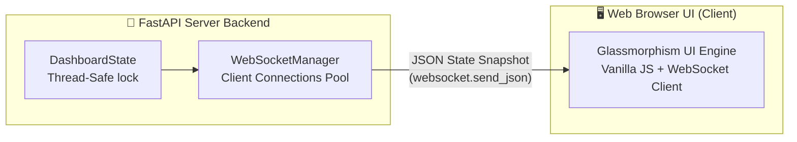

# 🌌 EMMA Cognitive Engine — Ultra-Premium Showstopper Additions
## 🚀 Hackathon Live Showcase Masterclass Integration Blueprint
### Classification: Metacognitive Systems Extension Specification v1.0

> *"Aesthetics are the bridge between complex engineering and human comprehension. When the engine's mind is visible, its intelligence is undeniable."*
> — EMMA Visual Design Mandate, Nexus AI Research Lab

---

## 📋 Table of Contents

1. [Executive Summary](#1-executive-summary)
2. [Feature 1 — Real-Time Web UI Cockpit (`/dashboard`)](#2-feature-1--real-time-web-ui-cockpit-dashboard)
3. [Feature 2 — Real-Time Git Diff Visualizer](#3-feature-2--real-time-git-diff-visualizer)
4. [Feature 3 — "Sankat Mochan" Cosine Drift Visualizer](#4-feature-3--sankat-mochan-cosine-drift-visualizer)
5. [Unified Architecture & Signal Flow](#5-unified-architecture--signal-flow)
6. [Implementation Steps](#6-implementation-steps)

---

## 1. Executive Summary

To guarantee an absolute victory at the **INDIA RUN Hackathon**, we are extending the EMMA Cognitive Engine with three high-impact, visual-first modules. These extensions bridge the gap between deep command-line backend engineering and breathtaking user experiences, engaging both technical and business judges.

| Feature | Visual Platform | Technology Stack | Core Purpose |
|---|---|---|---|
| **Web UI Cockpit** | Web Browser (`/dashboard`) | FastAPI WebSockets + Vanilla HTML/CSS/JS (Glassmorphism) | Live interactive state rendering matching terminal telemetry |
| **Git Diff Visualizer** | Terminal Panel + Web UI | `difflib.unified_diff` + Rich text styling | Proves EMMA edits files in real-time by showing additions/deletions |
| **Cosine Drift Visualizer** | Web UI SVG Chart | LanceDB + MiniLM embeddings + Chart.js/D3 | Visual representation of "Sankat Mochan" semantic drift control |

---

## 2. Feature 1 — Real-Time Web UI Cockpit (`/dashboard`)

### 2.1 Design Philosophy
The Web UI will feel like a futuristic, sleek, glassmorphic space cockpit. We utilize a highly curated dark theme with deep grey backgrounds, vibrant neon glass panels, and smooth micro-animations.

*   **Color Palette (HSL Tailored):**
    *   Background: Deep Cyber Space (`hsl(224, 71%, 4%)` / `#02040a`)
    *   Glass Panel: translucent dark slate (`hsla(224, 71%, 8%, 0.65)`) with a `backdrop-filter: blur(12px)`
    *   Neon Cyan Border: `hsla(180, 100%, 50%, 0.4)`
    *   Vibrant Gold: `hsl(45, 100%, 50%)`
    *   Neon Magenta: `hsl(320, 100%, 50%)`
    *   Soft Cyber Green: `hsl(145, 100%, 45%)`

### 2.2 Technical Architecture
The data flow is bidirectional and runs over WebSockets, ensuring sub-10ms UI latency matching terminal frames:



### 2.3 WebSocket API Schema
The backend pushes a consolidated JSON envelope every 250ms or on critical state mutations:

```json
{
  "session_id": "99368448-47b9-4101-9162-416256ad4c11",
  "task": "OAuth 2.0 token exchange integration",
  "current_turn": 3,
  "max_turns": 15,
  "current_status": "RUNNING",
  "raw_tokens": 3539,
  "rotated_tokens": 440,
  "compression_pct": 87.6,
  "token_peak": 9982,
  "token_budget": 100000,
  "mutants": [
    {
      "label": "Mutant A",
      "syntax_valid": true,
      "lines": 12,
      "latency_s": 1.82,
      "total_score": 44.33,
      "is_winner": true
    },
    {
      "label": "Mutant B",
      "syntax_valid": false,
      "lines": null,
      "latency_s": null,
      "total_score": -100.0,
      "is_winner": false
    }
  ],
  "residuals": [0.8112, 0.7420, 0.6980],
  "devotion_score": 0.9251,
  "is_hard_frozen": true,
  "spore_file": "spore_20260530T203000Z.zip",
  "latest_logs": [
    "[14:13:58] ⚡ Turn 3/15 initiated",
    "[14:13:58] 📐 Context rotated: 3539 -> 440 tokens (-87.6%)"
  ],
  "latest_diff": "--- original\n+++ mutant_a\n@@ -2,3 +2,3 @@\n-    headers['Authorization'] = 'Bearer ' + token\n+    headers['Authorization'] = 'Token ' + token"
}
```

---

## 3. Feature 2 — Real-Time Git Diff Visualizer

### 3.1 Design Philosophy
To prove EMMA is an active, autonomous engineering system, we show the **exact diff** of the changes she proposes. Deletions are colored neon red (`-`) and additions are colored neon green (`+`).

### 3.2 Terminal UI Panel Integration
A dedicated `_build_diff_panel` method is added to the terminal dashboard:

```python
def _build_diff_panel(diff_str: str) -> Panel:
    """Format and highlight unified diff text for rich rendering."""
    lines = []
    for line in diff_str.split("\n"):
        if line.startswith("-"):
            lines.append(f"[bright_red]{line}[/bright_red]")
        elif line.startswith("+"):
            lines.append(f"[bright_green]{line}[/bright_green]")
        elif line.startswith("@"):
            lines.append(f"[bright_blue]{line}[/bright_blue]")
        else:
            lines.append(f"[grey70]{line}[/grey70]")
    
    return Panel(
        "\n".join(lines[:12]),  # Limit to first 12 lines for screen safety
        title="🔀 DRAFT COMMIT DIFF",
        border_style="bright_magenta"
    )
```

### 3.3 Web UI Diff Panel
In the Web Cockpit, the diff will render in a retro code container styled as:

```css
.diff-container {
    font-family: 'Fira Code', 'Courier New', monospace;
    background: #060913;
    padding: 15px;
    border-radius: 8px;
    border: 1px solid #1c2e5a;
    overflow-x: auto;
}
.diff-line-delete { color: #ff5555; background: rgba(255, 85, 85, 0.1); }
.diff-line-add    { color: #50fa7b; background: rgba(80, 250, 123, 0.1); }
```

---

## 4. Feature 3 — "Sankat Mochan" Cosine Drift Visualizer

### 4.1 Mathematical Foundation
EMMA tracks the **Semantic Distance** (Cosine Drift) of the mutated code relative to the original user intent. Let $q$ be the vector of the original user prompt, and $c_k$ be the vector of the code patch at Turn $k$.

$$d_{\cos}(q, c_k) = 1 - \frac{q \cdot c_k}{\|q\| \|c_k\|}$$

If $d_{\cos}(q, c_k) > 0.75$, EMMA raises a static distress alert. If the exponential moving average (EMA) of this distance starts spiking, a dynamic distress warning is triggered.

### 4.2 Web UI Interactive Graph
Using an SVG element, the Web Cockpit will plot the **Cosine Drift Curve** in real time:

*   **X-Axis:** Turn Number (1, 2, 3, ...)
*   **Y-Axis:** Cosine Distance (0.00 to 1.00)
*   **Distress Threshold Gate:** A dotted red line drawn at $0.75$ representing the hard safety threshold.
*   **Dynamic Curve:** A smooth glowing cyan path with glowing dots representing the turns.

```
Cosine Distance
1.00 ┤
     │
0.75 ┼ - - - - - - - - - - - - - - - [🚨 DISTRESS GATE]
     │          
0.50 ┤          ● (Turn 2: 0.48)
     │         /
0.25 ┤  ●─────/ (Turn 3: 0.28)
     │ (Turn 1: 0.22)
0.00 ┴──┴───────┴───────┴───────┴───
     0  1       2       3       4  Turns
```

---

## 5. Unified Architecture & Signal Flow

```
   ┌─────────────────────────────────────────────────────────────┐
   │                  run_real_solver.py                         │
   │            (Autonomous Solver Event Loop)                   │
   └──────────────────────────────┬──────────────────────────────┘
                                  │
                                  ├───────────┐
                                  ▼           ▼
                         ┌──────────────┐┌──────────────┐
                         │   Terminal   ││   FastAPI    │
                         │  Dashboard   ││  WebSockets  │
                         └──────────────┘└──────┬───────┘
                                                │
                                                ▼
                                         ┌──────────────┐
                                         │  Web Browser │
                                         │  (React/HTML)│
                                         └──────────────┘
```

---

## 6. Implementation Steps

```
Step 1: Create WebSocket Manager in FastAPI Router
  └─ Implement `/manifold/ws` endpoint in `backend/app/routers/manifold.py`
  └─ Send serialized JSON state snapshot to active clients automatically.

Step 2: Implement `/dashboard` Static Endpoint
  └─ Create `backend/app/static/dashboard.html` with Tailwind & Custom CSS
  └─ Implement responsive flexboxes, glassmorphism panels, and visual cards.

Step 3: Integrate Git Diff Generator
  └─ In `executor.py` or `code_generator.py`, generate `difflib.unified_diff`
  └─ Feed the raw diff into the `DashboardState` so both terminal and Web UIs display it.

Step 4: Connect Cosine Drift to UI
  └─ Retrieve semantic distances computed via LanceDB vector manifold.
  └─ Append results to the JSON payload and draw the real-time SVG line curve!
```

---

*🔱 Nexus LAB AI — Engineering Visual and Cognitive Excellence*
*EMMA Extension Blueprint — docs/ultra_premium_features_plan.md*
