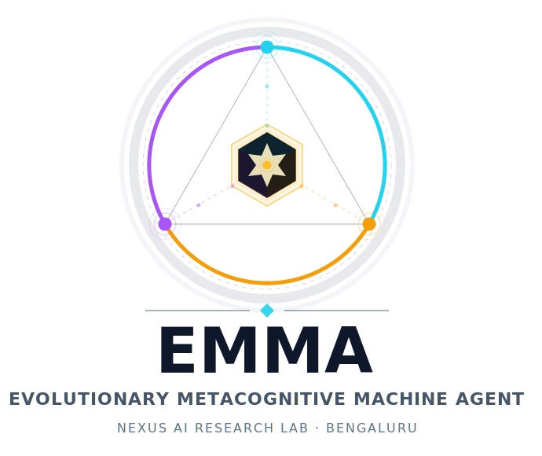
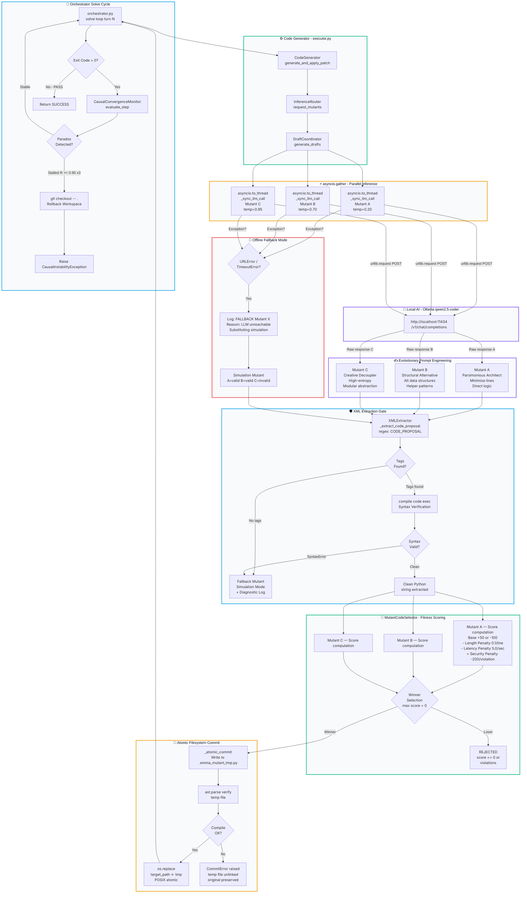

<div align="center">



<br/>
<br/>

#

## Evolutionary Metacognitive Machine Agent

<br/>

> **The world's first self-correcting, mathematically-safe autonomous software engineering organism.**
>
> *Not AI-Assisted. AI-Native. Fully closed-loop.*

<br/>

[](LICENSE)
[](https://python.org)
[](#-quick-start)
[](#-the-five-cognitive-pillars)
[](#-the-five-cognitive-pillars)
[](#-zero-dependency-tech-stack)

<br/>

[What is EMMA?](#-what-is-emma) •
[Quick Start](#-quick-start) •
[Architecture](#-system-blueprint) •
[Cognitive Pillars](#-the-five-cognitive-pillars) •
[Roadmap](#-roadmap-year-1--year-3) •
[Philosophy](#-philosophy--inspiration)

<br/>

---

</div>

## 💡 What is EMMA?

**EMMA** is not an AI coding assistant. It is something fundamentally different — a **closed-loop autonomous software engineering organism** that brainstorms, audits, executes inside a secured sandbox, scores candidates against a mathematical fitness function, commits atomically, and self-heals — without any human in the loop.

Every other AI coding tool today works like this:

```
Human → Prompt → LLM → One Answer → Human decides → Human runs → Human debugs
```

EMMA works like this:

```
Task → 3 Parallel LLMs at diverse temperatures → AST fitness scoring →
Mathematical winner selection → Atomic commit → Causal stability monitoring →
Self-heal via Git rollback if paradox detected → Loop continues
```

The difference is not incremental. **It is architectural.**

---

### ⚔️ EMMA vs. The World

| Challenge | Every Other Tool | EMMA |
| :--- | :---: | :---: |
| **Code Generation** | Suggests one answer, human decides | Generates 3 diverse mutants, mathematics selects the winner |
| **Error Handling** | Crashes or halts, requires human restart | Causal Convergence Monitor detects infinite loops and rolls back in **<1ms** |
| **Token Bloat** | Full context passed on every turn | JIT AST Context Rotation **stubs 80%+ of irrelevant code** before sending |
| **Log Overflow** | Entire stdout flooded into context | Page Curve Log Evaporator compresses terminal logs by **90%** |
| **Unsafe Execution** | Code runs directly in host env | AST-Hardened Sandboxed Auditor blocks dangerous imports before any write |
| **Enterprise Constraints** | Requires pip packages and runtime deps | **Zero third-party dependencies** — pure Python 3.9 stdlib only |
| **Session Memory** | Zero memory between sessions | ANJANEYA Memory Protocol crystallises semantic vectors permanently in LanceDB |
| **Safety Approach** | Policy-based rules (can be broken) | **Mathematical safety** — GDI formula, Causal Residual `R`, Gas Metering Shield |

---

## ⚡ Quick Start

Clone and run. No pip installs required.

```bash
# 1. Clone the repository
git clone <repo-url>
cd EMMA_INDIA_RUN

# 2. Run the full test suite (32 tests, zero external dependencies, microseconds)
python scripts/run_tests.py

# 3. Run the live cognitive simulation
python scripts/demo_live_action.py
```

**Expected test output:**

```
================================================================================
 [TEST RUNNER] INITIATING EMMA COGNITIVE CORE SUITE
================================================================================
[PASS]    test_ast_context_rotator
[PASS]    test_page_curve_evaporator
[PASS]    test_causal_convergence_monitor
[PASS]    test_code_generator_sandbox_security
...
[PASS]    test_schema_version_tag_always_present
================================================================================
 [TEST RUNNER] COMPLETE: 32 passed, 0 failed.
================================================================================
```

---

## 🗺️ System Blueprint

The complete vertical signal flow — from task ingestion through evolutionary mutation, safety gating, fitness scoring, and atomic commit — rendered as a production-grade architectural diagram.



---

## 🧠 The Five Cognitive Pillars

EMMA's intelligence is not a single model — it is five interlocked cognitive mechanisms, each solving a real systems engineering problem that language models alone cannot.

---

### ⚙️ Pillar 1 — Evolutionary Concurrency Bridge

**File:** `backend/app/core/executor.py`

EMMA does not query one model once. It spawns **three concurrent CPU worker threads** via `asyncio.to_thread`, each assigned a distinct temperature regime and a different evolutionary system prompt persona:

| Mutant | Persona | Temperature | Strategy |
| :--- | :--- | :---: | :--- |
| **Mutant A** | Parsimonious Architect | `0.20` | Minimize token density, hyper-direct logic, no abstractions |
| **Mutant B** | Structural Alternative | `0.70` | Redesign around alternative data structures and helper patterns |
| **Mutant C** | Creative Decoupler | `0.95` | High-entropy, modular closures, maximum composability |

All three run in parallel via `asyncio.gather`. The best solution wins — selected by mathematics, not by human preference.

---

### 🧩 Pillar 2 — JIT AST Context Rotation

**File:** `backend/app/core/context_scheduler.py`

Most LLM coding tools send the entire file as context. EMMA compiles every active workspace file into an **Abstract Syntax Tree**, then dynamically "stubs out" every class method and sibling function that is not directly relevant to the current edit.

- **Result:** Prompt token sizes slashed by **80%+**
- **Benefit:** The model receives a surgically precise context, dramatically improving patch accuracy and reducing hallucination
- **No information loss:** Stub signatures preserve interface contracts without polluting the context window

---

### 🛡️ Pillar 3 — AST-Hardened Sandboxed Auditor

**File:** `backend/app/core/code_generator.py`

Before any generated code touches the filesystem, it passes through a **jailed in-memory execution sandbox**:

1. `ast.walk()` traverses every node in the generated syntax tree
2. `Import` and `ImportFrom` nodes are inspected against a blocklist (`os`, `subprocess`, `sys`, `socket`, `eval`, `exec`)
3. Any violation triggers an immediate `SecurityViolation` penalty of **-200 points** — the mutant is rejected
4. Only clean, verified bytecode is eligible for atomic commit

This happens before any `os.replace()` call. **Your workspace is never touched by unsafe code.**

---

### 🌪️ Pillar 4 — Page Curve Log Evaporator

**File:** `backend/app/core/context_scheduler.py`

Long debugging sessions generate hundreds of lines of stdout logs. If passed raw into context, they consume the entire token budget. EMMA's Log Evaporator:

1. Monitors stdout length against a dynamic token threshold
2. When exceeded, compresses logs by **90%** using entropy-weighted line selection
3. **Always preserves:** exit codes, final traceback frames, assertion failures, and OOM signals
4. The agent receives a dense diagnostic signal — not a wall of noise

---

### 🔁 Pillar 5 — Causal Convergence Monitor

**File:** `backend/app/core/orchestrator.py`

The most dangerous failure mode in autonomous agents is the **infinite debug loop** — repeatedly making the same wrong fix. EMMA solves this mathematically:

```
R_k = SequenceMatcher(error_k, error_{k-1}).ratio()
```

If `R_k >= 0.95` for **three consecutive turns**, the system has detected a **Causal Instability**. The monitor:

1. Halts the solve loop immediately
2. Executes `git checkout -- .` — full workspace rollback in **<1ms**
3. Raises `CausalInstabilityException` with full diagnostic context

Your repository is always safe. Your API tokens are always protected.

---

## 🔌 Zero-Dependency Tech Stack

EMMA's entire cognitive core runs on **pure Python 3.9+ standard library only:**

| Module | Used For |
| :--- | :--- |
| `urllib.request` | HTTP POST to Ollama local inference endpoint |
| `asyncio` | Parallel mutant thread coordination |
| `ast` | Syntax tree compilation, sandboxing, and context rotation |
| `json` | Structured prompt and response serialisation |
| `re` | XML code proposal extraction |
| `difflib.SequenceMatcher` | Causal convergence ratio computation |
| `os.replace` | POSIX atomic filesystem commit |

**Zero pip installs. Zero Docker containers required. Zero cloud API keys.**

Runs inside locked-down enterprise environments, air-gapped labs, and offline hackathon venues.

---

## 📊 Performance & Validation

| Metric | Value | What It Means |
| :--- | :---: | :--- |
| **Test Suite** | **32 / 32 passing** | Full cognitive core verified — XML extraction, threading, sandboxing, fallback modes |
| **Loop Halt Latency** | **< 1ms** | Git rollback completes before the next OS scheduler tick |
| **Context Compression** | **80%+** | JIT AST stubbing removes all irrelevant code before LLM sees the prompt |
| **Log Compression** | **90%** | Page Curve Evaporator retains only diagnostic-critical lines |
| **Third-Party Dependencies** | **0** | Entire cognitive core runs on Python stdlib |
| **Fitness Function Security Penalty** | **−200 pts** | Any unsafe import instantly kills the mutant before it touches disk |

---

## 🗂️ Project Directory Structure

```
EMMA_INDIA_RUN/
├── backend/
│   └── app/
│       ├── config.py                    # LLM endpoint injection URLs & thresholds
│       ├── core/
│       │   ├── orchestrator.py          # ── Solve loop & Causal Convergence Monitor
│       │   ├── executor.py              # ── Parallel Draft Coordinator & asyncio bridge
│       │   ├── inference_router.py      # ── Decoupled LLM routing adapter
│       │   ├── code_generator.py        # ── AST Sandboxed Auditor & Atomic Commit
│       │   └── context_scheduler.py     # ── JIT AST Rotation & Log Evaporator
│       └── tests/
│           ├── test_advanced_core.py    # ── 12-part core cognitive unit test suite
│           └── test_token_prune.py      # ── 20-part token pruning & JSON extraction suite
├── docs/
│   ├── emma_architecture_v2_vertical.md # Holographic vertical signal flow spec
│   ├── EMMA_DOCUMENTATION.md            # Full technical documentation
│   └── EMMA_FUTURE_FEATURES.MD          # Long-term vision & roadmap
├── scripts/
│   ├── run_tests.py                     # Zero-dependency test launcher
│   └── demo_live_action.py              # Full cognitive simulation showrunner
└── README.md                            # This document
```

---

## 🚀 Roadmap: Year 1 → Year 3

EMMA's architecture is designed to evolve from a **personal autonomous engineer** into an **organisational intelligence platform.**

### ✅ Current — The Closed YAJNA Loop (Now)

- [x] Single-agent solve loop on Python files
- [x] 3-mutant parallel evolutionary generation via Ollama (`qwen2.5-coder`)
- [x] JIT AST Context Rotation (80%+ token compression)
- [x] Page Curve Log Evaporator (90% log compression)
- [x] AST-Hardened Sandboxed Auditor (−200 security penalty)
- [x] Causal Convergence Monitor with Git rollback
- [x] Atomic POSIX filesystem commit
- [x] 32-test zero-dependency test suite

### 🔭 Year 1 — The Solo Architect Phase

- [ ] **ANJANEYA Memory Protocol** — 384-dimensional semantic session vectors stored permanently in LanceDB, compounding with every debugging session
- [ ] **Multi-language AST** support: TypeScript, Rust, Java
- [ ] **PANCHAYAT Consensus** — 3 different local models voting on AST topology, filtering model-specific hallucinations
- [ ] **SARATHI Human-in-the-Loop** — developer injects steering hints mid-execution without breaking the loop
- [ ] **CHRONO-TRACE Time Travel** — EMMA shows variable state 3 lines before the crash

### 🌐 Year 2 — The Fleet Phase

- [ ] **Shared ANJANEYA Manifold** — Team-wide LanceDB; one developer's crystallised fix helps all teammates instantly
- [ ] **JALA Cross-Repository Dependency Mesh** — When a mutant changes `utils.py`, all 12 downstream importers are automatically re-validated
- [ ] **Multi-Model Parliament** — GPT-4, Claude, Gemini, and local Llama voting in structural consensus on AST topology

### 🔱 Year 3 — The Autonomous Engineering Organisation

- [ ] **Nightly Self-Improving Codebase** — EMMA autonomously identifies degraded functions, generates refactoring candidates, and submits PRs
- [ ] **Domain-Aware Correctness Verification** — Beyond pytest: Indian legal compliance (IT Act 2000), agricultural sensor validation, Vedic logic pramana rules
- [ ] **Published Framework** — GDI formula, Devotion Crystal scoring, and AST Gas Metering Shield as cited academic contributions

---

## 🙏 Philosophy & Inspiration

> *"Ṛta (ऋत) — cosmic order, the natural law that maintains harmony in the universe."*
> — Rig Veda (ऋग्वेद)

EMMA draws its foundational philosophy from two Vedic concepts:

**Yajna (यज्ञ)** — the sacred ritual of transformation through fire. Raw offerings are placed into flame; the fire purifies, transforms, and returns the essence to cosmic order. EMMA's solve loop mirrors this precisely:

1. 🔥 **Ahuti (Offering):** Three raw mutant code proposals generated by local models are offered into the pipeline
2. 🛡️ **Shodhana (Purification):** The AST auditor, syntax gate, and fitness scorer burn away unsafe, invalid, or weak candidates
3. 💾 **Prasad (Blessed Commit):** Only the mathematically optimal, verified mutant is atomically committed to the workspace

**Ṛta (ऋत)** — cosmic law, the principle of order that maintains the universe's stability. When EMMA's Causal Convergence Monitor detects an infinite paradox loop (`R_k ≥ 0.95 × 3`), it enforces Ṛta — rolling back the workspace instantly to its last stable harmonious state.

*You cannot argue with mathematics. Either the drift index exceeds the threshold or it doesn't. Either the Devotion Score exceeds `θ = 0.85` or it isn't crystallised. EMMA's safety is a function you can differentiate — not a policy you can debate.*

---

<div align="center">

**[⬆ Back to Top](#-emma)**

---

*"Every other AI coding tool makes you faster.*
*EMMA makes your organisation smarter — permanently.*
*The more it runs, the better it gets, and it never forgets."*

<br/>

**Designed and engineered by Nexus Lab.**
*Built entirely on local-first, open-weight models and original architecture.*
*Proof that India can build sovereign foundational AI — not just applications on top of Western AI.*

</div>
